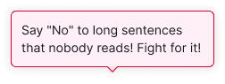
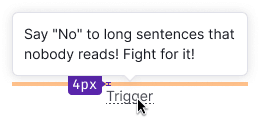
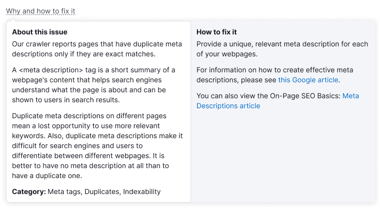
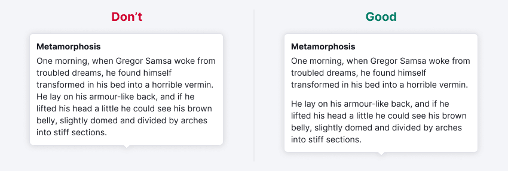

::: react-view

:::

## Description

**Tooltip** is a component used to display various tips and hints, and serves as a wrapper over the [Popper](/utils/popper/popper) component.

Differences between Tooltip and [Dropdown](/components/dropdown/dropdown):

- Tooltip usually appears when hovering over the trigger (except for the [Informer pattern](../../patterns/informer/informer)).
- It has an arrow pointing to the trigger.
- Tooltip only provides additional information about the feature, it doesn't contain any settings or commands.

## Component composition

It's useful to keep in mind that in code tooltips consist of two main parts:
- Trigger — the element that should be hovered, clicked on, etc, to show the tooltip,
- Popper — the tooltip itself, that is, the container for tooltip content.

Trigger and Popper behave differently depending on which component is used in the code — `Tooltip`, `Hint` or `DescriptionTooltip`, and you should choose the appropriate component according to your use case. Read about the differences in [Interaction](#interaction) and [Content](#content).

## Themes

Tooltip has three themes: `default`, `invert` for use on a dark background, and `warning` for validation messages. In all cases, the text color changes to `--text-primary-invert`, and the background color changes accordingly.

::: tip
Starting from [version 3.1.0](/components/tooltip/tooltip-changelog), you can set your own custom theme and change the background color.
:::

Table: Tooltip themes

| Theme   | Appearance example              | Styles      |
| ------- | ------------------------------- | ----------- |
| `default` |  | `background-color: var(--tooltip-default)`, `border: 1px solid var(--border-secondary)`, `box-shadow: var(--box-shadow-popper)` |
| `invert` |    | `background-color: var(--tooltip-invert)`, `border: 1px solid var(--border-tooltip-invert)`, `box-shadow: var(--box-shadow-popper)` |
| `warning` |      | `background-color: var(--tooltip-warning)`, `border: 1px solid var(--border-danger-active)`, `box-shadow: var(--box-shadow-popper)` |

## Appearance

### Maximum width and offset

By default, the Tooltip has a maximum width of 228px, but you can set a different width if needed.

#### Offset and arrow placement

The distance between the trigger and the tooltip is 4px.

The placement of the arrow depends on the `placement` property, refer to the live examples in the [Placement](/components/tooltip/tooltip#placement) section.

### Paddings and margins

The content area of the tooltip has a default padding of 12px.

#### Content margins and paddings

::: tip
It's recommended to use a font size of 14px (`--fs-200`, `--lh-200` tokens) for the title in non-advertising messages.
:::

The image inside the tooltip has a size of 130px * 130px.

#### Data margins

To improve readability, it's recommended to use specific margins between labels and values inside the tooltip. Detailed recommendations for tooltip margins can be found in [Data visualization](/data-display/d3-chart/d3-chart#tooltip) and [Summary](/patterns/summary/summary#difference-value).

## Placement

The tooltip is built using the [Popper.js](https://popper.js.org/) library, allowing you to change its placement according to the [Popper API](/utils/popper/popper-api).

The default tooltip placement is `top`.

::: sandbox

:::

## Interaction

For the tooltip trigger, you can use formatted text, table headers, or interactive components like [Icon](/style/icon/icon), [Link component](/components/link/link), [Button](/components/button/button), etc.

### Appearance and hiding

`Hint` and `Tooltip` appear on hover and hide when cursor leaves both the trigger and the popper. If the trigger is focusable, they also appear on focus and hide on unfocus or Esc.

`DescriptionTooltip` appears on click or Space/Enter, and hides when user clicks or moves focus outside of both trigger and popper, or presses Esc.

### Delay of appearance and hiding

Default values for tooltip appearance and hiding:

- Appearance: `100ms`
- Hiding: `50ms`

If the tooltip has interactive elements inside, the hiding time should be increased to `100ms`.

## Content

Tooltip content is closely related to its behavior, so you should choose the appropriate component depending on what you intend to show inside the tooltip.

Table: Tooltip content

| Component | Tooltip function | Content |
| --------- | ---------------- | ------- |
| `Hint` | Show a label for an interactive element without visible text | Very short unformatted text reflecting an action or element's name, for example, "Export", "Settings".  |
| `Tooltip` | Show additional information about an element with a visible label | Short unformatted text, preferably no more than one sentence.  |
| `DescriptionTooltip` | Show information that's related not to the trigger itself, but to another element or the feature in general ([Informer pattern](../../patterns/informer/informer))  | Any amount of text, formatted or unformatted. Can include images, links, buttons and other element.  |

## Usage in UX/UI

Main recommendations:

- Use the tooltip to show hints and additional information only. Avoid adding complex functionality inside it.
- Ensure that the tooltip doesn't overlap important information for the user.

::: tip
For complex content and forms, use [DropdownMenu](/components/dropdown-menu/dropdown-menu).
:::

**If the tooltip trigger conveys information about a new feature, avoid duplicating the trigger text in the tooltip title.** The title may not be necessary if the trigger text already explains the tooltip content.

**When the trigger isn’t clear enough, add a clear title to the tooltip.** Additionally, include a title when the trigger doesn't adequately explain the topic of the tooltip. For example, you can describe additional conditions in the header or expand on the trigger's idea.

**Divide long text into paragraphs.**

**Avoid overloading the tooltip with information.** A large amount of content can be inconvenient to view in the tooltip. If there is too much content and nothing can be removed, consider using a separate paragraph on the page or widget instead of a tooltip.

**Ensure that the tooltip doesn't prevent users from interacting with nearby triggers.**

