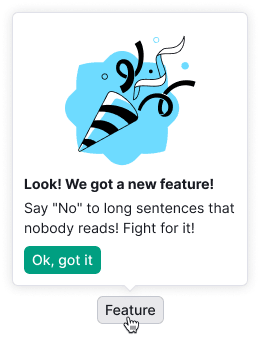
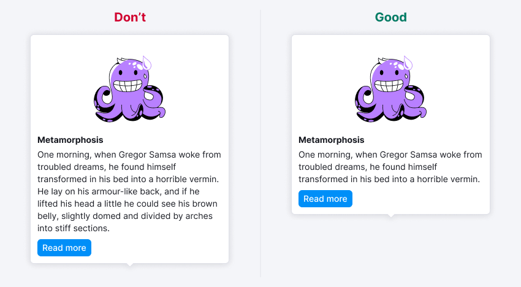

@import playground

> ⚠️ The component has a major version, changes are in the changelog.

@## Description

**Tooltip** is a modeless popover designed to display all sorts of tips in tools.

Differences from [Dropdown](/components/dropdown/):

- It appears only at hovering over the trigger;
- It has a pointer to the trigger;
- It contains only reference and additional information without complex controls.

@## Component consists of

- container
- content
- chevron

@## Types

There are two types of tooltips, which are the defaulted ] and the advanced tooltip.

### TooltipBase

TooltipBase contains only unformatted text.

### Advanced tooltip

The advanced tooltip may contain:

- formatted text,
- simple controls ([Button](/components/button/), [Link](/components/link/), etc.),
- custom marking,
- image,
- different background color.

@## Themes

The tooltip has themes to use on a dark background and for error messages. In both cases, the text color changes to `#fff` and the background color changes to the corresponding one.

|                 | Appearance                             | Styles                                                                  |
| --------------- | -------------------------------------- | ----------------------------------------------------------------------- |
| Dark background |    | `background-color: #000; box-shadow: 0 1px 10px 0 rgba(0, 0, 0, 0.65);` |
| Error message   |  | `background-color: $orange; box-shadow: 0 2px 5px 0 rgba(0,0,0,0.25);`  |

> 💡 In [3.1.0 version](http://i.semrush.com/components/tooltip/#Changelog), opportunity to set own theme and change background color to custom is added.

@## Sizes and indents

### Sizes

The basic tooltip has a maximum width, namely, `max-width: 250px`. In the advanced version of the tooltip, you can set a different width if necessary.

### Indents

**Content**. The content area of the component has optional internal indents.

### Recommendations for indents within content

> 💡 Please note that it is better to use 14px for the title in the default non-advertising tooltip.

Image area is 256px х 132px.

**Chevron**. Chevron can be placed either in the middle of the component or next to any angle.

@## Positioning

- Tooltip is positioned on the basis of the [Popper.js](https://popper.js.org/) library.

- Tooltip opens at the hover over the trigger. It should not change its position when scrolling a page (for example, it opened upwards, but when scrolling it appeared at the edge of the browser and moved down) so that it remains where it originally opened until closing. By default, it is positioned at the top in relation to the trigger.

Possible positions towards the trigger:

@example placement

@## Interaction

The tooltip trigger can be a formatted text (for example, it is available in Brand Monitoring), table header, or various controls such as [Icon](/style/icon/), [Link](/components/link/), [Button](/components/button/) etc.)

### Appearance and hiding

| Hidden                                                                            |                                |
| --------------------------------------------------------------------------------- | ------------------------------ |
| Cursor left the trigger (for basic tooltip)                                       |  |
| Cursor left the trigger or the tooltip itself (For advanced tooltip with control) |  |

### Delay of appearance and hiding

Default values for tooltip appearance and hiding:

- appearance: `100ms`;
- hiding: `50ms`.

If there are controls in your tooltip, which appears when you hover over a trigger, the time for hiding the tooltip should be increased to `100ms`.

@## Use in UX/UI

### Recommendations for use

Use the tooltip to show additional or reference content to the user. Such content can be text, formatted text with lists, links, buttons and small images.

> 💡 For more complex content and features, use [Dropdown-menu](/components/dropdown-menu/).

Make sure that the tooltip does not overlap the information important for the user, which is necessary in the context of use.

**If the tooltip falls out of the trigger that tells about the new feature, the tooltip title should not duplicate the text of the trigger.** The title may not be used if the trigger text already explains the tooltip content to a sufficient extent. For example, you should not duplicate the text of the trigger in the tooltip, as it is redundant.

> 💡 If the title of a table or a control label that can be shortened into an `ellipsis` (...) is wrapped in a tooltip, the title in the tooltip must duplicate the text of the trigger.

**In the case when the essence of the trigger is not obvious enough, it is better to add a title to the tooltip.** It is also necessary to add a title when the trigger does not sufficiently explain the topic of the tooltip. For example, you can describe additional conditions in the header, or expand the idea behind the trigger.

**The long text of the tooltip must be divided into paragraphs.**

**Do not overload the tooltip with information.** Keep your temper in check 🙃 The large amount of content is inconvenient to view in the tooltip. If there is too much content and you cannot remove anything, think about whether you need a separate block/page for it instead of a tooltip.

**A tooltip with an interactive element inside should not prevent you from pointing the cursor at a nearby trigger.**

@page tooltip-api
@page tooltip-code
@page tooltip-changelog
