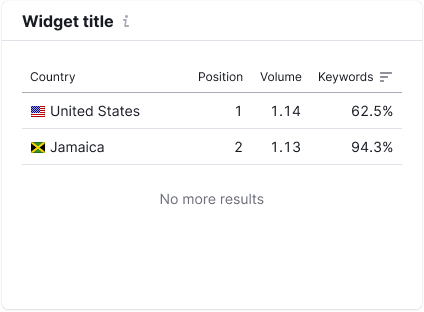

Widgets of our tools have “empty” states, which should properly inform the user, why he/she does not see the data. And give a clue, how he/she can remedy the situation.

@## Composition and styles

The widget’s “empty” state includes the following:

- image in svg format;
- state heading;
- state description;
- button (optional);
- select (optional).

|                     | Description, styles                                |
| ------------------- | -------------------------------------------------- |
| Image in svg format | `margin-bottom: 12px; width: 100px; height: 72px;` |
| Heading             | h6, `$gray60`, `margin-bottom: 8px;`               |
| Description         | Paragraph, M size, `$gray60`                       |
| Button (optional)   | M size button, `margin-top: 16px;`                 |
| Select (optional)   | L size select, `margin-top: 8px;`                  |

> 💡 If the widget has a heading, it should be displayed in the “empty” state of the widget.

**The maximum width of the block with “empty” state is 400px**. It is required in order the text was readable.

**Be brief**. Write briefly and to the point in such states. Two-three short sentences are usually enough to describe the situation.

@## Widget sizes

As a rule, the widget height in “empty” state is the same as the height of the widget with data.

The content of the “empty” state is centered horizontally in relation to the widget content. Vertically this state is recommended to be centered optically, depending on the illustration.

### Minimum height (for extreme cases)

There are cases when it is required to reduce the height of the widget with “empty” state for saving the space on the page. In these cases the widget height is 170px. The state heading becomes the description (usual text styles are used), it is recommended to be reduced up to one sentence. But remember that it is an extreme case.

@## State types

The main “empty” states of our widgets:

- Nothing found
- No more results
- Tool is not set up
- Something went wrong

@## Nothing found

The state when for some reason we do not have data at the user request or cannot show it. If the widget has a heading, it should be displayed in this state. In this case we show the following instead of the data:

- an image corresponding to the type of the data in the widget;
- a text message specifying that we have no data or specifying the user’s actions in order to obtain it;
- the main button helping the users to remedy the situation (optional);
- selects of filters helping to remedy the situation (optional).

We have a certain image for each type of data. The button is an optional element in this case. It is recommended to use an additional button in order it did not intercept the main buttons of the report/tool by priority.

| Wide widget                                       | Medium widget                                           | Text                                             |
| ------------------------------------------------- | ------------------------------------------------------- | ------------------------------------------------ |
|          |          | h6 — We have no data to show; p — {Hint message} |
|  |  | h6 — We have no data to show; p — {Hint message} |

> 💡 **Be brief**. Do not write too much text in such states. Two-three short sentences are enough.

If your widget has width of less than 300px, you may just insert the heading of the error as the text of `--fs-100` size into such “empty” state: `12px; --lh-100: 1.5;` (12px). And hide the explanatory information into the icon `Info` of S size.

@## No more results

Our tools also have the state when there is a small amount of data in the widget. This state is used in the widgets with table, text and other data not displayed as diagrams.

Add the text `No more results` and center it vertically and horizontally at the place where there is no data.

@## Set up your tool

The state, when the data is absent because you need to connect something. It may be said that this is more detailed and more advertising state for the `Nothing found` state.

- In some cases the tool may be set up at once by clicking the corresponding button.
- In other cases you should write to the specified email address for setting up the tool.

> 💡 Important! Write positively in the heading and description of the state. _For example, write: “Set up the service” instead of “The service is not set up”._

We show the following instead of the data in this state:

- an image corresponding to the type of the data in the widget / advertising picture;
- a text message specifying what you should set up or do in order to obtain the data;
- the main button.

| Wide widget                                 | Medium widget                                     | Text                                             |
| ------------------------------------------- | ------------------------------------------------- | ------------------------------------------------ |
|  |  | h6 — Set up your {Name Tool}; p — {Hint message} |

If your widget has width of less than 300px, you may just insert the heading of the error as the text of `--fs-100` size into such “empty” state: 12px; `--lh-100: 1.5;` (12px). And you may hide the explanatory information into the icon `Info` of S size.

@## Something went wrong

The state when something went wrong at the backend. And either we do not have any information, what exactly went wrong and where it will be repaired, or we know about the problem and inform the user about it in the most understandable form.

### We know that there are problems at the backend

We show the following instead of the data in this case:

- an image;
- a text message specifying what you should set up;
- an additional button.

> 💡 We recommend always to show the button in this state. Use an additional button in order it did not intercept the main buttons of the report/tool by priority.

| Wide widget                               | Medium widget                                   | Text                                                                                                                            |
| ----------------------------------------- | ----------------------------------------------- | ------------------------------------------------------------------------------------------------------------------------------- |
|  |  | h6 — Something went wrong; p — Don't worry though, we are aware of the issue and are working to fix it. Please try again later. |

If your widget has width of less than 300px, you may just insert the heading of the error as the text of `--fs-100` size into such “empty” state: 12px; `--lh-100: 1.5;` (12px). And you may hide the explanatory information into the icon `Info` of S size.

### We do not know that there are problems at the backend

We show the following instead of the data in this case:

- an image;
- a text message specifying what you should set up;
- an additional button.

> 💡 We recommend always to show the button in this state. Use an additional button in order it did not intercept the main buttons of the report/tool by priority.

| Wide widget                                 | Medium widget                                     | Text                                                                                                                    |
| ------------------------------------------- | ------------------------------------------------- | ----------------------------------------------------------------------------------------------------------------------- |
|  |  | h6 — Something went wrong; p — Try to reload the widget. If the problem persists, please contact us at mail@semrush.com |

If your widget has width of less than 300px, you may just insert the heading of the error as the text of `--fs-100` size into such “empty” state: 12px; `--lh-100: 1.5;` (12px). And you may hide the explanatory information into the icon In`fo of S size.

@page widget-empty-api
@page widget-empty-code
@page widget-empty-changelog
