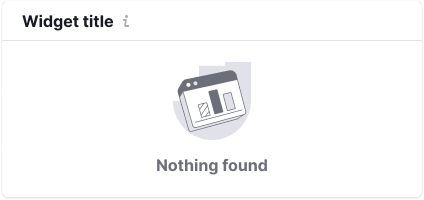
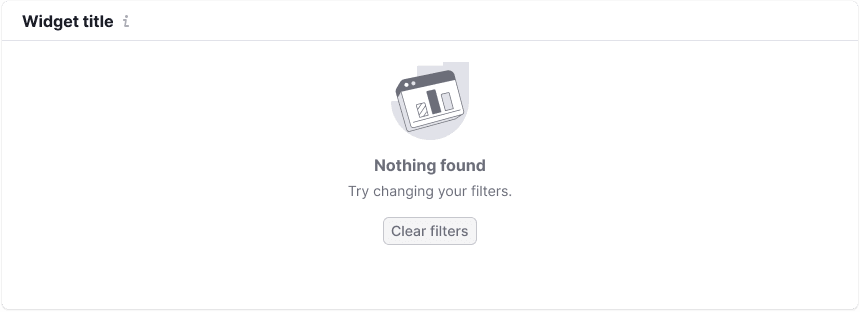

**WidgetEmpty** is a component for displaying messages in the widgets.

Widgets have “empty” states, which should properly inform user, why there is no data and how to remedy the situation.

@## Composition and styles

Widget’s “empty” state usually includes the following:

- image in svg format;
- title;
- description;
- button (optional);
- select (optional).

|                     | Description, styles                                                                        |
| ------------------- | ------------------------------------------------------------------------------------------ |
| Image in svg format | `margin-bottom: 12px; width: 100px; height: 72px;`                                         |
| Title               | Text with 16px size (`--fs-300; --lh-300;`), `--gray-500` color and `margin-bottom: 4px;`. |
| Description         | Text with 14px size (`--fs-200; ----lh-200;`) and `--gray-500` color.                      |
| Button (optional)   | Button with M size and `margin-top: 16px;`                                                 |
| Select (optional)   | Select with M size and `margin-bottom: 4px;`                                               |

> If widget has a title, it should be displayed in the “empty” state, too.

**The maximum width of the “empty” state message is 400px**. It is required in order the text should be readable.

**Be brief**. Write briefly. Two or three short sentences are usually enough to describe the situation.

@## Widget sizes

As a rule, the widget height in “empty” state is the same as the height of the widget with data.

The content of the “empty” state is centered horizontally and vertically in relation to the widget content.

### Minimum height (for edge cases)

There are cases when it is required to reduce the height of the widget with “empty” state for saving the space on the page. In these cases the widget's `min-height: 188px;`. The title becomes the description (use styles from the table above), it is recommended to be reduced up to one sentence.

@## Button names

1. If the WidgetEmpty's description starts with "Try" and only the problem area should be updated, then call the button "Try again".
2. If the whole page should be refreshed, then call the button "Reload page".
3. If the widget should be refreshed, then call the button "Reload".

@## State types

The list of “empty” states in the widgets:

- No data
- Nothing found
- No more results
- Product is not set up
- Something went wrong (has also specific version: "Cannot filter data")

@## No data

Use this state, when for some reason there is no data or system cannot show it. If widget has a title, it should be displayed in this state. In this case show the following instead of the data:

- an image corresponding to the type of the data in the widget;
- a message specifying that we have no data or specifying the user’s actions in order to obtain it;
- button helping the users to remedy the situation (optional);
- filters helping to remedy the situation (optional).

| Wide widget                                       | Medium widget                                           | Text                                                           |
| ------------------------------------------------- | ------------------------------------------------------- | -------------------------------------------------------------- |
|          |          | Title: "We have no data to show". Description: {Hint message}. |
|  |  | Title: "We have no data to show". Description: {Hint message}. |

> **Be brief**. Do not write too much text in these states. Two or three short sentences are enough.

If your widget has width less than 300px, you may leave just the title with styles of the description text. And hide the description into the Info icon with M size.

@## Nothing found

It's a specific variant for cases when there is no data at the user request. In this case show the following instead of the data:

- an universal image;
- a text message specifying that there is no data at the user request;
- button helping to remedy the situation (optional);

| Wide widget                                              | Medium widget                                                  | Text                                                              |
| -------------------------------------------------------- | -------------------------------------------------------------- | ----------------------------------------------------------------- |
|  |  | Title: "Nothing found". Description: "Try changing your filters". |

If your widget has width less than 300px, you may leave just the title with styles of the description text. And hide the description into the Info icon with M size.

@## No more results

Interface also can have the state when there is a small amount of data in the widget. This state is usually used in the widgets with table, text and other data.

Add the text: "No more results" — and center it both vertically and horizontally.

@## Set up your tool

Use this state, when the data is absent because user needs to connect something. This state is more detailed and more advertising than the others.

- In some cases the product may be set up at once by clicking the corresponding button.
- In other cases user should write to the specified email address for setting up the product.

> Title and description must be written in a positive form. _For example, write: “Set up the service” instead of “The service is not set up”._

Show the following instead of the data in this state:

- an image corresponding to the type of the data in the widget / advertising picture;
- text message specifying what user should set up or do in order to obtain the data;
- button.

| Wide widget                                 | Medium widget                                     | Text                                                           |
| ------------------------------------------- | ------------------------------------------------- | -------------------------------------------------------------- |
|  |  | Title: "Set up your {Name Tool}". Description: {Hint message}. |

If your widget has width less than 300px, you may leave just the title with styles of the description text. And hide the description into the Info icon with M size.

@## Something went wrong

Use this state, when something went wrong at the backend. And either product team does not have any information, what exactly went wrong and where it will be repaired, or product team know about the problem and inform the user about it.

### We know that there are problems at the backend

Show the following instead of the data in this case:

- an image;
- text message specifying what user should do;
- an additional button.

> We recommend to show the button in this state.

| Wide widget                               | Medium widget                                   | Text                                                                                                                                           |
| ----------------------------------------- | ----------------------------------------------- | ---------------------------------------------------------------------------------------------------------------------------------------------- |
|  |  | Title: "Something went wrong". Description: "Don't worry though, we are aware of the issue and are working to fix it. Please try again later". |

If your widget has width less than 300px, you may leave just the title with styles of the description text. And hide the description into the Info icon with M size.

### User has done something wrong

It's a version of the "Something went wrong" state for the cases when user did something wrong and we need to help him/her deal with the situation.

Show the following instead of the data in this case:

- an image;
- text message specifying what user should do.

| Wide widget                                      | Medium widget                                          | Text                                                                                                                             |
| ------------------------------------------------ | ------------------------------------------------------ | -------------------------------------------------------------------------------------------------------------------------------- |
|  |  | Title: "Cannot {filter/search/sort} data". Description: "{Provide helpful information for the user to deal with the situation}". |

If your widget has width less than 300px, you may leave just the title with styles of the description text. And hide the description into the Info icon with M size.

### We do not know that there are problems at the backend

Show the following instead of the data in this case:

- an image;
- a text message specifying what user should set up;
- an additional button.

> We recommend to show the button in this state.

| Wide widget                                 | Medium widget                                     | Text                                                                                                                                              |
| ------------------------------------------- | ------------------------------------------------- | ------------------------------------------------------------------------------------------------------------------------------------------------- |
|  |  | Title: "Something went wrong". Description: "Try {filtering/searching/sorting} data again. If the problem persists, please contact us at {email}" |

If your widget has width less than 300px, you may leave just the title with styles of the description text. And hide the description into the Info icon with M size.

@page widget-empty-api
@page widget-empty-code
@page widget-empty-changelog
