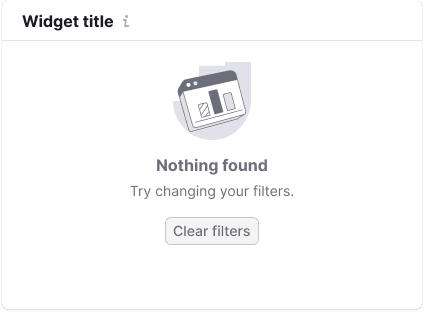
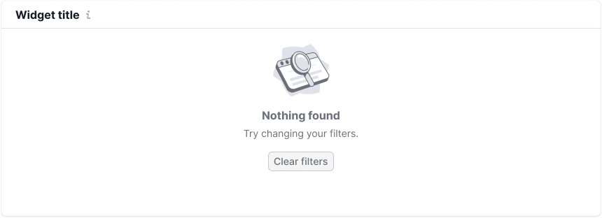
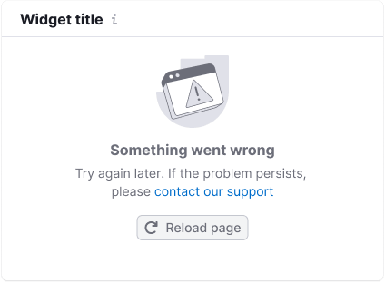

## Description

**WidgetEmpty** is a component designed to display empty states in widgets.

The WidgetEmpty component informs the user why there is no data (for example due to applied filters, tool not having been set up yet, or a system error) and provides guidance on how to address the situation.

## Composition and styles

Component consists of the following:

- `WidgetEmpty.Title`
- `WidgetEmpty.Description`
- [Illustration](/style/illustration/illustration)
- Controls

## Styles

We recommend restricting maximum width of the message text to 400px to ensure readability.

Table: WidgetEmpty styles

| Element             | Styles   |
| ------------------- | -------- |
| Title               | Font has 16px size (`--fs-300`, `--lh-300` tokens), `--text-secondary` token for color and `margin-bottom: var(--spacing-1x)` |
| Description         | Font has 14px size (`--fs-200`, `--lh-200` tokens) and `--text-secondary` token for color     |
| Illustration | `margin-bottom: 12px`        |
| Controls   | Usually have M size and `margin-top: var(--spacing-4x)`   |

### Indents

## Widget size

Normally, widget's height doesn't change in the empty state and stays the same as in the normal state with data.

The content of the empty state is centered both horizontally and vertically inside the widget.

### Reducing the height (in edge cases)

In some cases, widget's height needs to be reduced in the empty state to save space on the page. In such cases, you can hide the description line and display the whole message using only the title. It's recommended to keep it to one sentence.

### Widgets with small width

If your widget's width is less than 300px, you can use the compact version of the state:
* hide the illustration,
* display the title using description styles,
* move the description text into an [Informer](../../patterns/informer/informer),
* display a link instead of the button.

## State types

Some common empty states in widgets are:

- No data / Nothing found
- Something went wrong (has a specific version: "Cannot filter data")
- Product isn't set up
- No more results

## No data

Use this state when there is no data or the system cannot display it for some reason. If the widget has a title, it should also be displayed in this state. In this case, display the following:

- An illustration (use one of the [Chart type or Data type illustrations](../../style/illustration/illustration) to represent the kind of data that's normally displayed in the widget).
- A message specifying why there's no data and what can be done to obtain it.
- Optionally: a button to help remedy the situation in one click (for example, clear filters).
- Optionally: filters to help remedy the situation.

Table: No data message examples

| Large widget     | Medium widget       | Text           |
| ---------------- | ------------------- | -------------- |
|          |          | Title: "Nothing found". Description: {Hint message}. |
|  |  | Title: "Nothing found". Description: {Hint message}. |

::: tip
Be brief — avoid excessive text in these states. Two or three short sentences are sufficient.
:::

### Nothing found

This is a variation of the `No data` state that's used when there are no search results in a widget, table or page. Display the following:

- The `NothingFound` illustration.
- A text message specifying that nothing was found based on the user's request.
- Optionally: a button to clear filters or otherwise try to remedy the situation in one click.

Table: Nothing found message examples

| Large widget        | Medium widget      | Text     |
| ------------------- | ------------------ | -------- |
|  |  | Title: "Nothing found". Description: "Try changing your filters". |

## Something went wrong

Use this state when something went wrong in the system. Display the appropriate variation of the state depending on whether the team is aware of the issue.

### We know there are problems in the system

Display the following:

- An illustration.
- A text message specifying that we're working on the issue and asking the user to try again later.
- Recommended: a helpful button (for example to reload the widget or the whole page).

Table: Something went wrong message examples

| Large widget       | Medium widget               | Text    |
| ------------------ | --------------------------- | ------- |
|  |  | Title: "Something went wrong". Description: "We are aware of the issue and are working to fix it. Please try again later". |

### We don’t know there are problems in the system

Display the following:

- An illustration.
- A text message about what happened and what the user can do (for example contact the support team).
- Recommended: a helpful button (for example to reload the widget or the whole page).

Table: Something went wrong message examples

| Large widget  | Medium widget         | Text       |
| ------------- | --------------------- | ---------- |
|  |  | Title: "Something went wrong". Description: "Please try again later. If the problem persists, contact us at {email}" |

### Button name

<!-- 1. If the WidgetEmpty's description starts with "Try" and only the problem area should be updated, then call the button "Try again". -->
1. If the button refreshes the whole page, call it "Reload page."
2. If the button refreshes only this widget, call it simply "Reload."

## Custom messages

### User has done something wrong

Use this state when the user has done something wrong and we need to assist them in rectifying the situation.

Display the following:

- An illustration.
- A text message specifying what the user should do.

Table: Custom message examples

| Large widget   | Medium widget        | Text      |
| -------------- | -------------------- | --------- |
|  |  | Title: "Cannot {filter/search/sort} data". Description: "{Provide helpful information for the user to deal with the situation}". |

### Set up your product

Use this state when data is absent because the user needs to connect something. This state is more detailed and serves an advertising purpose.

In some cases, the product may be set up instantly by clicking the corresponding button.
In other cases, the user should contact a specified email address for setting up the product. The title and description must be written in a positive form. For example, write: "Set up the service" instead of "The service isn’t set up."

Display the following:

- An illustration corresponding to the type of data in the widget or an advertising picture.
- A text message specifying what the user should set up or do to obtain the data.
- A button.

Table: Set up your product message examples

| Large widget           | Medium widget    | Text         |
| ---------------------- | ---------------- | ------------ |
|  |  | Title: "Set up your {Name Tool}". Description: {Hint message}. |

### No more results

This state is used when there is a small amount of data in the widget, typically with tables, text, or other data.

Add the text: "No more results" after the data and center it horizontally.

