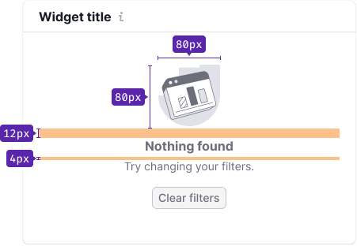
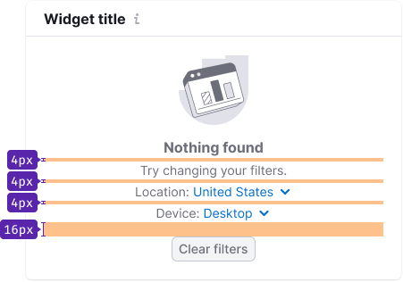
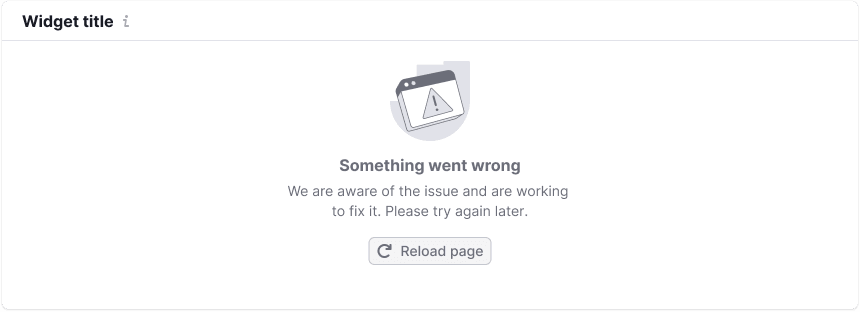
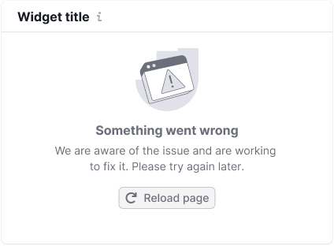
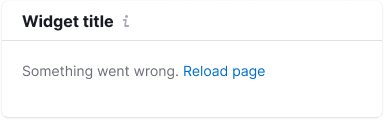
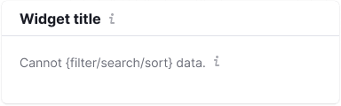
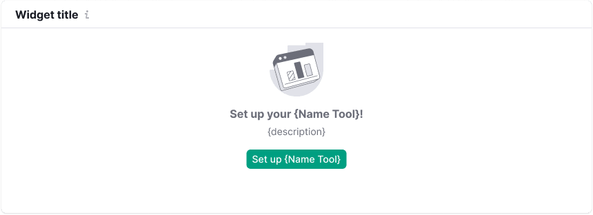

@## Description

**WidgetEmpty** is a component designed to display messages in widgets.

Widgets have "empty" states, when there is no data to show. In such cases, the WidgetEmpty component informs the user why there is no data and provides guidance on how to address the situation.

@## Composition and styles

Component consists of:

- `WidgetEmpty.Title`
- `WidgetEmpty.Description`
- [Illustration](/style/illustration/)
- Controls

@## Styles

We recommend to add maximum 400px width for the "empty" state message to ensure readability.

@table-caption WidgetEmpty styles

| Element             | Styles   |
| ------------------- | -------- |
| Title               | Font has 16px size (`--fs-300`, `--lh-300` tokens), `--text-secondary` token for color and `margin-bottom: var(--spacing-1x)` |
| Description         | Font has 14px size (`--fs-200`, `--lh-200` tokens) and `--text-secondary` token for color     |
| Illustration | `margin-bottom: 12px`        |
| Controls   | Usually have M size and `margin-top: var(--spacing-4x)`   |

### Indents

@## Widget sizes

The height of the widget in the "empty" state is usually the same as the height of the widget with data.

The content of the "empty" state is centered both horizontally and vertically in relation to the widget content.

### Minimum height (for edge cases)

In some cases, the height of the widget with the "empty" state needs to be reduced to save space on the page. In such cases, the widget's minimum height is set to 188px. The title becomes the description, and it is recommended to keep it to one sentence.

@## Button names

<!-- 1. If the WidgetEmpty's description starts with "Try" and only the problem area should be updated, then call the button "Try again". -->
1. If the whole page should be refreshed, then call the button "Reload page."
2. If the widget should be refreshed, then call the button "Reload."

@## State types

The list of "empty" states in the widgets includes:

- No data
- Nothing found
- No more results
- Product isn't set up
- Something went wrong (has a specific version: "Cannot filter data")

@## No data

Use this state when there is no data or the system cannot display it for some reason. If the widget has a title, it should also be displayed in this state. In this case, display the following:

- An illustration corresponding to the type of data in the widget.
- A message specifying that there is no data or providing user actions to obtain it.
- An optional button to help users remedy the situation.
- Optional filters to help remedy the situation.

@table-caption No data message examples

| Large widget     | Medium widget       | Text           |
| ---------------- | ------------------- | -------------- |
|          |          | Title: "Nothing found". Description: {Hint message}. |
|  |  | Title: "Nothing found". Description: {Hint message}. |

**Be brief.** Avoid excessive text in these states. Two or three short sentences are sufficient.

If your widget has a width less than 300px, you may display only the title with styles of the description text and hide the description behind an `Info` icon of size M.

### Nothing found

This specific state is used when there are no data results in a search, table, or page. Display the following:

- A universal illustration.
- A text message specifying that there is no data based on the user's request.
- An optional button to help remedy the situation.

@table-caption Nothing found message examples

| Large widget        | Medium widget      | Text     |
| ------------------- | ------------------ | -------- |
|  |  | Title: "Nothing found". Description: "Try changing your filters". |

If the widget has a width less than 300px, you may display only the title with styles of the description text and hide the description behind an `Info` icon of size M.

@## Something went wrong

Use this state when something went wrong at the backend. Either the product team is unaware of the issue, or they are aware and informing the user about it.

### We know there are problems at the backend

Display the following:

- An illustration.
- A text message specifying what the user should do.
- An additional button (recommended).

@table-caption Something went wrong message examples

| Large widget       | Medium widget               | Text    |
| ------------------ | --------------------------- | ------- |
|  |  | Title: "Something went wrong". Description: "We are aware of the issue and are working to fix it. Please try again later". |

If your widget has a width less than 300px, you may display only the title with styles of the description text and hide the description behind an `Info` icon of size M.

### We don’t know there are problems at the backend

Display the following:

- An illustration.
- A text message specifying what the user should set up.
- An additional button (recommended).

@table-caption Something went wrong message examples

| Large widget  | Medium widget         | Text       |
| ------------- | --------------------- | ---------- |
|  |  | Title: "Something went wrong". Description: "Please try again later. If the problem persists, contact us at {email}" |

If your widget has a width less than 300px, you may display only the title with styles of the description text and hide the description behind an `Info` icon of size M.

@## Custom messages

### User has done something wrong

Use this state when the user has done something wrong and we need to assist them in rectifying the situation.

Display the following:

- An illustration.
- A text message specifying what the user should do.

@table-caption Custom message examples

| Large widget   | Medium widget        | Text      |
| -------------- | -------------------- | --------- |
|  |  | Title: "Cannot {filter/search/sort} data". Description: "{Provide helpful information for the user to deal with the situation}". |

If your widget has a width less than 300px, you may display only the title with styles of the description text and hide the description behind an `Info` icon of size M.

### Set up your product

Use this state when data is absent because the user needs to connect something. This state is more detailed and serves an advertising purpose.

In some cases, the product may be set up instantly by clicking the corresponding button.
In other cases, the user should contact a specified email address for setting up the product. The title and description must be written in a positive form. For example, write: "Set up the service" instead of "The service isn’t set up."

Display the following:

- An illustration corresponding to the type of data in the widget or an advertising picture.
- A text message specifying what the user should set up or do to obtain the data.
- A button.

@table-caption Set up your product message examples

| Large widget           | Medium widget    | Text         |
| ---------------------- | ---------------- | ------------ |
|  |  | Title: "Set up your {Name Tool}". Description: {Hint message}. |

If your widget has a width less than 300px, you may display only the title with styles of the description text and hide the description behind an `Info` icon of size M.

### No more results

This state is used when there is a small amount of data in the widget, typically in widgets with tables, text, or other data.

Add the text: "No more results" and center it both vertically and horizontally.

@page widget-empty-a11y
@page widget-empty-api
@page widget-empty-code
@page widget-empty-changelog
