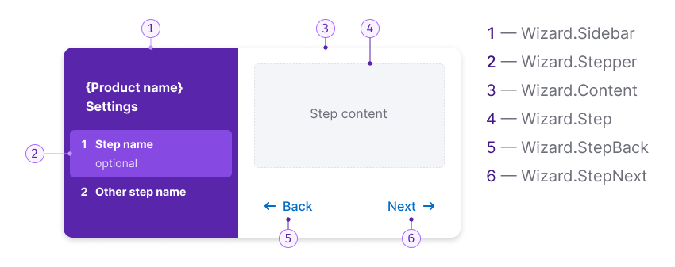
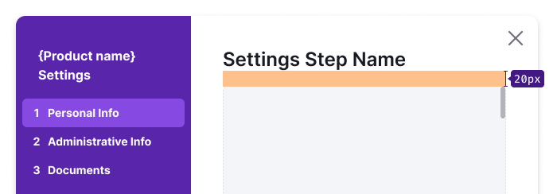
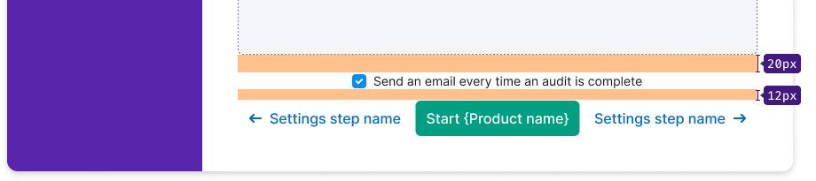
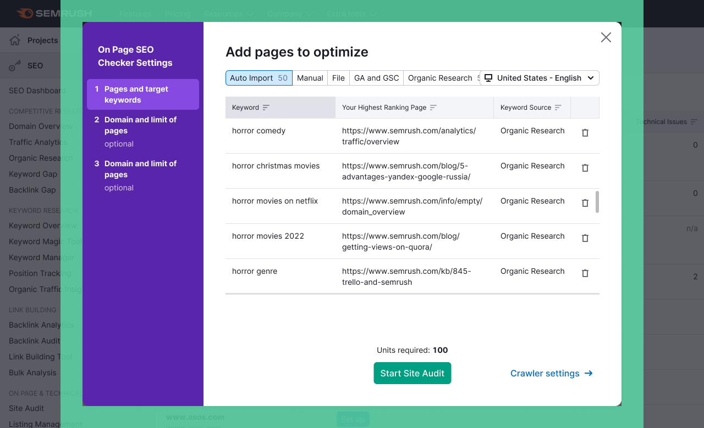

## Description

**Wizard** is a component that guides users through a series of predefined steps to complete a larger task. It simplifies complex tasks by breaking them down into manageable steps, reducing the perceived complexity.

### Usage recommendations

#### When to use wizard

- Use a wizard when dealing with large tasks that can't be simplified. Breaking them down into steps helps users focus on each part of the task.
- If a task requires a specific sequence of steps to be followed, a wizard ensures users don't miss important parts and make fewer mistakes.
- Wizards are suitable when a task involves three-five steps. For smaller tasks with just two steps or very large tasks with more than ten steps, consider alternative approaches and components.

#### When not to use wizard

- Avoid using wizards for educational purposes, as they focus on task completion rather than providing additional information for learning. Instead, use components like [FeaturePopover](/components/feature-popover/feature-popover), [Informer](../../patterns/informer/informer.md), [DesctiptionTooltip](../tooltip/tooltip.md), or videos for education.
- Advanced users may find predefined steps in a wizard restrictive. Consider using wizards for audiences that would benefit from step-by-step guidance.

## Component composition



Component consists of the following:

1. `Wizard.Sidebar`
2. `Wizard.Stepper`
3. `Wizard.Content`
4. `Wizard.Step`
5. `Wizard.StepBack`
6. `Wizard.StepNext`

## Appearance

### Stepper states

Table: Stepper states

| State    | Appearance example       | Styles                                                                                         |
| -------- | ------------------------ | ---------------------------------------------------------------------------------------------- |
| Normal   |    | `background-color: var(--control-primary-advertising)`, `border-radius: var(--rounded-medium)` |
| Hover    |     | `background-color: var(--control-primary-advertising-hover)`, `cursor: pointer`                |
| Active   |    | `background-color: var(--control-primary-advertising-active)`                                  |
| Disabled |  | Use `--disabled-opacity` token.                                                                |
| Checked  |   | The number changes to a `Check` icon with M size.                                              |

### Stepper styles

If a `Stepper` has optional text, it should have the following styles:

```CSS
color: var(--intergalactic-text-secondary-invert);
margin-top: var(--intergalactic-spacing-1x);
```

### Content area styles

#### Header margin



#### Footer margins

For basic controls use L size.



## Keyboard control

- When opening a Wizard, the focus should move to it.
- Users can move between interactive elements within the window using the `Tab` key.
- The Wizard can be closed with the `Esc` key.

When the Wizard closes, the focus should return to the page. Refer to [Accessibility](./wizard-a11y) guidelines.

## Wizard in Modal

For the Wizard displayed in a Modal, ensure the following styles:

```CSS
max-width: 980px;
max-height: 700px;
```


### Collapsing panel with steps on screen less than 1060px

Collapse the panel to 44px, leaving only the step numbers. When hovering a step number, show the name of the step.


### Placement

The scroll behavior inside and outside the window, the general rules for content, etc. are the same as for the [Modal component](/components/modal/modal).

Center the Wizard relative to the user's viewport. And leave margins of 40px outside the window.




## Usage in UX/UI

::: tip
For consistent user experience within products of the same platform, use a Wizard for setting up products.

In exceptional cases, steps can be placed in the content area of the page.
:::

Here are some scenarios where a universal solution is recommended:

### Form validation

After submitting a form, highlight all invalid inputs and focus on the first invalid input.

For more information about validation, refer to the [Validation](/patterns/validation-form/validation-form).


### Form loading error

If an error occurs on the backend while submitting a form, display the error message above the form.


### Sizes of form controls

In the form, use the same sizes for inputs and controls.


### Saving entered value

If data entered into the form by the user wasn't sent and the window is closed, save the entered data so that the user doesn't lose it.
