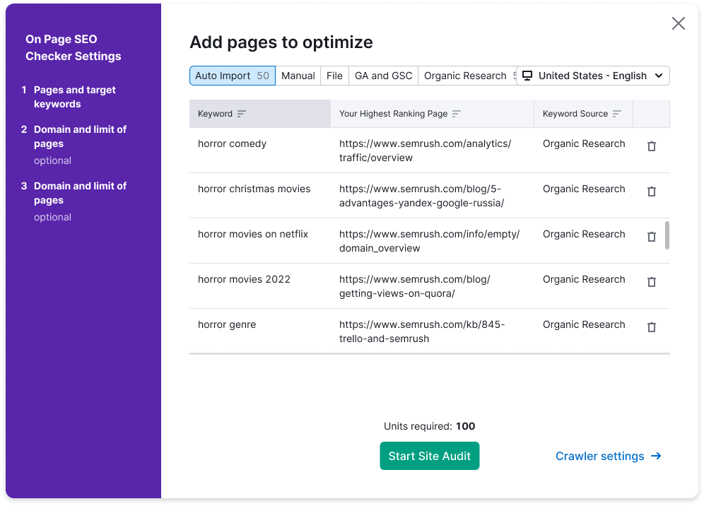
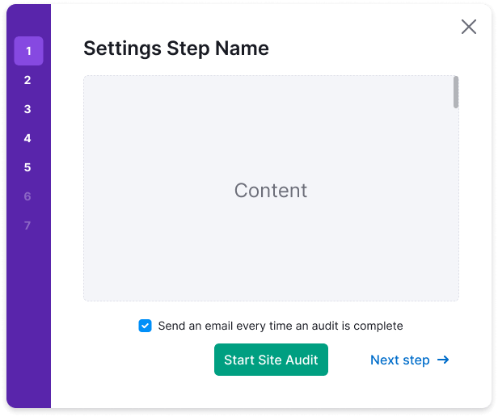
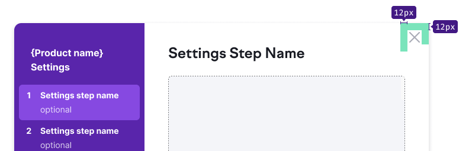
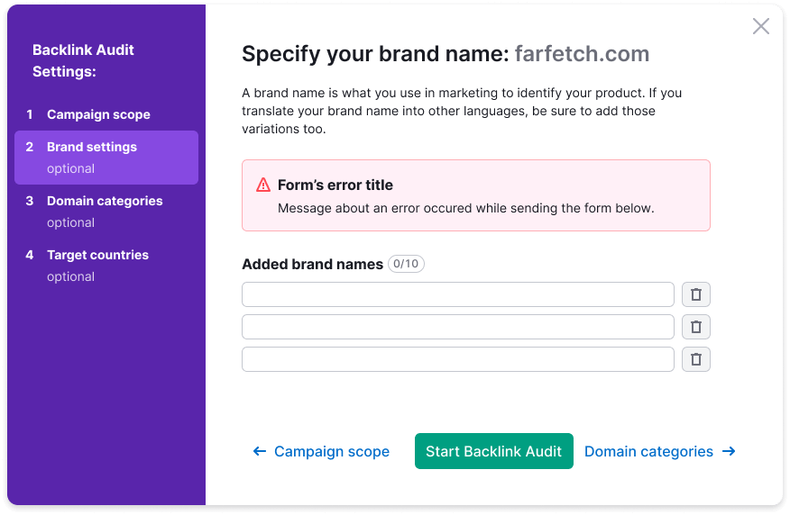

@## Description

**Wizard** is a component that guides the user through a set of predefined steps and helps to complete a large task.

_For example, set up and run a report, submit a very large form._

@## When to use wizard

- The task is very large and cannot be simplified. In this case, it needs to be broken down into several small steps. It is more convenient for the user to solve such problems gradually, focusing on each individual step. Breaking down a large task into steps reduces the perceived complexity of the task.
- A task has a predefined sequence of steps that the user must follow in order to complete it. In such cases, the user is unlikely to miss any important part and make fewer mistakes when performing the task.
- If the task has two steps, you hardly need a wizard. And if the task has 10 or more steps, perhaps you should think about simplifying it. Usually the optimal number of steps for a wizard is 3-5.

@## When do not use wizard

- You need to educate the user. Wizards do not help in user education, because they usually focus users on solving a large problem, rather than reading additional information. For learning, use other components - FeaturePopover, `Info` icons, pseudo links, videos, etc.
- If your audience is quite advanced and trained, they may not feel comfortable using a wizard with a predefined set of steps. Usually this applies to various kinds of IDE and graphic editors, for example.

@## Component composition


@## Appearance

Wizard has the following default styles.

### Sidebar styles

```
max-width: 220px;
padding: 40px 8px;
color: var(--white);
background-color: var(--violet-600);
font-size: var(--fs-300);
line-height: var(--lh-300);
font-weight: 700;
```


### Step styles


### Stepper styles

```
padding: 8px 12px;
color: var(--white);
font-size: var(--fs-200);
line-height: var(--lh-200);
font-weight: 700;
```


For optional text, use the following styles:

```
margin-top: 4px;
color: color-mod(var(--white) a(75%));
font-size: var(--fs-100);
line-height: var(--lh-100);
font-weight: 400;
```

If a stepper has a substep, it has the following styles:


@## Wizard in Modal

### Sizes

```
max-width: 980px;
max-height: 700px;
```




#### Collapsing panel with steps on screen less than 1060px

Collapse the panel to 44px, leaving only the step numbers. On hover per step, show the name of the step.




### Placement

The scroll behavior inside and outside the window, the general rules for content, etc. are the same as for the [Modal component](/components/modal/).

Center the Wizard relative to the user's viewport. And leave margins of 40px outside the window.


### Content area styles

```
padding: 40px;
background-color: var(--white);
color: var(--gray-800);
font-size: var(--fs-200);
line-height: var(--lh-200);
font-weight: 400;
```


### Header styles

```
margin-bottom: 20px;
color: var(--gray-800);
font-size: var(--fs-500);
line-height: var(--lh-500);
font-weight: 700;
```


#### Icon for closing window

The icon has L size and `--gray-300` color.

On hover, the color of the icon changes to the next one in the palette — `--gray-400`.



### Footer styles

```
margin-bottom: 20px;
color: var(--gray-800);
font-size: var(--fs-500);
line-height: var(--lh-500);
```

For basic controls use L size.


@## Interaction

There you can see default styles for stepper button.

| State    | Appearance example                                                                                | Styles                                                                                                                                         |
| -------- | ------------------------------------------------------------------------------------------------- | ---------------------------------------------------------------------------------------------------------------------------------------------- |
| normal   |                                                         | `background-color: var(--violet-600); border-radius: 6px;`                                                                                     |
| hover    |                                                          | `background-color: var(--violet-700); cursor: pointer;`                                                                                        |
| active   |                                                         | `background-color: var(--violet-500);`                                                                                                         |
| disabled |   | Use `--disabled-opacity variable`. When hovering on a button in this state, hang up a tooltip with a description of why this step is disabled. |
| checked  |                                                        | The number changes to a Check icon in size M.                                                                                                  |

@## Keyboard control

- When opening a wizard, the focus should move to it.
- You can move between the interactive elements of the window using `Tab`.
- You can close the window with `Esc`.

When the fullscreen modal closes, focus returns back to the page. See [Accessibility](/core-principles/a11y/).

@## Use in UI/UX

> For consistency of user experience within products of the same platform, use a wizard for setting a product.
>
> In exceptional cases, place steps in the content area of the page.

Here are some situations that should have a universal solution in all products.

### Form validation

After submitting the form, when validating the inputs, all invalid inputs are highlighted. And the first invalid input gets the focus.

For more information about validation, see the [Validation guide](/components/validation/).


### Form loading error

If some error occurred on the backend while submitting the form, show the error message above the form.



### Sizes of controls in the form

In the form, use the same sizes of inputs and controls.


### Saving the entered value

If the data entered into the form by the user was not sent, and the window was closed, save the entered data.

The user must not lose the previously entered values.

@page wizard-a11y
@page wizard-api
@page wizard-code
@page wizard-changelog
