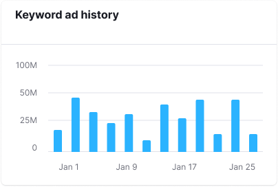
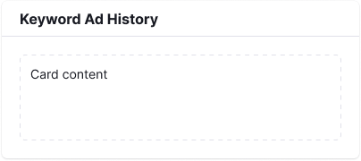
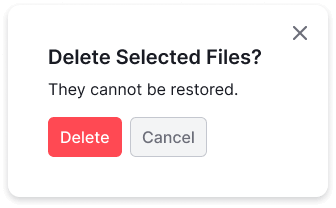
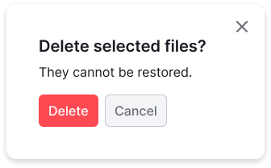
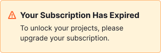
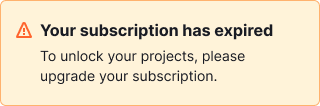
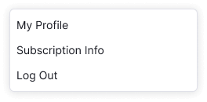
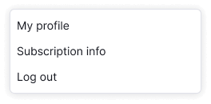
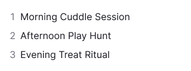
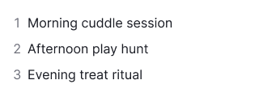

## Title case
With this type of case, all words are capitalized, except for minor words that aren't the first or last word of the title.

### Elements using “Title Case”
  * Page titles
  * Table titles
  * Graph titles
  * Widget/Card titles
  * Chart legends and axis descriptions
  * Tabs
  * Pills

<DosDonts>
    <template #dont>
        
    </template>
    <template #do>
        
    </template>
</DosDonts>

<DosDonts>
    <template #dont>
        
    </template>
    <template #do>
        
    </template>
</DosDonts>

### Words to capitalize
* Major words: nouns, verbs, adjectives, adverbs, pronouns, and all words of 4 letters or more
* The first word of a title or a subtitle
* The first word after a colon or em dash **in a heading**
* The second part of hyphenated major words
* The second part of phrasal verbs: Sign Up
* Team names, including the word “team”

### Words NOT to capitalize
* Articles (“the”, “an”, “a”)
* Prepositions
* Conjunctions (and, or, but)
* “To” in an infinitive
* “Report” and “tool” if they aren't part of the title

<DosDonts>
    <template #dont>
      
Sign up for Our Newsletter

      
Award-winning Platform

      
Contact Support team

      
Select A Custom Plan

      
Get Started With Semrush

      
Organic Positions Report

    </template>
    <template #do>
      
Sign Up for Our Newsletter

      
Award-Winning Platform

      
Contact Support Team

      
Select a Custom Plan

      
Get Started with Semrush

      
Organic Positions report

    </template>
</DosDonts>

## Sentence case
With this type of case, most words in a titles or headings are in lowercase. You should capitalize only:
* The first word of the title, heading, or subtitle
* Proper nouns

### Elements using “Sentence case”
* Modal window titles

<!-- vale DevDocs.Contractions = NO -->
<DosDonts>
    <template #dont>
      
    </template>
    <template #do>
      
    </template>
</DosDonts>
<!-- vale DevDocs.Contractions = YES -->

* Notice titles

<!-- vale DevDocs.Please = NO -->
<DosDonts>
    <template #dont>
      
    </template>
    <template #do>
      
    </template>
</DosDonts>
<!-- vale DevDocs.Please = YES -->

* Buttons

<DosDonts>
    <template #dont>
      
     </template>
    <template #do>
      
    </template>
</DosDonts>

* Field labels
* Checkboxes

<DosDonts>
    <template #dont>
      
      </template>
    <template #do>
      
    </template>
</DosDonts>

* Menus
* Dropdown items

<DosDonts>
    <template #dont>
      
    </template>
    <template #do>
      
    </template>
</DosDonts>

* Tags

<DosDonts>
    <template #dont>
      
    </template>
    <template #do>
      
    </template>
</DosDonts>

* Links

<DosDonts>
    <template #dont>
      
Contact Us

    </template>
    <template #do>
      
Contact us

    </template>
</DosDonts>

* Bulleted and numbered lists

<DosDonts>
    <template #dont>
      
    </template>
    <template #do>
      
    </template>
</DosDonts>

* Filter names (including filters in the report headers)
* Company business units (Marketing department, R&D unit)

