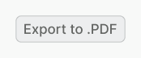
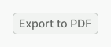

Use uppercase and no period in:
* buttons
* checkboxes
* radio buttons
* menu items

<DosDontsCopy>
    <template #dont>
        
.PDF, .CSS, .HTML

        
    </template>
    <template #do>
        
PDF, CSS, HTML

        
    </template>
</DosDontsCopy>

Use lowercase and specify a noun after the extension in **full sentences** in:
* tooltips
* notices
* messages

<DosDontsCopy>
    <template #dont>
        
Add a DOCX file.

        
Save your file in the pdf file format.

        </template>
    <template #do>
        
Add a .docx file.

        
Save your file in the .pdf file format.

    </template>
</DosDontsCopy>

