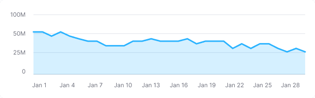
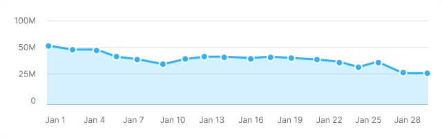
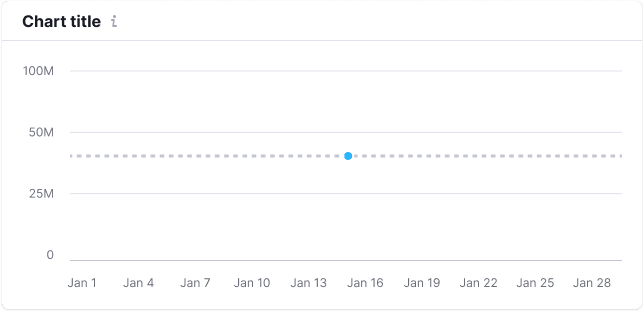
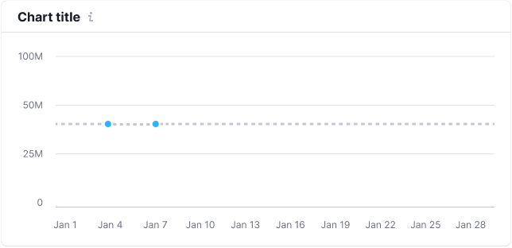
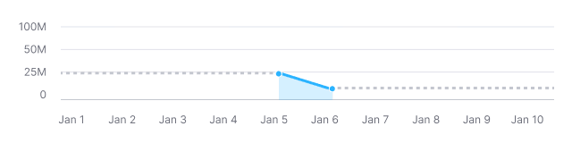
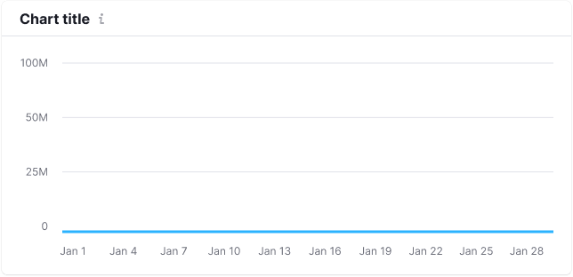
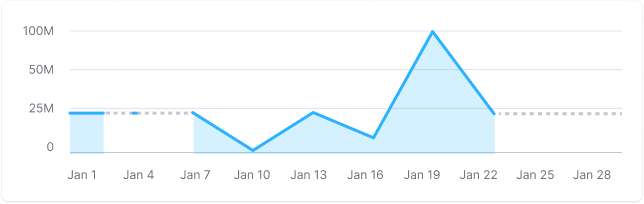
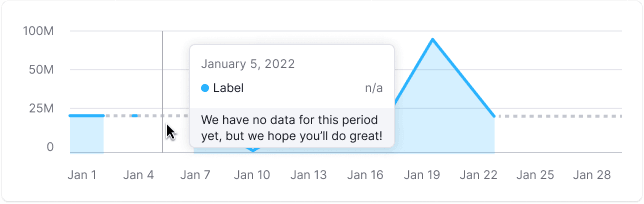
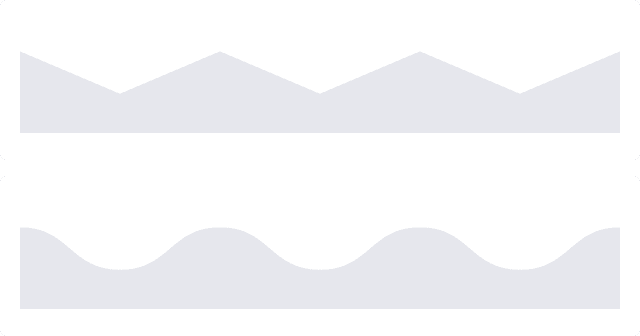

> 💡 Basic data visualization rules are described in the [Chart principles](/data-display/chart/).

@## Description

**Area chart** visualizes a trend and the ratio of numeric variables over a period of time. It can be used instead of [Line chart](/data-display/line-chart/) when it is important to demonstrate the ratio of parts to the whole.

**Important points to keep in mind when presenting data as an area chart:**

- A chart with areas shall be used when you need to show a larger picture of the data. _For example, line charts can be used to show the change in a population over time, while charts with areas are excellent for demonstrating the total volume of population over a time period._
- Try not to use too many categories (**it is not recommended to use more than 4 categories**). In such cases, it is better to use a line chart as it provides a cleaner and clearer data reading.
- Don't forget to clearly name the chart so that the axes are understandable enough.
- Use [Stacked area chart](/data-display/stacked-area-chart/) when, in addition to data amount, you need to display the part to the whole data.

> 💡 Useful materials about line chart vs. area chart:
>
> - [Choosing the right chart type: Line charts vs Area charts](https://www.fusioncharts.com/blog/line-charts-vs-area-charts/)
> - [The Fine Line In a Gray Area: When to Use Line vs Area Charts](https://visual.ly/blog/line-vs-area-charts/)

@## Appearance

By default, we show a chart with straight lines. This view facilitates reading the trend; this is what most people look at the chart for.

> 💡 Add a possibility to select either straight or smooth line type in the widget settings.

| Example                                             | Styles                                                                                                     |
| --------------------------------------------------- | ---------------------------------------------------------------------------------------------------------- |
|  | **Line thickness is 3px**. Background color under the line is the color of the line with 0.2 transparency. |

We recommend you to display the dots on lines either when there are few of them (one or two), or when data collection is irregular.

| Example                                  | Styles                                                                                                          |
| ---------------------------------------- | --------------------------------------------------------------------------------------------------------------- |
|  | Dot size is `8px * 8px`, `border: 2px solid var(--white)`. When hovering, the point increases to `12px * 12px`. |

@## Interaction

When user hovers over the chart area, show a vertical guide line at the nearest dot and a tooltip with detailed data for the dot appears next to it. The color of the vertical guide line is `--gray-300`.

> To see detailed information about tooltip for charts see [Chart principles](/data-display/chart/#ac9830) or [Line chart](/data-display/line-chart/).

@## Edge cases

Here you will find the states for one, two, zero values, etc. All other "empty states" for widgets are specified in [Error & n/a widget states](/components/widget-empty/).

@## One value

For this case enable the display of dots on the chart by default.

### Styles

- **Dot size is 8px \* 8px**. When hovering, the point increases to **12px \* 12px**.
- The line has the `dashed` border style and `--gray-200` color.

@## Two values

For this case enable the display of dots on the chart by default.

**Example 1** is for the case when there is data for two non-near dates.

**Example 2** is when there is data for one after another dates.

@## All values are null

If all values on the chart are zero, then show the trend line on the zero axis.

> **Zero is also data. 0 ≠ `n/a`.**

@## No data

> **When there is no data, you can't draw a zero line. Zero is also data. 0 ≠ `n/a`.**

In the area without data, show a dashed line between known dots. If the not available period is at the beginning or end of the chart, then the lines must be horizontal.

When user hovers over a dot without data, show the tooltip with the `n/a` value. We recommend you to add a message why there is no data, and when it will be available, if possible.

@## Initial data loading

When loading the chart for the first time, show [Skeleton](/components/skeleton/) instead of the chart.

If the chart has a title, show it during the loading. The user shall have an idea of what is being loaded and whether they need to wait for the loading process to complete.

More information about this state see in the guide for [Skeleton](/components/skeleton/).

@page area-chart-api
@page area-chart-d3-code
@page area-chart-recharts-code
