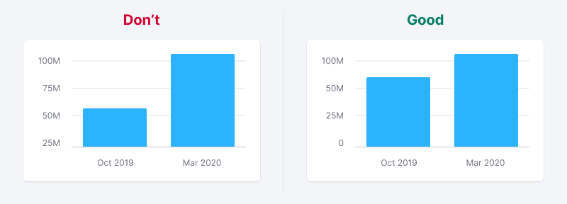

> 💡 Basic data visualization rules are described in the [Chart principles](/data-display/chart/).

@## Description

**Bar chart** is a method to visualize distribution of values by category for value comparison. A bar chart can be vertical or horizontal.

> 💡 **Difference from Histogram chart**
>
> Bar chart displays distribution of data sets by quality categories.
>
> Histogram charts are used to display distribution of data sets: how often values fall into quantitative ranges.

Important points to keep in mind when presenting data as a bar chart:

- Always start the Y-axis from zero.
- The axes should be clear to the user from the chart name. However, in cases where the graph name is not enough, you can denote the axes.
- Don't use too many colors to represent values. One color or shades of the same color shall be sufficient for your tasks. However, you can always select a value if necessary.

@## Appearance

If you have two values, you can place them next to each other — this makes it easier to track the trend of each of them. If there are more than two values, try to represent the data as a different chart type. For example, a stacked bar chart.

> 💡 It is recommended to make a minimum 20% margin between a group of columns. This is necessary so that the data does not turn into mush.

### Chart colors

Use [special chart palette](/style/color/) and follow the rules prescribed for it.

### Important moment

On the one hand, if the data refers to the same category, the values shall not have different colors.

On the other hand, color can focus attention on a specific portion of information. But it is practical only in some cases, when, for example, the size of the column may not be enough for visual selection.

@## Stacked bar chart

This type of bar graphs can be used if it is necessary to display more than two values and show the ratio of parts to the whole.

Important points to keep in mind when presenting data as a `stacked bar chart`:

- Use this chart type if you have more than two values to compare.
- Use this chart type to visualize the ratio of parts to the whole.
- Use sufficiently contrasting colors to show different parts more clearly.
- Don't make this chart too small in height and width – it will make it harder to read data inside such a chart.

@## Legend

If there is only one variable in the bar charts, the legend is not needed. It is enough to clearly name the chart. Denote the axes only in specific cases, when only one chart name is not enough.

| Vertical bar chart example             | Horizontal bar chart example                    |
| -------------------------------------- | ----------------------------------------------- |
|  |  |

> **Legend is required when there are two or more variables/categories in the bar chart.**

| Vertical bar chart example                                      | Horizontal bar chart example                                   |
| --------------------------------------------------------------- | -------------------------------------------------------------- |
|  |  |

### Trend

In some cases, a bar chart may have a trend line. Most often, this component overload such charts. However, in some cases, it can be useful for reading the overall trend.

Often, a trend line may be necessary on the `stacked bar chart`. **It allows us to focus on the total value of each point.**

When you hover over any part of the column, the tooltip shall display the values for all components and the total value.

@## Interaction

When you hover over a column, we highlight it with a grey background – `rgba 152 170 175, 0.3` (`$mist` with .3 opacity). The hover takes up half of the margin column on the right and left sides.

> 💡 If the column is clickable, the cursor must change to `pointer`.

@## Use in UX/UI

### Start the columns from zero

By comparing columns, we are actually comparing the length. If we do not start the scale from zero, there will be a visual illusion. Check out the charts below. In the wrong case, the scale does not start from zero, and it seems that the Y value is almost half as large as the X value. However, this is not true.

If the values are very large and close to each other, you may not see the difference in the columns. In this case, we recommend using a line chart. For such cases, you can add the possibility to switch the data display type from columnar to linear in the chart settings.

If the context and the audience's intelligence allow, you can display a comparison chart with some value on it (for example, with the average value). But this can be a difficult and hart-to-understand data visualization method.

### Sorting of columns

Keep in mind a reasonable order of magnitude when it is necessary. For example, from the largest value to the smallest one, and if they represent months - from January to December, etc.

### Big values (outliers)

In some cases some of the values in our data are very different from the majority of values. If you show this picture as it is, with a zero value on the Y-axis, then large values will draw all the attention to themselves, while the rest of the data will appear to be zero.

> 💡 **The column has a min-height of 2px.** It is necessary so that the column does not "disappear" if there are extremely large values next to it.

#### Solution options

**Recommended option. Make the scale not linear, but logarithmic.** In this case, the data will align with each other and remain comparable, and our outliers will still be the largest (although not so large). Our audience may not really understand this scale, but they will see a clear picture, and the exact values are always in the tooltip.

**The next option is to break the scale, showing the lower and upper parts.** The problem is that this gap is easily overlooked, and once noticed, it may appear incomprehensible. But the scale remains linear, with predictable curves on it.

> **[Article](https://tomhopper.me/2010/08/30/graphing-highly-skewed-data/) about other options and description of previous ones.**

If there are very large values, you may choose a different chart type which is better suited to your task. Perhaps your data is necessary to focus on these large values? Test, compare, and analyse! 😏

### Chart as a data entry point

Sometimes the chart displays overall picture, and detailed data can be viewed when interacting with it. There are two typical cases.

#### The detailed information is contained in another report

In this case, clicking on the column opens the corresponding report. In this case, the column must have the `hover` state. You can add the `Click to view details` text to the chart tooltip for clarity.

When hovering over, the column/columns are highlighted with grey background – `background-color: rgba(152, 170, 175, 0.3)`.

| Vertical bar chart example                     | Horizontal bar chart example                   |
| ---------------------------------------------- | ---------------------------------------------- |
|  |  |

#### The detailed information is contained in the table below

In this case, clicking on the date/column highlights the data for the information and switches the period in the table to the corresponding date.

When you hover over a clickable date, it changes color to `$white` and is highlighted with the background color `$mist`.

> 💡 **The selected date shall not have the `hover` state.**

| Vertical bar chart example                       | Horizontal bar chart example                          |
| ------------------------------------------------ | ----------------------------------------------------- |
|  |  |

@page bar-chart-vertical
@page bar-chart-horizontal
@page bar-chart-api
@page bar-chart-d3-code
@page bar-chart-recharts-code
