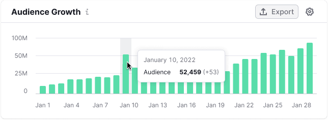
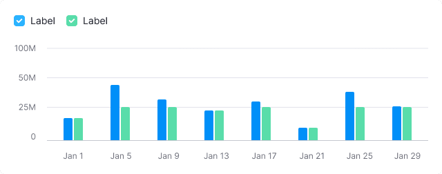
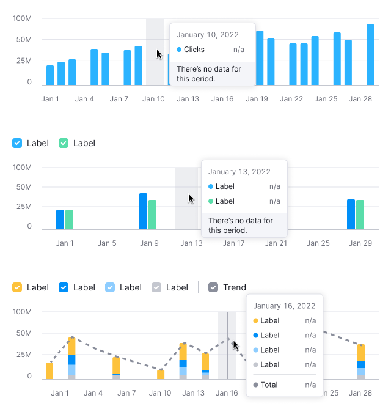
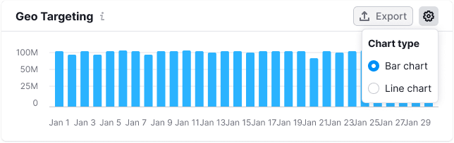

::: react-view

:::

::: info
Basic data visualization rules are described in the [D3 chart](/data-display/d3-chart/d3-chart).
:::

## Description

**Bar chart** visualizes distribution of values by time period or category for value comparison. A bar chart can be vertical or [horizontal](/data-display/bar-horizontal/bar-horizontal).

**Key tips for using bar chart:**

- Begin the Y-axis at zero to maintain scale integrity.
- Ensure the chart's axes are clear, adding labels if the title isn't descriptive enough.
- Use a single color or shades of one color for simplicity. Highlight categories only if needed.

::: tip
**Bar vs. Histogram Chart**

- Bar charts categorize data qualitatively, showing how different categories compare.
- Histograms organize data quantitatively, indicating how often values fall within certain ranges.
  :::

### When to use

- Use the bar chart when you need to focus on individual data points' values rather than tracking trends. For instance, when measuring a goal's achievement in a specific month or when analyzing audience fluctuations on specific days.
- Compare different categories against each other.

::: tip
Consider using the [horizontal bar chart](/data-display/bar-horizontal/bar-horizontal), as it makes it easier to fit category names within the bars.
:::

## Appearance

The upper part of the bar should have `border-radius: 2px`.

For the grouped bars maintain a 4px margin between them. Aim for at least a 20% margin between bars to avoid clutter.

For more than 3-4 categories, consider using the [stacked bar chart](/data-display/stacked-bar-chart/stacked-bar-chart) or other chart type to present the data. Additionally, consider allowing users to switch chart types in the widget settings.

### Chart colors

Stick to the [designated chart palette](/data-display/color-palette/color-palette) and ensure consistent color use. Colors can emphasize parts of the data, but be cautious not to overshadow other data points.

### Handling outliers

Significant value differences can skew perception. To balance this use a minimum bar height of 2px to keep small values visible alongside large ones.

Consider a logarithmic scale for a more uniform data comparison, especially with outliers.

Switch to another chart type if focusing on large values is more insightful.

::: tip
Explore alternative solutions for skewed data in the [article from Tom Hopper](https://tomhopper.me/2010/08/30/graphing-highly-skewed-data/).
:::

## Legend

Legend is unnecessary for a single-category bar chart; clear chart naming is usually enough.

Use legends for multiple categories.

## Trend

Trend lines can help identify overall patterns but may clutter simple charts. If used, ensure tooltips provide comprehensive value details.

## Interaction

Hovering highlights a bar with `--chart-grid-bar-chart-hover`, indicating focus or clickability. For trend lines, display corresponding points on hover.

Table: Bar chart interaction

| Categories count                  | Appearance example                                        |
| --------------------------------- | --------------------------------------------------------- |
| Chart with one category           |    |
| Chart with two or more categories |  |

::: tip
For detailed tooltip guidelines, see [Chart principles](/data-display/d3-chart/d3-chart#tooltip).
:::

## Edge cases

### One value

### Two values

### Null values

If all values on the chart are zero, display zero in the tooltips.

::: tip
Zero counts as data. 0 ≠ n/a.
:::

### No data

Do not display bars for data points without values. When hovering over such data points, show a tooltip with the "n/a" value. Additionally, consider adding a message explaining the absence of data and providing information on when it will be available (if possible).

## Initial data loading

Show [Skeleton](/components/skeleton/skeleton) during initial loading. If the chart has a title, display it to inform users about what's loading. Refer to [Skeleton](/components/skeleton/skeleton) for more details.

Use the `--skeleton-bg` color token for the skeleton's background.

## Usage in UX/UI

### Start the axes from zero

When comparing bars, we are actually comparing their lengths. If we don’t start the axis from zero, it creates a visual illusion. Take a look at the charts below. In the incorrect example, the axis doesn't start from zero, making it appear as though the value on the right is almost half as large as the value on the left. However, this is not accurate.

If the values are very large and close to each other, the difference between the bars may not be noticeable. In such cases, we recommend using a line chart.

For such cases, you can add the possibility to switch the data display from a bar chart to a line chart in the settings.

### Sorting of bars

Consider a logical order for the values on the axes. For instance, arrange them from the largest value to the smallest, or, if they represent months, from January to December, etc.

### Chart as an entry point

Sometimes, the chart provides an overall view, and detailed data can be accessed through interaction.

For example, clicking on a bar opens the corresponding report. The bar should have the `hover` state. For clarity, you can add a "Click to view details" message to the chart's tooltip.

Upon hovering, the bar or bars are highlighted with `--chart-grid-bar-chart-hover`.

