> 💡 Basic data visualization rules are described in the [Chart principles](/data-display/chart/).

@## Description

**Bar chart** visualizes distribution of values by category for value comparison. A bar chart can be [vertical](/data-display/bar-chart/) or horizontal.

> 💡 **Difference from histogram chart**
>
> Bar chart displays distribution of data sets by quality categories.
>
> Histogram charts are used to display distribution of data sets: how often values fall into quantitative ranges.

Important points to keep in mind when presenting data as a bar chart:

- The axes should be clear to the user from the chart name. However, in cases where the chart name is not enough, you can denote the axes.
- Don't use too many colors to represent categories. One color or shades of one color is enough. However, you can always highlight a category if necessary.

@## Usage

**Horizontal bars are best used when:**

- the names of compared categories of values are long (for example, names of countries);
- you need to compare more than 10 categories of values;
- you need to label value for each category to measure.

**Horizontal bars are not recommended when:**

- you need to display a trend (use [Line chart](/data-display/line-chart/) instead);
- you need to compare data for a certain period of time (use Vertical bar chart or [Line chart](/data-display/line-chart/) in this case);
- compare category values if they all add up to 100% (use [Donut chart](/data-display/donut-chart/)).

**Horizontal bars help you compare data in the following cases:**

- Distribution of different categories in a certain sequence. _For example, by reducing of their value._
- Compare different categories with each other if they have long names.

@## Appearance

### Horizontal bar chart

|                | Appearance example                          | Styles                                 |
| -------------- | ------------------------------------------- | -------------------------------------- |
| One category   | 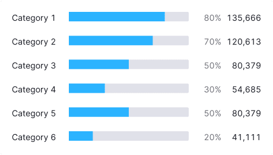  | `border-radius: 2px;`                  |
| Two categories | 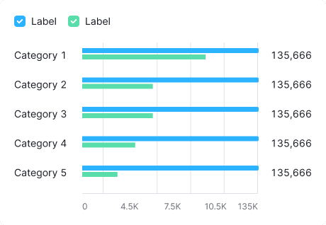 | The margin between two columns is 4px. |

> 💡 If there are more than 2-3 categories, use a [Stacked horizontal bar chart](/data-display/stacked-horizontal-bar/) or try to present the data using a different type of chart.
>
> It is also a good solution to allow users to switch the chart type in the widget settings.

@## Margins

| Description                                                                                                | Appearance example                         |
| ---------------------------------------------------------------------------------------------------------- | ------------------------------------------ |
| `margin: 8px 0px;`                                                                                         | 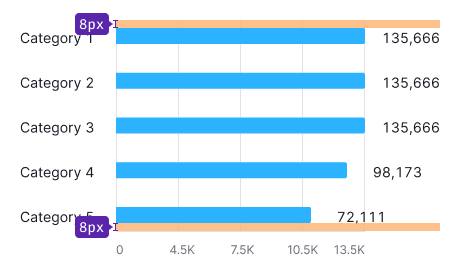 |
| The margin between categories and values on the Y-axis and bars is 16px. The margin between values is 8px. | 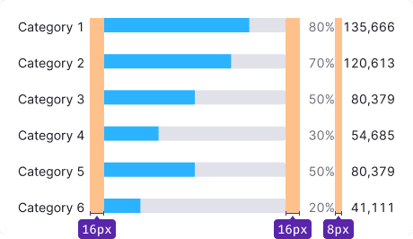 |
| The margin between categories shall be 20px minimum. Otherwise, the data becomes a mess.                   | 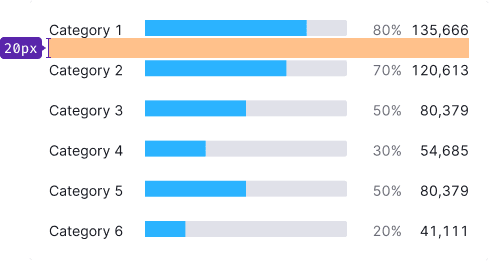 |

@## Grid and axes

### No grid and axes

If you need to demonstrate the ratio of the category value to 100%, don't use grid and axes.

### With grid and axes

If you do not need to present the ratio of values to 100%, but just to display their distribution, use the additional axes and the X-axis.

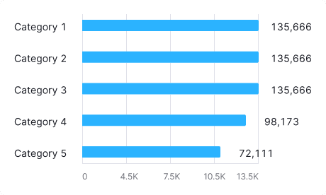

> 💡 Don't forget to provide space for category values in the right and left parts of the chart.

@## Labels of categories

- Unlike vertical chart, the Y-axis labels must have same color as the color of the main text – `--gray-800`.They are one of the main elements for "reading" data on this chart type.
- If the category label is too long, collapse into an `ellipsis`. By hovering over it, show the tooltip with the full category name.
- It is better to add the tooltip on the right or left side relative to the category label (so it will not labels of other categories).

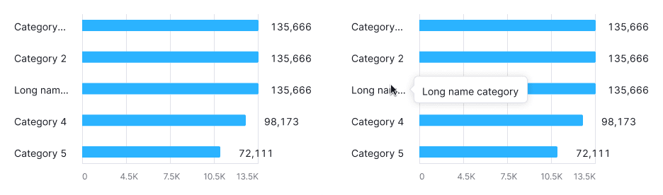

@## Interaction

When you hover over a column, we highlight it with `--gray-200` color with .3 opacity. The hover takes up half of the margin column on the right and left sides.

If the column is clickable, the cursor changes to `pointer`.

|                                   | Appearance example                                         |
| --------------------------------- | ---------------------------------------------------------- |
| Chart with one category           | 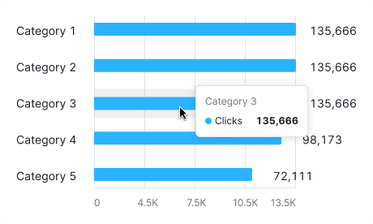                |
| Chart with two or more categories | 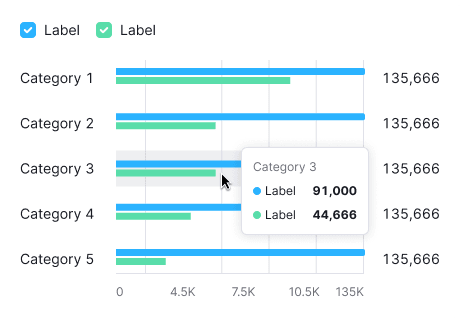 |

@## Edge cases

### No more results

Display message: "No more results" — below the values with a 32px margin.

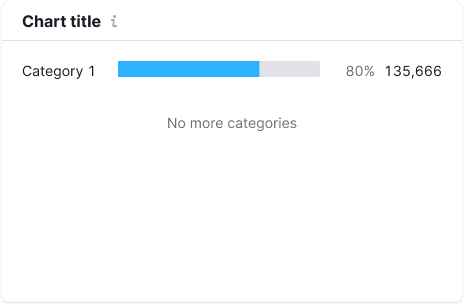

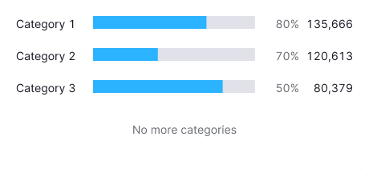

### Null values

If all the values on the chart are zero, then in the tooltip we shall display null all of them in the tooltips.

> 💡 **Zero is also data. 0 ≠ `n/a`.**

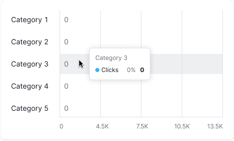

### Some dots have no data

Do not display bars without data.

When you hover over a dot without data, show tooltip with the `n/a` value. We also recommend you to add a message, which explains why there is no data, and when it will be available (if possible).

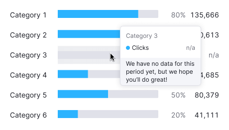

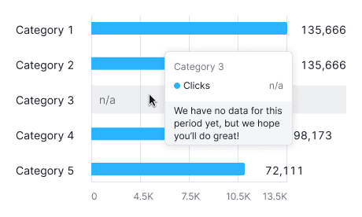

@## Initial loading

When loading the chart for the first time, show [Skeleton](/components/skeleton/) instead of the chart.

If the chart has a title, show it during the loading. The user shall have an idea of what is being loaded and whether they need to wait for the loading process to complete.

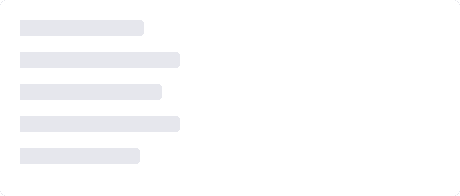

More information about this state see in the guide for [Skeleton](/components/skeleton/).

@page bar-horizontal-api
@page bar-horizontal-d3-code
@page bar-horizontal-recharts-code
