> 💡 Basic data visualization rules are described in the [Chart principles](/data-display/chart/).

@## Description

**Bar chart** is a method to visualize distribution of values by category for value comparison. A bar chart can be [vertical](/data-display/bar-chart/) or horizontal.

> 💡 **Difference from Histogram chart**
>
> Bar chart displays distribution of data sets by quality categories.
>
> Histogram charts are used to display distribution of data sets: how often values fall into quantitative ranges.

Important points to keep in mind when presenting data as a bar chart:

- Always start the Y-axis from zero.
- The axes should be clear to the user from the chart name. However, in cases where the graph name is not enough, you can denote the axes.
- Don't use too many colors to represent values. One color or shades of the same color shall be sufficient for your tasks. However, you can always select a value if necessary.

@## Usage

**Horizontal bars are best used when:**

- the names of compared values are long (for example, names of categories or countries);
- you need to compare more than 10 values;
- you need to denote value for each unit of measure.

**Horizontal bars are not recommended when:**

- you need to display a trend (use Line chart instead);
- you need to compare information for a certain period of time (use Vertical bar chart or [Line chart](/data-display/line-chart/) in this case);
- compare category values if they ALL ADD up to 100% (use [Donut chart](/data-display/donut-chart/)).

**Horizontal bars help you compare data in the following cases:**

- Distribution of different categories in a certain sequence. _For example, by reducing of their value._
- Compare different categories with each other if they have long names.

@## Appearance

### Horizontal bar chart

|                                                                                             | Apperance example                               | Styles                                                                                                                          |
| ------------------------------------------------------------------------------------------- | ----------------------------------------------- | ------------------------------------------------------------------------------------------------------------------------------- |
| One category                                                                                | 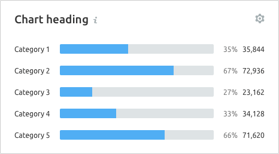  | `border-radius: 2px;`                                                                                                           |
| Two categories                                                                              | 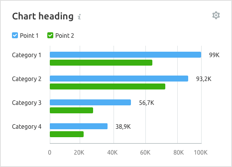 | The margin between two columns is 4px.                                                                                          |
| Two or more categories: use a different chart type. _For example, the stacked bar chart ☝🏻_ | 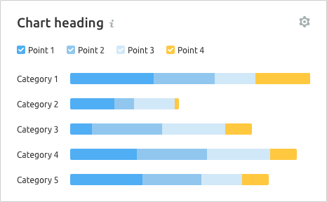    | The `stacked bar chart` has no margin between values inside the column. **Choose contrasting colors for different categories.** |

> 💡 If there are more than 2-3 categories, the researchers recommend using a stacked chart or try to present the data using a different type of chart.
>
> It is also a good solution to allow users to switch the chart type in the widget settings.

@## Margins

| Description                                                                                                                                                                                                                    | Apperance example                              |
| ------------------------------------------------------------------------------------------------------------------------------------------------------------------------------------------------------------------------------ | ---------------------------------------------- |
| For this type of chart, the upper margin is divided into two parts. The first 12px is the margin from the controls to the chart itself, the second 12px – is the margin inside the chart from the bar to the edge of the grid. | 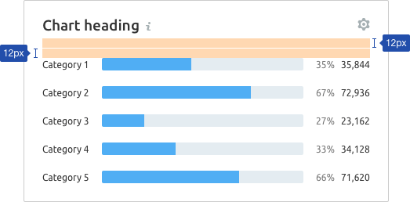 |
| The margin between categories and values on the Y-axis and bars is 16px. The margin between values is 8px.                                                                                                                     | 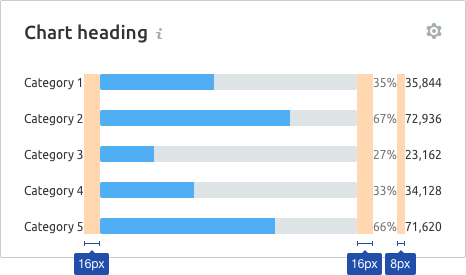 |
| The margin between categories shall be 20px minimum. Otherwise, the categories visually "stick together".                                                                                                                      | 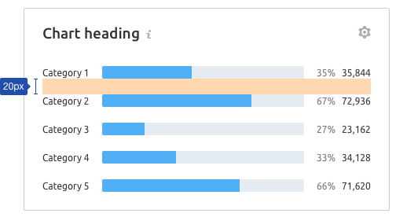 |

@## Grid and axes

### No grid and axes

If you need to demonstrate the ratio of the category value to 100%, no axes can be used in the chart. The values shall have presented the percentages they occupy.

### With grid and axes

If you do not need to present the ratio of values to 100%, but just to display their distribution, the additional axes and the X-axis can be used.

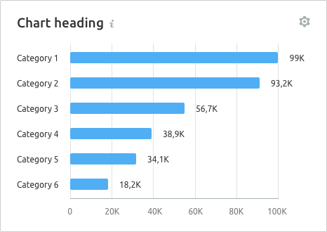

> 💡 Don't forget to provide space for category values in the right and left parts of the widget.

@## Labels of categories and values

- Unlike vertical chart, the Y-axis labels must have same color as the color of the main text – `$gray20`.
- They are one of the main elements for "reading" information by the values of this chart type.
- If the category label is too long, it collapses into an `ellipsis`. By hovering over it, we present the tooltip with the full category name.
- It is better to add the tooltip on the right or left side relative to the category label (it will overlap labels of other categories at the top or bottom).

@## Interaction

When you hover over a column, we highlight it with a grey background – `rgba 152 170 175, 0.3` (`$mist` with .3 opacity). The hover takes up half of the margin column on the right and left sides.

> 💡 If the column is clickable, the cursor must change to `pointer`.

If the chart has a trend line, then while hovering a line and a point shall be displayed on the trend line.

|                                                 | Appearance example                                             |
| ----------------------------------------------- | -------------------------------------------------------------- |
| Chart with one category                         | 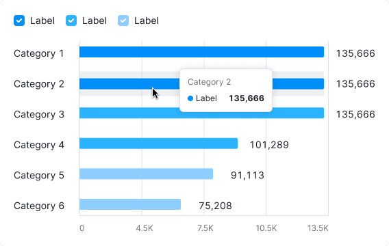                 |
| Chart with two or more categories               | 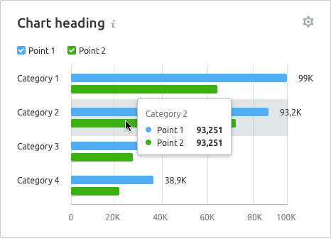 |
| Composed chart (Stacked bar chart + Line chart) | 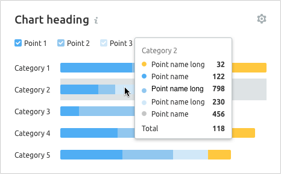                   |

@## Edge cases

### Data for categories 1-3

We display one or two columns, and type the text `No more results` below it in place of the other columns.

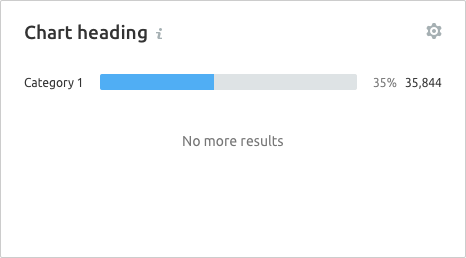

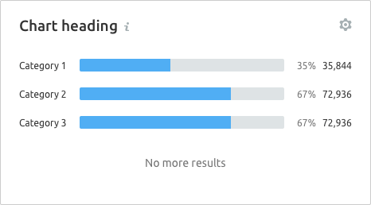

### All values are zero

If all the values on the chart are zero, then in the tooltip we shall display O for this point.

> 💡 **Zero is also data. 0 ≠ `n/a`.**

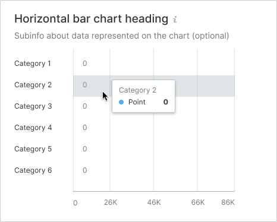

### A part of the chart contains no data

Do not display columns in the area without data.

When you hover over a category without data, the tooltip with the `n/a` value for the point shall appear. It is recommended to specify in the tooltip why there is no data, and when it will be available (if possible).

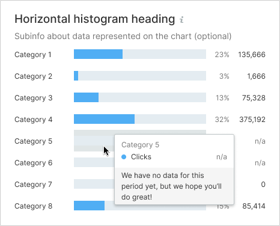

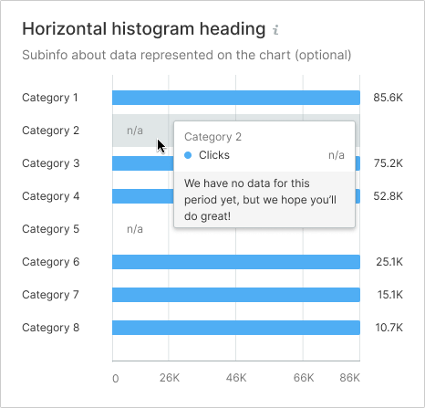

### Initial data loading

When loading the data for the first time, [Skeleton](/components/skeleton/) should be displayed instead of the chart. If the chart has a title, it should be displayed during loading. The user shall have an idea of what is being loaded and whether they need to wait for the loading process to complete.

Styles can be found in the guide book for [Skeleton](/components/skeleton/).

@page bar-horizontal-api
@page bar-horizontal-d3-code
@page bar-horizontal-recharts-code
