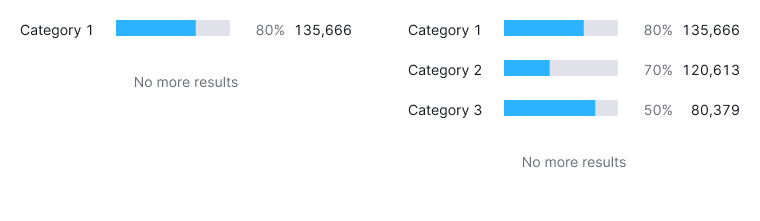
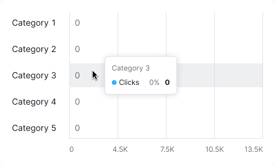

::: react-view

:::

::: tip
Basic data visualization rules are described in the [D3 chart](/data-display/d3-chart/d3-chart).
:::

## Description

**Horizontal bar chart** visualizes distribution of values by category for value comparison.

**Key points for using Horizontal bar chart:**

- Ensure the chart's axes are understandable. Label them if needed.
- Use simple color schemes. Highlight categories only when needed.

::: tip
**Bar vs. Histogram Chart**

- Bar charts categorize data qualitatively, showing how different categories compare.
- Histograms organize data quantitatively, indicating how often values fall within certain ranges.
:::

## Usage

**Use Horizontal bar chart when:**

- Categories have long names, like country names.
- Comparing less than 10 categories.
- Each category's value needs labeling.
- Showing category distribution in order.

**Use [Cigarette pack bar chart](/data-display/cigarette-pack/cigarette-pack) instead of Horizontal bar chart when:**

- Categories have or may have in localization long names.
- Interface is narrow, and you need to preserve horizontal space for other information.

**Avoid using Horizontal bar chart when:**

- Displaying trends (use [Line chart](/data-display/line-chart/line-chart)).
- Showing data over time (use [Bar chart](/data-display/bar-chart/bar-chart) or [Line chart](/data-display/line-chart/line-chart)).
- Categories add up to 100% (use [Donut chart](/data-display/donut-chart/donut-chart)).

## Appearance

For the grouped bars maintain a 4px margin between them. Aim for at least a 20% margin between bars to avoid clutter.

For more than 3-4 categories, consider using the [Stacked horizontal bar chart](/data-display/stacked-horizontal-bar/stacked-horizontal-bar) or other chart type to present the data. Additionally, consider allowing users to switch chart types in the widget settings.

### Margins

Ensure clear margins for readability and to avoid clutter, such as 8px top and bottom and 16px between category labels and bars.

Table: Margins for Horizontal bar chart

| Description                                                                                                | Appearance example                         |
| ---------------------------------------------------------------------------------------------------------- | ------------------------------------------ |
| `margin: 8px 0px`                                                                                          |  |
| The margin between categories and values on the Y-axis and bars is 16px. The margin between values is 8px. |  |
| The margin between categories shall be 20px minimum. Otherwise, the data becomes a mess.                   |  |

## Grid and axes

### No grid

Omit grid and axes when showing category values as a percentage of 100.

### With grid

Use axes and grids for displaying distribution without percentage constraints.

::: tip
Allocate space for category labels on both sides of the chart.
:::

## Category labels

- Y-axis labels use the primary text color (`--text-primary` token).
- Use `ellipsis` for long labels, with tooltips showing the full name.

## Legend

Legend is unnecessary for a single-category bar chart; clear chart naming is usually enough.

Use legends for multiple categories.

## Interaction

Hovering highlights a bar with `--chart-grid-bar-chart-hover`, indicating focus or clickability. The hover takes up half of the bars margin on the top and bottom sides.

Table: Horizontal bar chart interaction

|                                   | Appearance example      |
| --------------------------------- | ----------------------- |
| Chart with one category           |  |
| Chart with two or more categories |  |

## Edge cases

### No more results

Show "No more results" with a 32px margin below values and text with `--text-secondary` color.

### Null values

If all values on the chart are zero, display zero in the tooltips.

::: tip
Zero counts as data. 0 ≠ n/a.
:::

### No data

Do not display value inside the bar for data points without values. When hovering over such bars, show a tooltip with the "n/a" value. Additionally, consider adding a message explaining the absence of data and providing information on when it will be available (if possible).

## Initial data loading

Show [Skeleton](/components/skeleton/skeleton) during initial loading. If the chart has a title, display it to inform users about what's loading. Refer to [Skeleton](/components/skeleton/skeleton) for more details.

Use the `--skeleton-bg` color token for the skeleton's background.

Refer to [Error & n/a widget states](/components/widget-empty/widget-empty) for all other "empty states".

## Usage in UX/UI

See detailed information in the [Bar chart guide](/data-display/bar-chart/bar-chart#usage-in-ux-ui).
