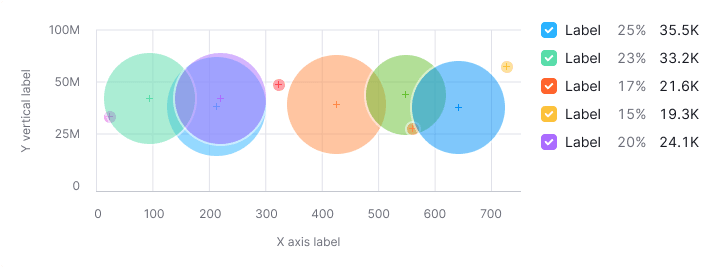
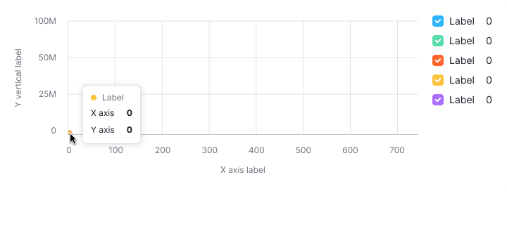

> 💡 Basic data visualization rules are described in the [Chart principles](/data-display/chart/).

@## Description

A **bubble chart** visualizes relationships between data categories using proportions, colors, and positioning on a coordinate axis. This chart type helps you analyze patterns between datasets.

It allows to visualize up to 3-4 parameters for datasets. A bubble chart is a mix between a scatterplot chart and a proportional area chart.

As the documentation for [Microsoft Office](https://en.wikipedia.org/wiki/Microsoft_Office) explains, "You can use a bubble chart instead of a scatterplot chart if your data has three data series that each contain a set of values. The sizes of the bubbles are determined by the values in the third data series.".

**Use the bubble chart, when you need to visualize:**

- patterns between data categories.
- the third or fourth dimension of the data (the size and color of the bubbles, respectively).

> 💡 A bubble chart is a variation of a scatterplot chart, but with one or two additional dimensions added to the data (the size and color of the circles, respectively).
>
> **Note that the more colors you use for the categories, the harder it will be to read the chart.**

@## Appearance

**A bubble plot chart must contain:**

- vertical lines (in addition to horizontal);
- labels for the X and Y axes (don't color them, as this makes the chart harder to read);
- a legend if the dataset has different categories, each with a different color.

> 💡 Make sure to add information on what the bubble size means.

| Case             | Appearance example                                     | Styles                             |
| ---------------- | ------------------------------------------------------ | ---------------------------------- | ----------------------------------------------------------------------------------------------------------------------------------------------------------------------------------------------------------------------------------------------------------------------------- |
| One dataset      |       |                                    | The default color for the category is `--blue300` with 50% transparency. If necessary, you can select any other color from the chart palette. A bubble always has a 2px white stroke. The center of the bubble is marked with a cross in the same color as the circle itself. |
| Several datasets |  | Use colors from the chart palette. |

### Text labels for bubbles

If you need captions for bubbles (in addition to the legend), show captions to the right or left of the bubble.

**Keep in mind that adding such captions to a data-dense chart can make the chart hard to read.**

@## Legend

- If there are multiple datasets in the chart, show the legend. Provide values for each dataset.
- We recommend using the vertical legend. It makes categories and their meaning easier to read.

@## Interaction

- When hovered, a bubble changes its opacity to 80%, and the tooltip displays the values for this bubble.
- If by clicking on the bubble you can go somewhere or open an additional report, then the cursor must change into a `pointer`.

@## Tooltip

Show the following values in the tooltip for this chart type:

- the value for the point on the X axis;
- the value for the point on the Y axis.
- sometimes it is necessary to show a third value for a bubble, which affects its size (this may be the difference between the axes, or there may be a different value).

**In the tooltip, focus on values rather than axis names or data categories.**

If you have several datasets on the chart, then it is important to show their color in the tooltip. Sometimes it is necessary to show a third value for a bubble, which affects its size (this may be the difference between the axes, or there may be a different value).

| Case             | Appearance example                                                                                    |
| ---------------- | ----------------------------------------------------------------------------------------------------- |
| One dataset      |                                                          |
| Several datasets |   |

@## Bubbles intersection

For this type of charts, we do not show values for the intersection of categories. On hovering over a specific circle, we show the values for that circle only.

@## Edge cases

| Case                                   | Description                                                                                                                                                                                                       | Appearance example                                                    |
| -------------------------------------- | ----------------------------------------------------------------------------------------------------------------------------------------------------------------------------------------------------------------- | --------------------------------------------------------------------- |
| Outliers                               | To prevent small values from being lost under the large ones (outliers), the bubble has a minimum size — 11px \* 11px.                                                                                            |   |
| Data values are null                   | If all the values on the chart are zero, display them at the origin of the grid. For cases where you compare multiple datasets, show the values for each dataset in the legend. **Zero is also data. 0 ≠ N / A.** |                   |
| No data for some points (n/a)          | Don't show points without data on the chart. For cases where you compare multiple datasets, show the values for each dataset in the legend.                                                                       |               |
| A point is very close to the axis/axes | Cut the bubbles next to the X and Y axes under the axes.                                                                                                                                                          |                              |
| First time loading                     | Show the skeleton state. If the chart has a title, it should be displayed while the chart is loading. The user must understand what exactly is being loaded and whether they should wait for it.                  |                        |

@## UI/UX use

### Subheading with additional information

> 💡 Accompany the bubble chart with additional information on what determines the size of the circles.

### Axes

- Label both the X and Y axes.
- Don't color the axis labels — this makes your chart harder to read.

### Chart size

Don't place bubble charts in a small widget (the medium size of the usual small widget in our products).

The data will be difficult to read and compare.

### Number of datasets

> 💡 The more datasets you cram into your scatterplot chart, the harder it is to read.

@page bubble-chart-api
@page bubble-chart-d3-code
