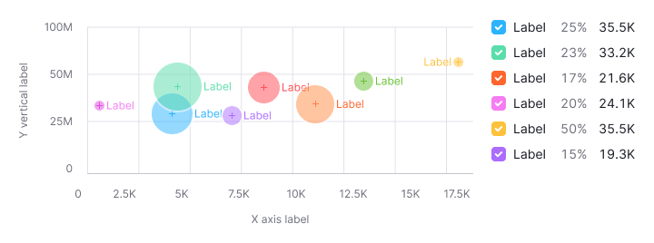
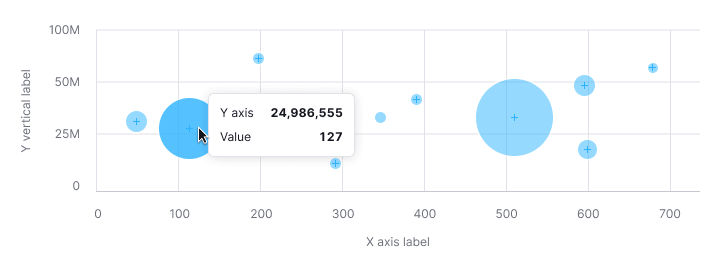

::: react-view

:::

::: info
Basic data visualization rules are described in the [D3 chart](/data-display/d3-chart/d3-chart).
:::

## Description

**Bubble chart** shows data relationships using size, color, and position on axes. It's useful for spotting data set patterns and can display up to 3-4 variables. A bubble chart is a mix between a scatterplot chart and a proportional area chart.

**When to use bubble chart:**

- To visualize patterns and relationships in data.
- To show data dimensions using bubble size and color.

::: tip
Bubble charts add dimensions to scatterplots. Not that they can become cluttered with more than 3-4 sets.
:::

## Appearance

Bubble chart plot must has:

- Both vertical and horizontal lines.
- Clear X and Y axis labels.
- A legend for different categories if they vary in color.

::: tip
Make sure to clarify what the bubble size means.
:::

Table: Bubble chart styles

| Case             | Appearance example                                     | Styles                                                                                                                                                                                                                                                                                                           |
| ---------------- | ------------------------------------------------------ | ---------------------------------------------------------------------------------------------------------------------------------------------------------------------------------------------------------------------------------------------------------------------------------------------------------------- |
| One data set      |       | The default color for the category is `--chart-palette-order-blue` (or `--blue-300`) with 50% transparency. If necessary, you can select any other color from the [chart palette](/data-display/color-palette/color-palette). A bubble always has a 2px white stroke. The center of the bubble is marked with a cross in the same color as the circle itself. |
| Several data sets |  | Use colors from the [chart palette](/data-display/color-palette/color-palette).   |

### Text labels for bubbles

Use captions for bubbles sparingly to avoid clutter, especially on dense charts.

::: tip
Remember to check contrast for the text labels. We don’t recommend to use light colors from the palette for the Bubble chart data. Use colors with 400 shade and higher from the [color palette](/data-display/color-palette/color-palette), they have the minimum necessary contrast with the white background.
:::

## Legend

- Add a legend for multiple data sets, with clear values for each.
- A vertical legend layout is preferred for easier reading and values comparing.

## Interaction

- Bubbles increase opacity to 80% on hover, displaying specific values.
- The cursor changes to a `pointer` for clickable bubbles.

## Tooltip

Tooltips should show:

- X-axis and Y-axis values.
- Additional values influencing bubble size.
- Focus tooltips information on values, incorporating colors for multiple data sets.

Table: Bubble chart tooltips

| Case             | Appearance example       |
| ---------------- | ------------------------ |
| One data set      |  |
| Several data sets |  |

### Bubbles intersection

Only show values for the hovered bubble, not intersections.

## Edge cases

### Outliers 

To prevent small values from being lost under the large ones (outliers), the bubble has a minimum size – 11px by 11px.

 

### Null values

Zero values are displayed at the origin, with legend reflecting zero data.

::: tip
Zero counts as data. 0 ≠ n/a.
:::

 

### No data

Omit points without data on the chart and reflect this in the legend.

### Bubbles near axes

The chart will scale automatically if the bubble is near the axes.

## Initial data loading

Show [Skeleton](/components/skeleton/skeleton) during initial loading. If the chart has a title, display it to inform users about what's loading. Refer to [Skeleton](/components/skeleton/skeleton) for more details.

Use the `--skeleton-bg` color token for the skeleton's background.         

Refer to [Error & n/a widget states](/components/widget-empty/widget-empty) for all other empty states.

## Usage in UX/UI

### Additional information

Accompany the chart with details on what influences bubble size.

### Axes

Label both the X and Y axes. Avoind coloring the axis labels, this can make the data harder to read.

### Chart size

Avoid placing bubble charts in small widgets to ensure data is readable and comparable.

### Data sets number

Limit the number of datasets to maintain chart readability.

