> 💡 General information on data visualization is presented in [Data Visualization](/data-display/data-visualization/).

@## Control types

By their effect on the widget data the controls located next to the chart can be of the following types:

- general widget controls;
- controls above the chart.

@## General widget controls

General widget controls are always placed on the same level as the title. For example these include:

- widget settings;
- chart display settings (smooth or sharp line, points or no points);
- screenshots settings, etc.

|                        | Apperance example                                                                    | Styles                                                                                                                                                                                                                                                                              |
| ---------------------- | ------------------------------------------------------------------------------------ | ----------------------------------------------------------------------------------------------------------------------------------------------------------------------------------------------------------------------------------------------------------------------------------- |
| Widget settings        | 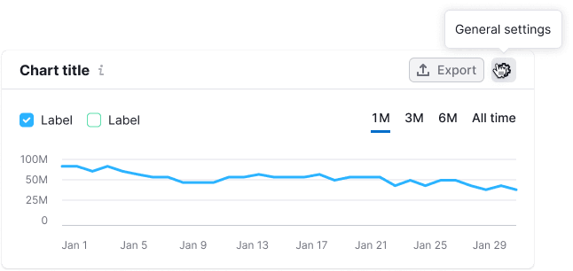                                               | Icon `SettingsS`, color - `$stone`. When adding other settings controls to the settings icon, put a 1px separator between them, the color is `$gray80` – `padding: 0px 16px`. When you hover over the settings icon, a tooltip with description for the control shall be displayed. |
| Chart display settings | 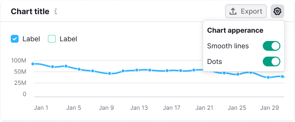 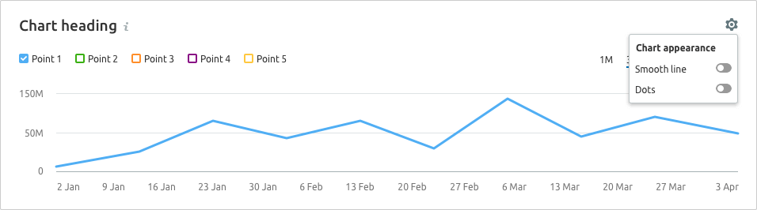 | Icon `SettingsS`, color - `$stone`. When adding other settings controls to the settings icon, put a 1px separator between them, the color is `$gray80` – `padding: 0px 16px`. When you hover over the settings icon, a tooltip with description for the control shall be displayed. |

@## Controls above the chart

As a rule, these are the controls that make effect upon the displayed data, axes, and some controls shown below. As well as derivatives of such controls.

### Controls on the left relative to the chart

- Legend;
- Country select;
- Device (text or [Select](/components/select/));
- Other controls. For example, a campaign selector in Brand Monitoring, a comparison selector in Sensor, or other text information (for example, Chart scope);
- Notes ([Notes module](/data-display/notes/)).

#### Legend

We use several types of legends in our charts. Styles for each of them are available in [Chart legend](/data-display/chart-legend/).

> The priority legend location is top left - above the chart. For charts with a large number of controls, place the legend in the left bottom part under the graph.

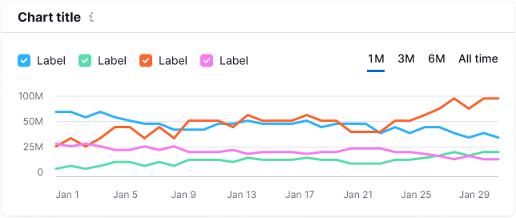

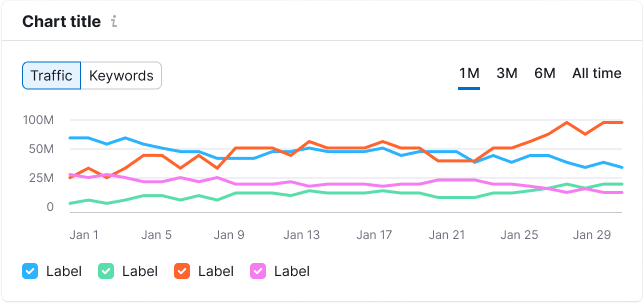

#### Country and device select

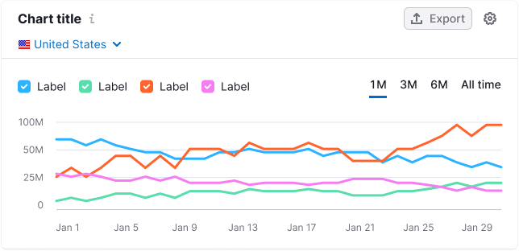

#### Notes (Notes module)

You can display notes made by the user, system, or other services on the chart. To read more about this tool, see [Notes](/data-display/notes/).

#### Other controls

This group of controls includes all other controls and their combinations. _For example, a campaign selector in Brand Monitoring, a comparison selector in Sensor, or other text information (for example, Chart scope)._

### Controls on the right side relative to the chart

- Period (text or [Pills](/components/pills/)) and custom period;
- Data frequency ([Pills](/components/pills/));
- Zoom controls.

#### Data period / frequency

This control can be represented either by the [TabLine](/components/tab-line/) component or by grey text with the `$gray60` colour.

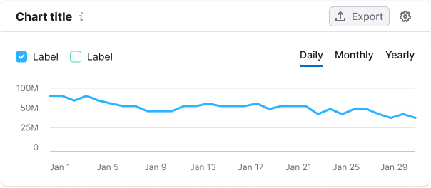

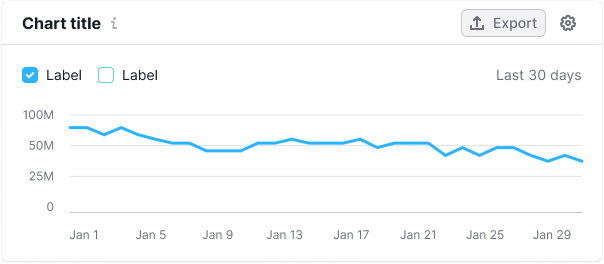

#### Custom period

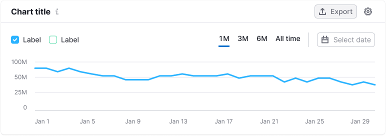

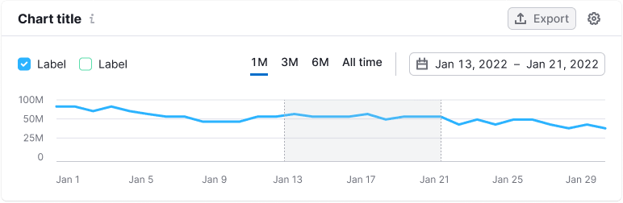

#### Data frequency (daily/weekly/monthly)

#### Chart with a zoom

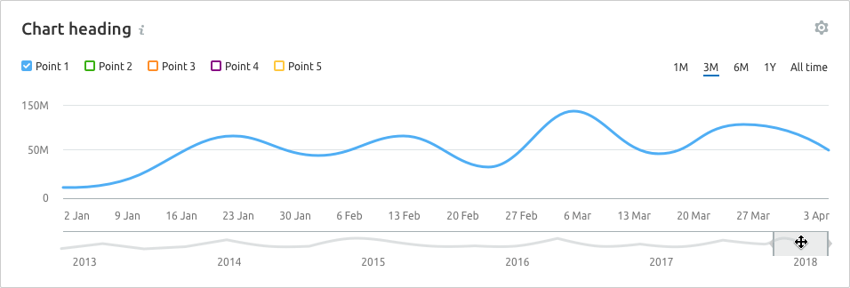

@## Collapsing rows with controls

You can collapse rows if necessary.

Separate different controls/groups of controls with a 1px separator of the color `$gray80` with `padding: 0px 16px`.

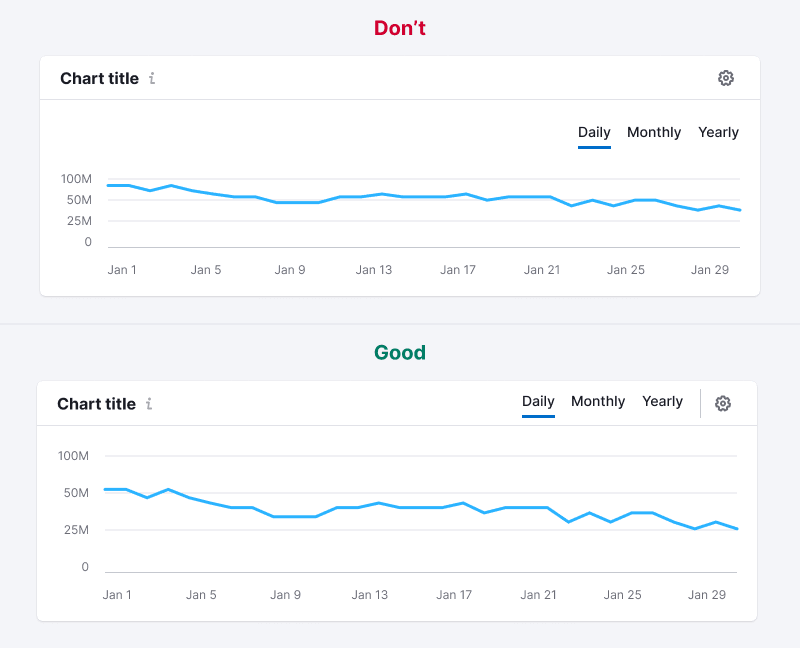

@page chart-control-code
