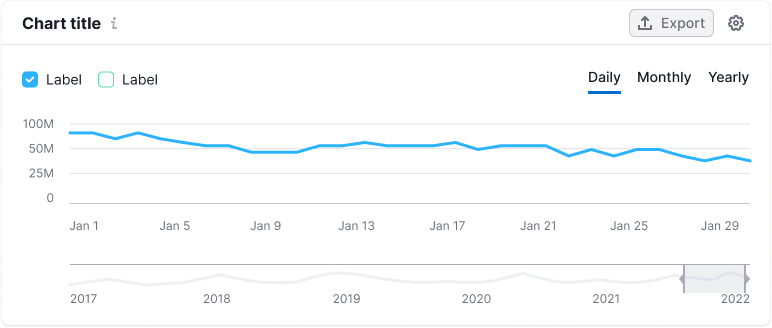

::: tip
Basic data visualization rules in widgets with charts are described in [D3 chart](/data-display/d3-chart/d3-chart).
:::

## Control types

The widget's controls can be categorized into the following types:

- General controls and filters
- Chart controls

## General controls

General controls and filters are always positioned at the same level as the title and include options such as:

- Widget settings
- Chart display settings (smooth or sharp lines, dots or no dots)
- Screenshot settings, and so on.

For widget settings, use a button with `use="tertiary"` and `theme="muted"`. Remember to add tooltips to all the buttons without visible text.

## Chart data controls

These controls filter the data, axes, and additional controls as described below:

### Left-placed controls and filters

- Legend
- Country select
- Device (use [Select](/components/select/select) or plain text)
- Notes (refer to [Notes module](/data-display/notes/notes))

#### Legend

We use various types of legends in our charts. Refer to the [Chart legend](/data-display/chart-legend/chart-legend) guide for more details.

::: tip
We recommend placing the legend at the top left, above the chart. For charts with numerous filters, position the legend at the bottom left, under the data.
:::

#### Country and device select

#### Notes (Notes module)

You can display user, system, or other service-generated notes on the chart. To learn more about this module, refer to [Notes](/data-display/notes/notes).

### Right-placed controls and filters

Always place these controls on the right side of the widget:

- Period (use [Pills](/components/pills/pills) or plain text) or a custom period
- Data frequency (use [Pills](/components/pills/pills))
- Zoom controls

#### Data period / Frequency

The data period can be represented either by the [TabLine](/components/tab-line/tab-line) or additional text with the `--text-secondary` color.

#### Custom period

For custom periods, use the [DateRangePicker](../../components/date-picker/date-picker#daterangepicker).

#### Data frequency (Daily/Weekly/Monthly)

#### Chart with a zoom

## Merging controls

You can merge rows with controls as needed. Different controls or control groups should be separated by a [Divider](/components/divider/divider) using the `--border-secondary` token for color and a margin of 0px 16px.

