> 💡 General information on data visualization is presented in [Data Visualization](/data-display/data-visualization/).

@## Description

**Legend** is a block that helps the user navigate the data presented on the chart.

> **For most charts, the legend's priority position is in the top left part of the chart.**

For charts with a large number of controls, place the legend in the left bottom part under the graph.

@## Legend types

The legend can be clickable or non-clickable (static).

The following are the examples of using different types of legend in widgets with graphs.

@## Clickable legend

A [group of checkboxes](/components/checkbox/) with specified colors is most often used as a clickable legend. [Radio buttons](/components/radio/) are used infrequently.

| Component                                     | Apperance example                                                                                      | Styles                                                                                                                    |
| --------------------------------------------- | ------------------------------------------------------------------------------------------------------ | ------------------------------------------------------------------------------------------------------------------------- |
| Checkbox                                      | 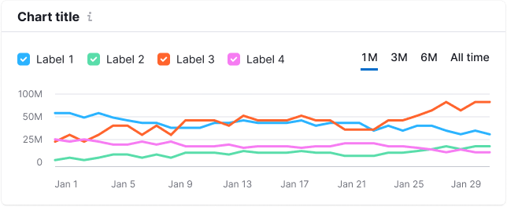 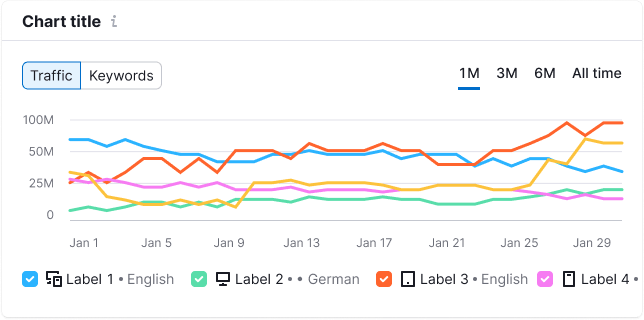            | Checkbox size M, `$gray20`, `text-padding: 4px;`, Icon size XS, additional information and counter — text 12px, `$gray60` |
| Checkbox with icon                            | 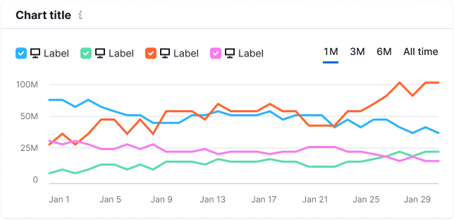                                                           |                                                                                                                           |
| Checkbox with icon and additional information | 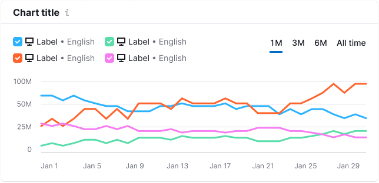 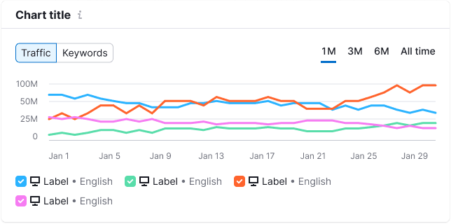 |                                                                                                                           |
| Checkbox with counter                         | 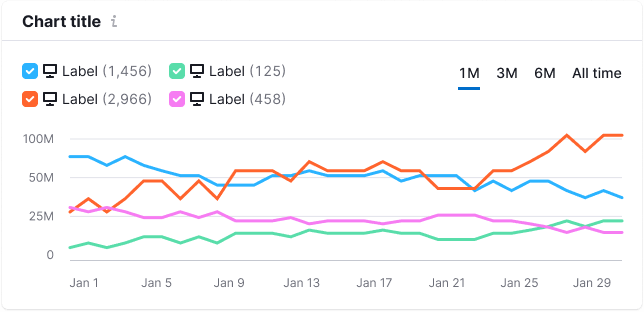                                                        |                                                                                                                           |
| Radio button                                  | 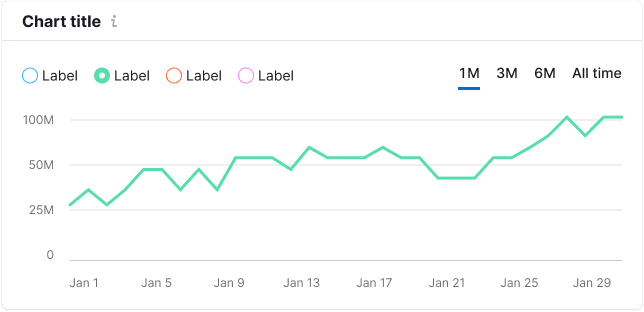                                                                      | Radio size M, `$gray20`, `text-padding: 4px;`                                                                             |

@## Legend with trend/average value

For the trend or average value in the legend, use the `--var(wall)` color for the checkbox. At the same time, we must separate it from the main legend with a [divider](/components/divider/) with `margin: 0 16px`.

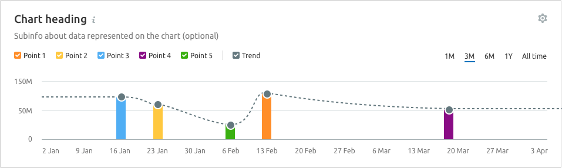

@## Non-clickable legend (static)

A static legend is a circle of the same size as the checkbox in the clickable legend. This legend does not disable the lines on the chart.

| Component               | Apperance example                        | Styles                                                                        |
| ----------------------- | ---------------------------------------- | ----------------------------------------------------------------------------- |
| Static circle with text | 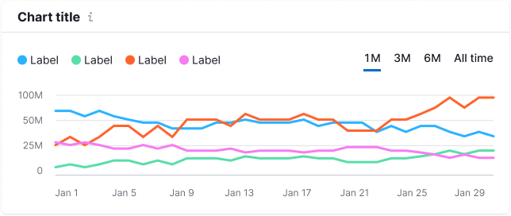 | Size — `12px * 12px`, text 12px (`--fs-100`), `$gray20`, `text-padding: 4px;` |

@## Interaction

When you hover over the checkbox in the legend, the line increases (`stroke-width` changes from 3 to 5).

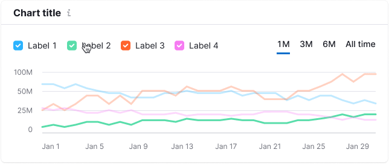

@## Disabled legend

If you disable all legend checkboxes, the chart should display the X-axis.

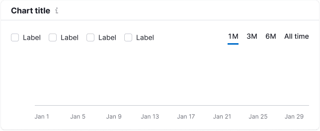

@page chart-legend-api
@page chart-legend-code
