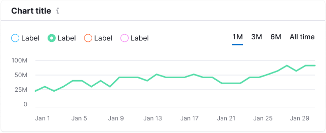

> 💡 Basic data visualization rules in widgets with charts are described in [Chart principles](/data-display/chart/).

@## Description

**Chart legend** helps a user read the data presented on the chart.

1. Legend items can be controls ([checkboxes](/components/checkbox/) or [radio](/components/radio/) buttons) or non-interactive markers. The marker colors match the data on the chart. In addition to the marker and text label, the legend item can also contain an icon and/or counter.
2. If there is only one data set on the chart, then do not display the legend — the purpose of the data should be clear from the chart context: chart title, description, etc.
3. **The margin between the legend items is 16px.**
4. If legend items are too long, move them to the second row. The spacing between the rows is 8px.

> **The recommended placement of the legend is the top left position above the chart.** However, in some cases (for example, two charts under each other with one hover, or a lot of filters over the chart), place the legend to the left bottom under the chart.

@## Legend types

The legend can be interactive or non-interactive.

@## Interactive legend

For an interactive legend use a group of [checkboxes](/components/checkbox/) or [radio buttons](/components/radio/) with specified colors.

| Component                                     | Apperance example                                                                                      | Styles                                                                                                                                                 |
| --------------------------------------------- | ------------------------------------------------------------------------------------------------------ | ------------------------------------------------------------------------------------------------------------------------------------------------------ |
| Checkbox                                      |              | Checkbox has M size. Text has 14px size (`--fs-200`) and `--gray-800` color.                                                                           |
| Checkbox with icon                            |                                                            | Icon has M size and usually `--gray-800` color.                                                                                                        |
| Checkbox with icon and additional information |   | Icon has M size and usually `--gray-800` color. For an additional information and counter use text with 14px size (`--fs-200`) and `--gray-500` color. |
| Checkbox with counter                         |                                                         | For a counter use text with 14px size (`--fs-200`) and `--gray-500` color.                                                                             |
| Radio button                                  |                                                                       | Radio has M size. Text has 14px size (`--fs-200`) and `--gray-800` color.                                                                              |

@## Non-interactive legend

A non-interactive legend is a colored circle with a label. This legend does not disable/enable the lines on the chart.

| Apperance example                                   | Styles                                                                                 |
| --------------------------------------------------- | -------------------------------------------------------------------------------------- |
|  | Circle has `12px * 12px` size. Text has 14px size (`--fs-200`) and `--gray-800` color. |

@## Trend/average value in the legend

To show the trend or average value in the legend, use the `--gray-400` color. At the same time, we must separate it from the main legend with a [divider](/components/divider/) with `margin: 0 16px`.

@## Interaction

By hovering on the checkbox, highlight the data on the chart by changing the transparency of the lines to 30% for the rest of the data categories.

If some data is already disabled in the legend, then this data remains disabled while hovering on the legend.

@## Disabled legend

If you disable all legend checkboxes, the chart should display the X-axis.

@page chart-legend-api
@page chart-legend-code
