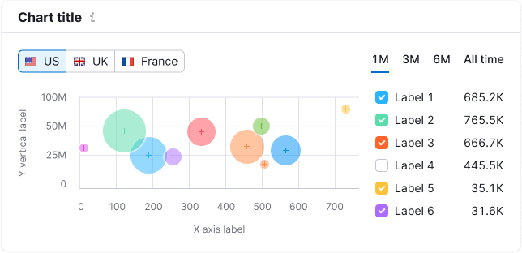

::: react-view

:::

::: tip
Basic data visualization rules in widgets with charts are described in [D3 chart](/data-display/d3-chart/d3-chart).
:::

## Description

**Chart legend** is a component that helps a user read the data presented on the chart.

Add legend to the chart if there are more than one data set. If there is only one data set on the chart, then don’t display the legend: in this case the purpose of the data should be clear from the chart context: chart title, description, etc.

## Component composition

Component consists of the following elements:

1. `ChartLegend.LegendItem`
2. `ChartLegend.LegendItem.Shape`
3. `ChartLegend.LegendItem.Label`

Optionally you can add the following to the LegendItem:

- Leading Icon
- Additional label
- Counter

## Placement

The recommended placement of the legend is the top left position above the chart.

### Other placement options

In some cases, you can position the legend either below the chart on the left or to the right of the chart. Here are examples and some possible scenarios:

Table: Chart legend placement examples

| Placement | Appearance example  | Examples of cases |
| --------- | ------------------- | ----------------- |
| right     |   | When the chart is compact and doesn't take up much space or when you want to display legend items in a list for value comparisons. |
| bottom    |   | For instance, when there are multiple filters above the chart or when the chart adapts for smaller screens. |

## Legend items

Legend items can be either interactive or static. Use `Checkbox` for interactive legend items and choose from a list of default SVG shapes (`Circle`, `Square`, `Line`) for static legend items. You can also set a custom shape if needed.

The colors of the checkboxes or shapes correspond to the data on the chart.

All legend items use `--text-primary` token for color of the text label.

Table: Legend item shapes

| Shape property           | Appearance example                   |
| ------------------------ | ------------------------------------ |
| `Checkbox` (interactive) |              |
| `Circle` (static)        |  |
| `Square` (static)        |  |
| `Line` (static)          |    |

### Optional legend item elements

A legend item can include an icon, additional text, a counter, or a combination of these.

Table: Optional legend item elements

| Element       | Appearance example    | Styles   |
| ------------- | --------------------- | -------- |
| Leading icon  |       | Icon has M size and `--icon-non-interactive` color.   |
| Additional information |  | For additional information, use text with 14px size (`--fs-200`) and `--text-secondary` token for color. |
| Counter      |    | For a counter, use text with 14px size (`--fs-200`) and `--text-secondary` token for color.  |

Example of a combination of the elements above:

## Trend and average value

To display the trend or average value in the legend, use the `withTrend` property. It adds checkbox with [Divider](/components/divider/divider) to separate trend from the main legend.

Similarly, you can display total values. Dots on the line are optional.

## Interaction

Hovering over a LegendItem can highlight the corresponding data on the chart by reducing the transparency of other data categories to 30%.

If some data is already disabled in the legend, it should remain disabled while hovering.

## Disabled legend

When all legend items are disabled, the chart should display the X-axis.

