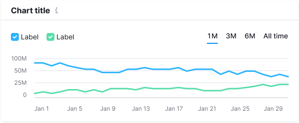
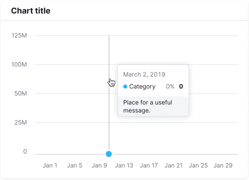
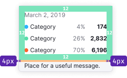
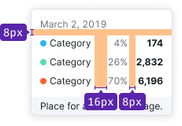
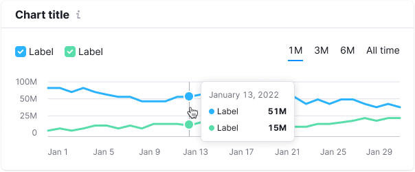
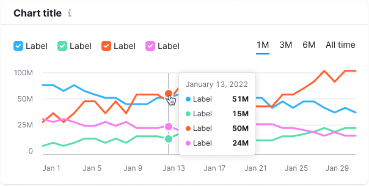
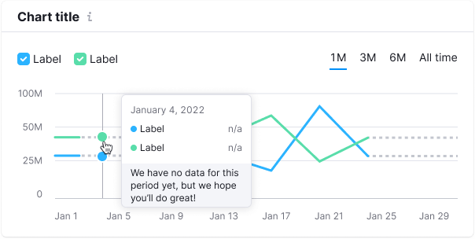
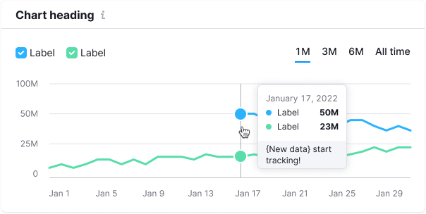

@## Chart widget anatomy

In our interfaces, data is usually placed in [Card](/components/card/), which consists of:

1. **Header:**

   1. Title (`margin-bottom: 8px;`)
   2. Additional information under the heading (`margin-bottom: 8px;`) — _optional_
   3. General widget controls (export or view settings, etc.) — _optional_

2. **[Divider](/components/divider/)**

3. **Body:**

   1. Top controls (filters, buttons, etc.) — _optional_
   2. Chart — axes, values and chart itself (`margin-top: 20px;`)
   3. Bottom controls (`margin-top: 20px;`) — _optional_

> Optional elements mean that their presence depends on the case you are solving in your interface.

@## Card header

### Title

**The chart shall have a title** which briefly and clearly indicates what data is shown on the chart. If the chart belongs to a table or report's [Summary](/patterns/summary/), and the title is far from the chart, then keep an eye on the margins between widgets. The user shall clearly understand what data is on the chart.

The title can be clickable.

Place M size [Info](/style/icon/) icon next to the title.

| Appearance                           | Styles                                                                                                                                                                                                                                                              |
| ------------------------------------ | ------------------------------------------------------------------------------------------------------------------------------------------------------------------------------------------------------------------------------------------------------------------- |
|  | For chart title use 16px text (`--fs-300`, `--lh-300`, `font-weight: bold;`) and `--gray-800` color. M size`Info` icon has `--gray-300` color and `margin-left: 4px`. `Hover` state for the clickable title matches the [styles for link hover](/components/link/). |

### Description

**The header may have a description text.** It usually contains information about maximum/minimum data statuses or explanation of what the data is based on, etc. Or some interesting insight/advice for the visualized data.

| Appearance                             | Styles                                                                              |
| -------------------------------------- | ----------------------------------------------------------------------------------- |
|  | For description text use 14px text (`--fs-200`, `--lh-200`) and `--gray-500` color. |

@## Chart controls

For detailed information about chart controls, see [Chart controls](/data-display/chart-controls/).

@## Collapsing rows

You can collapse card rows if necessary. See more information in the [Chart controls](/data-display/chart-controls/#adbaac) guide.

@## Legend

**Legend** is an additional visual information that explains the data on the chart.

The legend can work as a filter or be unclickable representation of the data. For more information about the legend and its types, see [Chart legend](/data-display/chart-legend/).

@## Grid and axes

**Axes** help user navigate the data and relate values to each other.

> 💡 Please don't make the additional lines bright and colored — the emphasis should be on the data, not on the grid.

- The **Y axis** is hidden by default.
- The color of additional axes is `--gray-100`.
- Color of the X axis and additional active lines on the grid (if needed) — `--gray-200`.
- Left and right margin to the Y axis values is 16px.
- `margin-top` of the X axis values is 12px.

### Minimum and maximum number of axes

To make it easier to track changes, use 3-5 additional horizontal guides. Round the values on the axes, like _25K − 20K − 15K − 10K_, instead of using exact values like _24.8K − 20.0K − 15.2K − 10.2K_.

> 💡 **The recommended minimum height of the chart is 118px.** For such a chart, it is recommended to display 3 additional horizontal guides. Keep in mind that it can be difficult to read changes on the charts that has such small height.

Minimum (small) chart height has 3 additional horizontal guides.

**The maximum height of the chart is up to your case.** For high-height charts, use no more than 5-6 additional horizontal guides.

@## Tooltip

When hovering over any part of the chart, show a tooltip with data for the dot or dots.

The tooltip is displayed even for the dots with no data. In this case, we show `n/a` instead of the value and recommend adding a note about the forecast.

The tooltip appears next to the cursor. It is always located inside the chart container. _In other words, if the dot is near the upper or lower border of the chart area, the tooltip will position within the chart area._

- The tooltip shows data for all the lines for the selected date.
- For tooltip title use the date or data category name. For easy comparison, the values shall be right-aligned.
- The tooltip can contain the total value.
- If several charts have the same timeline under each other, then they can be synchronized — when you hover over one of the charts, the hover is triggered on the other. This is quite useful for comparing data.

> As a rule, we do not put the measurement unit for the values inside the tooltip (it should be clear from the chart name and the axes). However, in some complex charts such as scatterplot, a measurement unit can be added to make data reading more easy.

### Styles

The data tooltip shall always be displayed relative to the dot with an 8px margin.

| Appearance                                                                                      | Styles description                                                                                    |
| ----------------------------------------------------------------------------------------------- | ----------------------------------------------------------------------------------------------------- |
|   | The inner tooltip padding is 12px.                                                                    |
|                                                                 | The color for the additional vertical line that appears on line charts when hovering is `--gray-300`. |
|                                                                 | The background color that appears on bar charts is `--gray-200` with .3 opacity.                      |

### Cases

| Case                     | Appearance                               | Styles description                                                                                                                                          |
| ------------------------ | ---------------------------------------- | ----------------------------------------------------------------------------------------------------------------------------------------------------------- |
| One dot                  |          | The default dot size is `12px * 12px` (plus a 2px border). The size of the dot in a hoiver state is `16px * 16px`.                                          |
| Several dots             |        |
| Not available data       |    | Use a dashed line to show not available data.                                                                                                               |
| Start of data collecting |  | Solid line, color of the dot corresponds to the legend. In the tooltip, the text about the beginning of data collection is 12px and has `--gray-300` color. |

@## Trend and average value
To display the trend line or average value on the chart, use gray color with styles: `border: solid 2px var(--gray-400)`. Similarly, we can display total values.

- Dots on the line are optional.
- The legend must have a checkbox for the trend line. On the charts, the universal color for the checkbox is `var(--gray-400)`.

@## Data loading

During initial data loading, the widget displays the [Skeleton](/components/skeleton/) instead of the chart.

If the chart has a title, it should be displayed during the initial loading. The user shall have an idea of what is being loaded and whether they need to wait for the loading process to complete.

> 💡 Note that every chart has it's own skeleton. For more information see guides for every chart type.

@## Edge cases

The particular edge cases differ for different chart types, so see them in the documentation for specific chart you need.

General rules of "empty" states for widgets with charts are described in [Error & n/a widget states](/components/widget-empty/).

@page chart-code
