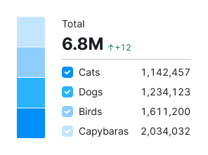
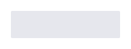

::: info
Basic data visualization rules are described in the [D3 chart](/data-display/d3-chart/d3-chart).
:::

## Description

**Cigarette bar chart** shows parts of a whole by dividing a bar into proportional segments. Each segment represents a fraction, and the entire bar represents the total sum, always equaling 100%. Basically it serves the same function as [Donut chart](/data-display/donut-chart/donut-chart) does.

**Key points for using Cigarette bar chart:**

- Cigarette bar charts are best for highlighting category proportions, not exact values.
- It can only show a few values clearly. With more values, segments become too small to be effective. For more than 5 categories, consider another chart type, like a [Bar chart](/data-display/bar-chart/bar-chart).

## Appearance

The gap between values is 1px. Border-radius for the whole bar is 2px (`--intergalactic-chart-rounded`).

### Layout

Chart can be displayed using horizontal or vertical layout.

- For the horizontal layout values are displayed from left to right.

- For the vertical layout values are displayed from bottom to top.

## Legend

- Keep the legend close to the chart, ideally within a 24px margin.
- Legends have a 16px margin-right and a 12px margin between values.
- Align the legend with the chart's top.

## Total value

- You can place the largest or total value next to the chart.
- Always name the value.

### Styles

- Use 24px (`--fs-500`) size, `--bold` font-weight and `--text-primary` color for the value text.
- For the description text use 12px (`--fs-100`) size and `--text-secondary` color.
- Center them inside the chart vertically and horizontally.

## Interaction

When hovering over a sector, it increases by 2px.

For a clickable sector the cursor changes to `pointer`.

## Edge cases

### Null values

Show zeros in the legend but not on the chart. Show 0 as the values in the legend, use `--text-secondary` color.

### Value less than or equal 1%

Show as 1% on the chart.

### No data

Mark data as n/a in legend and tooltip, use `--text-secondary` color.

## Initial data loading

Show [Skeleton](/components/skeleton/skeleton) during initial loading. If the chart has a title, display it to inform users about what's loading. Refer to [Skeleton](/components/skeleton/skeleton) for more details.

Use the `--skeleton-bg` color token for the skeleton's background.

Refer to [Error & n/a widget states](/components/widget-empty/widget-empty) for all other empty states.
