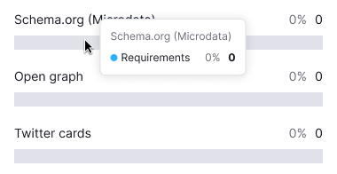

::: tip
Basic data visualization rules are described in the [D3 chart](/data-display/d3-chart/d3-chart).
:::

## Description

**Cigarette pack bar chart** visualizes the distribution of values by category for a part-to-whole comparison.

## Usage

**Use Cigarette pack bar chart instead of [Horizontal bar chart](/data-display/bar-horizontal/bar-horizontal) when:**

- Categories have or may have in localization long names.
- Comparing less than 10 categories.
- Interface is narrow, and you need to preserve horizontal space for other information.

**Avoid Cigarette pack bar chart when:**

- Displaying trends (use [Line chart](/data-display/line-chart/line-chart)).
- Showing data over time (use [Bar chart](/data-display/bar-chart/bar-chart) or [Line chart](/data-display/line-chart/line-chart)).

## Appearance

## Grid and axes

This chart type does not need a grid.

## Category labels

- Labels use the primary text color (`--text-primary` token).
- Use `ellipsis` for long labels, with tooltips showing the full name.

## Legend

Legend is unnecessary for a single-category bar chart; clear chart naming is usually enough.

For the case with multiple categories, add a legend.

## Interaction

Hovering highlights a bar with `--chart-grid-bar-chart-hover`, indicating focus or clickability. The hover takes up half of the bars margin on the top and bottom sides.

## Edge cases

### No more results

Show "No more results" with a 32px margin below values and text with `--text-secondary` color.

### Null values

If all values on the chart are zero, display zero in the tooltips.

::: tip
Zero counts as data. 0 ≠ n/a.
:::

### No data

Do not display value inside the bar for data points without values. When hovering over such bars, show a tooltip with the "n/a" value. Additionally, consider adding a message explaining the absence of data and providing information on when it will be available (if possible).

## Initial data loading

Show [Skeleton](/components/skeleton/skeleton) during initial loading. If the chart has a title, display it to inform users about what's loading. Refer to [Skeleton](/components/skeleton/skeleton) for more details.

Use the `--skeleton-bg` color token for the skeleton's background.

Refer to [Error & n/a widget states](/components/widget-empty/widget-empty) for all other "empty states".

## Usage in UX/UI

See detailed information in the [Bar chart guide](/data-display/bar-chart/bar-chart#usage-in-ux-ui).
