@## Chart widget composition

In our interfaces, data is usually placed in widgets, which consist of:

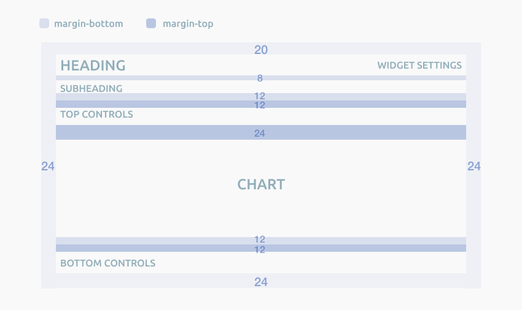

- Heading (`margin-bottom: 8px;`)
- Additional information under the heading (`margin-bottom: 12px;`)
- General widget controls (at the same level as the title)
- Upper controls (`margin-top: 12px;`)
- Chart — axes, values, graph (`margin-top: 24px; margin-bottom: 12px;`)
- Bottom controls (`margin-top: 12px;`)

> 💡 Please note that margins between different parts of the chart are not added up. _For example, if there are upper controls under the additional information section, the margin between them is 12px, not 24px._

@## Title and additional information

**The chart shall have a title** which briefly and clearly indicates what data is shown on the chart. If the chart belongs to a table or PanelSummary, and the title is far from the chart, then keep an eye on the indents between widgets. The user shall clearly understand what data is on the chart.

- The title can be clickable.
- [InfoXS](/style/icon/) icon can be placed next to the title.

| Appearance                           | Styles                                                                                                                                                                  |
| ------------------------------------ | ----------------------------------------------------------------------------------------------------------------------------------------------------------------------- |
| 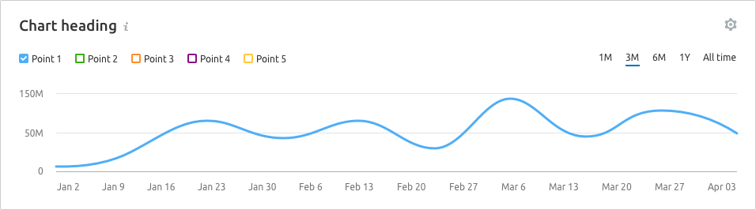 | Heading — h5 (`--fs-400`), `$gray20` color. `InfoXS` icon, `$stone` color, `margin-left: 4px`. The clickable title `hover` matches the [link hover](/components/link/). |

**The title may have a summary subtitle.** It usually contains information about maximum/minimum data statuses or explanation of what the data is based on, etc. Or some interesting insight/advice for the visualized data.

| Appearance                                           | Styles                                                |
| ---------------------------------------------------- | ----------------------------------------------------- |
| 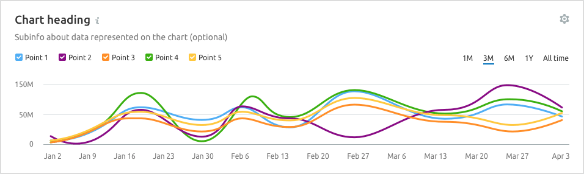 | Subtitle — 14px (M size, `--fs-200`), `$gray60` color |

@## Control types

### Types

By their effect on the widget data the controls located next to the chart can be of the following types.

**General widget controls.** These shall always be placed on the same level as the title. These include:

- widget settings;
- chart display settings (smooth/sharp line);
- screenshot settings (for future use).

**The controls that make effect upon the displayed data, axes, and some controls shown below.** As well as derivatives of such controls. They are placed to the left and right relative to the chart.

**Always place the following controls to the left** relative to the chart:

- legend;
- country select;
- device (text or [Select](/components/select/));
- other controls. For example, a campaign selector in Brand Monitoring, a comparison selector in Sensor, or other text information (for example, Chart scope);
- notes ([Notes module](/data-display/notes/)).

**Always place the following controls to the right** relative to the chart: As a rule, above the data they can produce an effect on or the data they are associated with:

- period (text or [Pills](/components/pills/));
- custom period;
- data frequency ([Pills](/components/pills/));
- zoom controls.

For more information about widget controls, see [Chart controls](/data-display/chart-controls/).

@## Collapsing rows

You can collapse rows if necessary.

Separate different controls/groups of controls with a 1px separator in the color `$gray80` with `padding: 0px 16px;`.

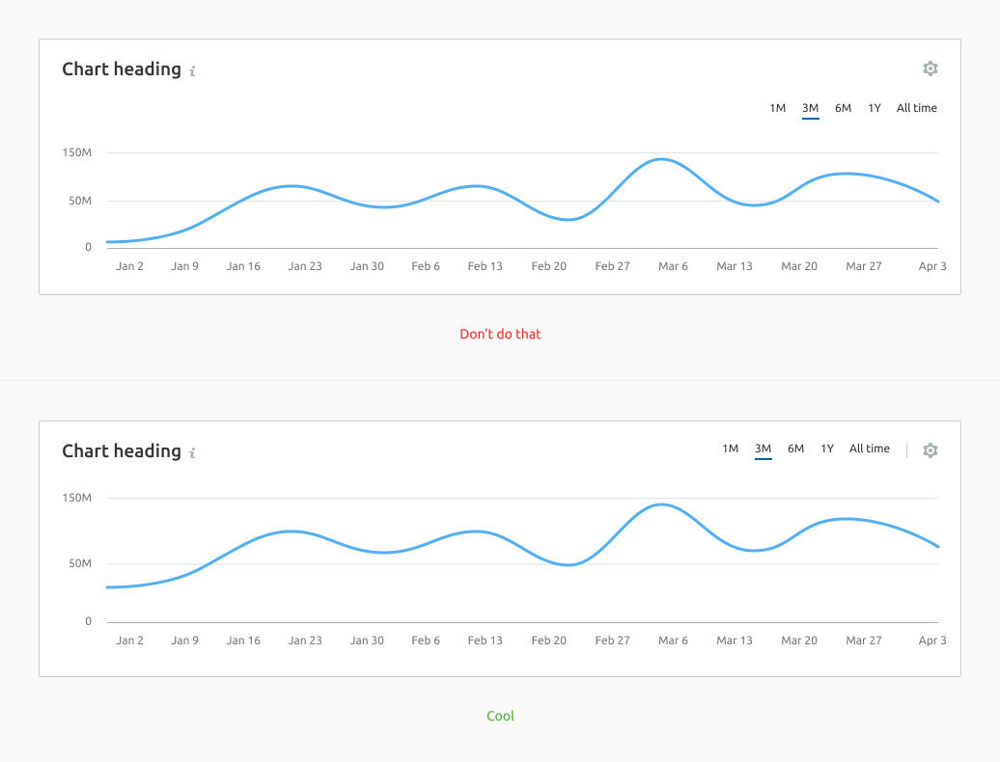

@## Legend

**Legend** is additional visual information that explains the data on the chart.

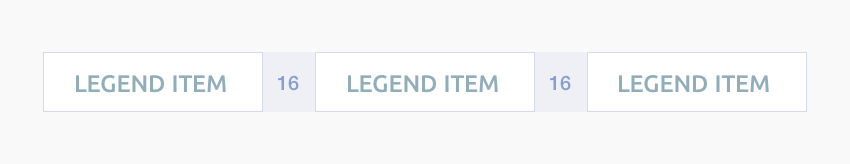

1. Legend items can be controls ([checkboxes](/components/checkbox/) or [radio](/components/radio/) buttons) or non-clickable markers (square). The marker colors shall match the chart lines. In addition to the marker and text name, the legend item can also contain an icon and/or counter.
2. If there is only one line on the chart / one data set, etc., then do not display the legend — the purpose of the line should be clear from the chart context.
3. The recommended position of the legend is the top left position above the chart. However, in some cases (for example, two charts under each other with one hover, or a lot of controls over the chart), the legend can be moved under the chart.
4. **The margin between the legend items is 16px.**
5. If parts of the legend are very large, they will be moved to the second row. In this case the spacing between the rows is 8px.

The legend can be clickable or non-clickable (static). For more information about the legend and its types, see [Chart legend](/data-display/chart-legend/).

@## Grid and axes

**Axes** should help user navigate the data and relate values to each other.

> 💡 Please don't make the additional lines bright and colored — the emphasis should be on the data, not on the grid.

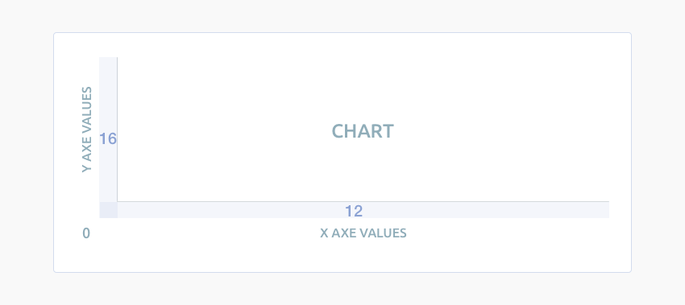

- The **Y axis** is hidden by default.
- The color of additional axes is `$mercury`.
- Color of the X axis and additional active lines on the grid (if available) — `$stone`.
- `Margin-left` to the Y axis values is 16px.
- `Margin-bottom` to the X axis values is 12px.

### Minimum and maximum number of axes

To make it easier to track changes, 3-5 horizontal guide lines are displayed. In this case, it is recommended to round the values on the axes, like 25K − 20K − 15K − 10K, instead of using exact values like 24.8 K − 20.0 K − 15.2 K − 10.2 K

> 💡 **The recommended minimum height of the chart is 118px.** For such a chart, it is recommended to display 3 horizontal guide lines. Keep in mind that it can be difficult to read changes on the charts that are so small in height.

Minimum (small) chart height is three horizontal guides.

**The maximum height of the chart is unlimited.** For high-height charts, we recommend showing no more than 4-5 horizontal guides.

Large chart height shall have maximum of 4-5 horizontal guides

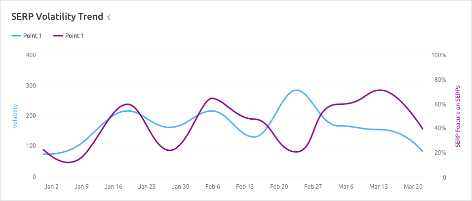

@## Tooltip

When hovering over any part of the chart, a tooltip is displayed with data for the point/points over which the cursor is located. The tooltip is displayed even for the points where there is no data.

In this case, we put `n/a` instead of the value and recommend adding a note about the positive forecast.

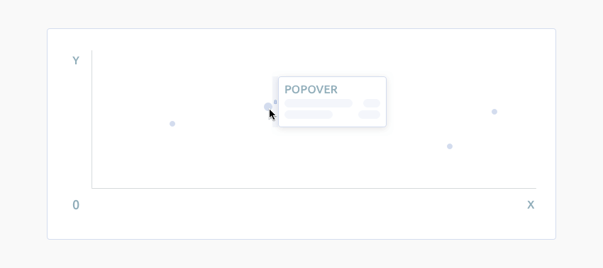

The tooltip appears next to the cursor. It does not overlap the guide and active points. It is always located inside the chart container. In other words, if the point is near the upper or lower border of the chart area, the tooltip is positioned within the chart area.

- The tooltip shall data for all the lines for the selected date.
- The tooltip title is usually the active point date or project name. The value shall precede the legend item (color, name). For easy comparison, the values shall be aligned on the right side.
- The tooltip can contain adding-up items of the Total type.
- If several charts have the same timeline under each other, then they can be synchronized — when you hover over one of the charts, the hover is triggered on the other. This is convenient for comparing data.

> As a rule, we do not put the measurement unit for the values inside the tooltip (it should be clear from the chart name and the axes). However, in some complex charts such as scatter plot and the like, a measurement unit can be added to facilitate data reading.

### Styles and margins

- The data tooltip shall always be displayed relative to the point with an 8px margin. The inner tooltip padding is 12px.
- The color for the additional vertical line that appears on line charts when hovering is `$stone`. The background color that appears on charts with a higher bar chart color density is `$mist` with 20% transparency.

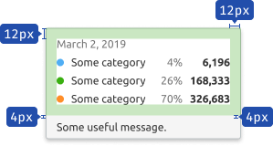

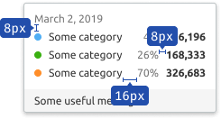

|                          | Appearance                               | Styles                                                                                                                                                                                                                                    |
| ------------------------ | ---------------------------------------- | ----------------------------------------------------------------------------------------------------------------------------------------------------------------------------------------------------------------------------------------- |
| One point                | 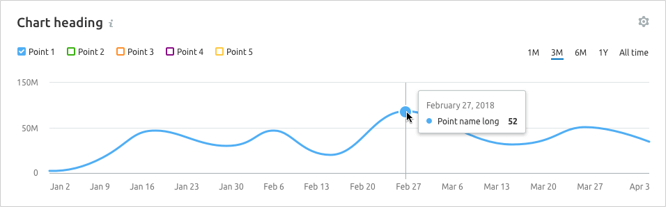         | The default point size is `12px * 12px` (plus a 2px border). The size of the hover point is `16px * 16px`.                                                                                                                                |
| Several points           | 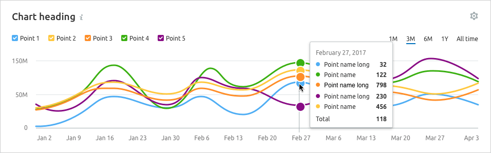       |
| n/a                      | 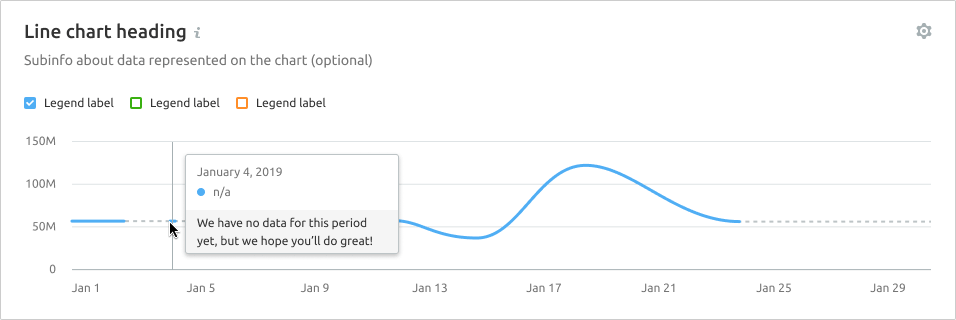   | Designation of a point with `n/a` data: 12px \* 12px gray point (plus 2px border), the color is `$stone-light`. In the tooltip, the text about missing data is 12px, the color is `$gray60`.                                              |
| Start of data collecting |  | Designation of the data collection start point: dashed line with a 16px \* 16px point, the color of the point corresponds to the legend. In the tooltip, the text about the beginning of data collection is 12px, the color is `$gray60`. |

@## Trend and average value
To display the trend line or average value on the chart, we use gray colour with styles: `border: solid 2px var(--wall)`. Similarly, we can also display total values.

- Points on the line are optional.
- The legend must have a checkbox for the trend line. On the charts, the universal color for the checkbox is `--var(wall)`.

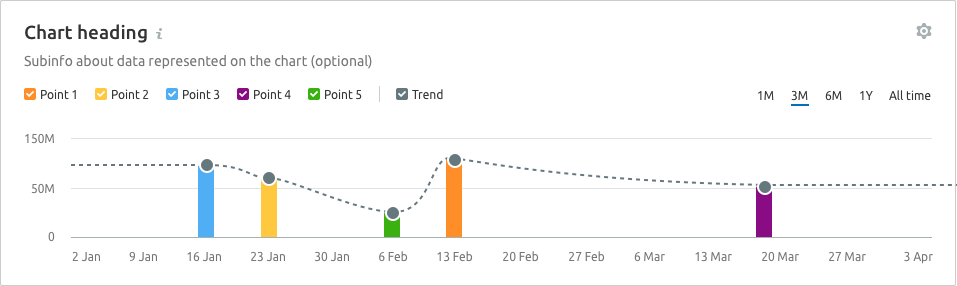

@## Data loading

During primary data loading, the widget displays the [Skeleton](/components/skeleton/) in place of the chart.

If the chart has a title, it should be displayed during loading. The user shall have an idea of what is being loaded and whether they need to wait for the loading process to complete.

> 💡 Note that every chart has it's own skeleton. For more information see guides for evety chart type.

@## Edge cases

The state for one, two, zero, and partial values differ for different chart types, and these states shall be checked in the documentation for respective chart types.

General rules of "empty" states for widgets with charts are described in [Error & n/a widget states](/components/widget-empty/).

@page conception-code
