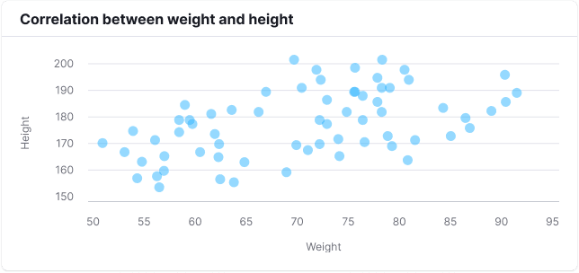
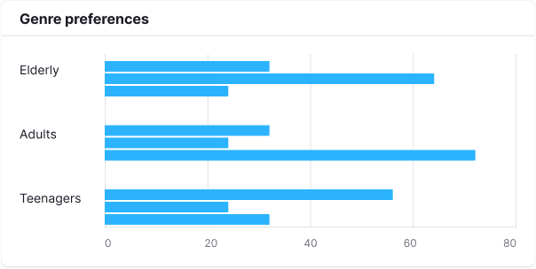

## How charts accessibility works

All charts created with the `@semcore/d3-chart` package are available for [screen readers](https://en.wikipedia.org/wiki/Screen_reader) such as [JAWS](https://www.freedomscientific.com/Products/software/JAWS/), [NVDA](https://www.nvaccess.org/), [Apple VoiceOver](https://www.apple.com/accessibility/vision/), [Chrome Vox](https://support.google.com/chromebook/answer/7031755) and others. With keyboard or [braille display](https://en.wikipedia.org/wiki/Refreshable_braille_display) navigation users may reach a block that is hidden for other users. That block contains anchor links for faster navigation, an autogenerated summary of the chart, and a plain table containing all the data used for visualization.


The data table may not look pretty but it is fully accessible for screen readers.


## Examples of accessible charts


Example summary (autogenerated):

```
Chart represents 1 time series of Temperature:  weakly growing from 15.5 to 16.5, also strongly growing from January to July and strongly declining from July to December.
Temperature is represented from January to December.
```



Example summary (autogenerated):

```
Chart represents 3 clusters of sizes from 1 to 66 of Height: significantly big cluster of 66 size around cross of 68.348 Weight and 174.076 Height, significantly small cluster of 1 size around cross of 78 Weight and 153 Height, and significantly small cluster of 1 size around cross of 99 Weight and 199 Height.
Weight represented from 50 to 99 and Height represented from 148 to 199
```



Example summary (autogenerated):

```
Chart represents 3 groups each containing 3 values of Genre preferences in survey: group adults contains thriller of value 80, fiction of value 28, and romance of value 20, group elderly contains romance of value 70, fiction of value 24, and thriller of value 18, and group teenagers contains fiction of value 63, thriller of value 25, and romance of value 19.
```


Example summary (autogenerated):

```
Chart represents 3 values of Survived passengers: Class 3 of value 218, Class 1 of value 107, and Class 2 of value 93.
```


A pie chart representing the same data will have the same summary.

## How to make your charts more accessible

### Define all properties

To make sure your users get a meaningful data summary, provide a `locale` property (for example, `en`, `zh` or `es`) for the `<Plot />` component of the chart. This property defines the language of the accessibility card and the language the data summary will be generated in. Another essential property is `label`. This property should briefly describe what is represented on the chart, like "Gold stocks" or "Subscribers overview".

### Best practices

1. Make sure to add both the `<XAxis.Title>...<XAxis.Title>` and the `<YAxis.Title>...</YAxis.Title>` component. These components help the summarizer generate a better chart summary.
2. Check that the generated summary describes your chart correctly. To do that, press Tab to see the text and review it.
3. Make sure that all the information in the tooltips is also provided in the `data` property of `<Plot />`.
4. If you are redefining children rendering of the `<XAxis.Ticks>` or `<YAxis.Ticks>` component, return both the `children` and the `value` properties. More on this below.
5. Only use chart interactivity for visual, unimportant effects.
6. If your chart is highly customized, the summary generator may struggle with the summary. To fix that, either tweak the data summarizer configuratoin or add your own summary manually. More on this below.

### Edge cases

#### Redefining children rendering of ticks

If you are redefining children rendering of `<XAxis.Ticks>` or `<YAxis.Ticks>` beside `children` return `value` property in render function. So `value` would be used to describe a tick in the generated summary. Note that render function may be called more times than ticks displayed because some ticks making sense for summary generation may make no sense for visualization.

```jsx
<XAxis>
  <XAxis.Title>Year</XAxis.Title>
  <XAxis.Ticks ticks={xScale.ticks(6)}>
    {({ value }) => ({
      value: new Date(value),
      children: formatDate(value),
    })}
  </XAxis.Ticks>
</XAxis>
```

#### Tweak data summarizer configuration

If the chart summary looks similar to what you expect to tell users but not good enough—especially with your data (for example, your data is too variable and the summarizer seems to be too sensitive)—you can tweak the summarizer's configuration.

@typescript PlotSummarizerConfig

#### Add summary manually

If the automatically generated summary is not suitable for the data provided to the `<Plot />` component, simply disable the summarizer and provide your own text.

```jsx
<Plot
  scale={[xScale, yScale]}
  width={width}
  height={height}
  data={data}
  a11yAltTextConfig={{
    override:
      "This chart represents the sales of our great unicorn startup. We haven't sold anything.",
  }}
>
...
```

## Data summarizer architecture

Data summarization is performed on the client side in linear time, linear memory and split into three phases:

1. Catching data structure hints from visualization components (such as `<Line />` or `<Bar />`).
2. Extracting data insights into abstract insights blocks.
3. Transforming the abstract insights blocks into human-readable text.

## How to contribute to the chart accessibility module

If you are interested in expanding the charts accessibility module for your needs or in ejecting the accessibility module into a separated package, feel free to [open a pull request](https://github.com/semrush/intergalactic/tree/master/semcore/d3-chart/src/a11y). We will react to it sooner.
