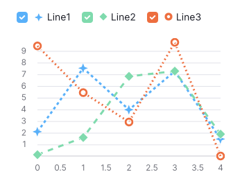

## What component has

### Default attributes

The following table describes roles and attributes the component already has.

| Component            | Attribute                         | Usage                     |
| -------------------- | --------------------------------- | ------------------------- |
| `Chart.*`            | `role="group"`                    | Presents the chart plot and its legend as a single group.  |
| `ChartLegend`        | `role="group"`                    | Presents the legend items as a single group.  |
|                      | `aria-label="Chart legend"`       | Defines an accessible name for the chart legend. <br/>**Set by default only if using `Chart.*`. If you're adding the legend manually, you have to [set the accessible name for it](#recommended-attributes).** |
<!-- uncomment when the task about the a11y dialog is done -->
<!-- | `Plot`               | `aria-label="Chart"`              | Defines an accessible name for the chart plot. | -->

### Accessible data summary

All charts created with the `@semcore/d3-chart` package are accessible for [screen readers](https://en.wikipedia.org/wiki/Screen_reader), such as [JAWS](https://www.freedomscientific.com/Products/software/JAWS/), [NVDA](https://www.nvaccess.org/), [Apple VoiceOver](https://www.apple.com/accessibility/vision/), [Chrome Vox](https://support.google.com/chromebook/answer/7031755) and others. With keyboard or [braille display](https://en.wikipedia.org/wiki/Refreshable_braille_display) navigation users may reach a block that's hidden by default. That block contains anchor links for faster navigation, an autogenerated summary of the chart, and a plain table containing all the data used for visualization.


The data table may not look pretty but it's fully accessible for screen readers.


::: tip
Refer to [accessible summaries examples](./d3-chart-code.md#summary-examples) to learn how different summaries look.
:::

### Data summarizer architecture

Data summarization is performed on the client side in linear time, linear memory and split into three phases:

1. Catching data structure hints from visualization components, such as `<Line />` or `<Bar />`.
2. Extracting data insights into abstract insights blocks.
3. Transforming the abstract insights blocks into human-readable text.

## Considerations for developers

### Recommended attributes

| Component        | Attribute                         | Usage                     |
| ---------------- | --------------------------------- | ------------------------- |
| `Chart.*`        | `aria-label` or `aria-labelledby` | **Required when using `Chart.*`.** Defines an accessible name for the group with the chart plot and the legend.  |
| `Plot`           | `locale`                          | Defines the language of the chart. Set it to generate the data summary correctly.  | <!-- do we really need this recommendation? all strings in charts are localized -->
|                  | `patterns`                        | Enables pattern fills and dashed lines instead of solid fills and lines, and symbols instead of dots. [Read more about patterns](#pattern-fills-dots-and-lines). |
| `ChartLegend`    | `aria-label` or `aria-labelledby` | **Required when using `ChartLegend` explicitly.** Defines an accessible name for the chart legend. |
|                  | `patterns`                        | **Only with `shape="checkbox"`.** Shows pattern symbols in addition to checkboxes in legend items.  |

### How to ensure correct summary generation

1. Check that the generated summary describes your chart correctly. Press Tab <!-- correct this when we change the key --> to open the summary and review the text and the table.
1. Add both the `XAxis.Title` and the `YAxis.Title` components. These components help the summarizer generate a better chart summary.
1. Make sure that all the information displayed in the tooltip is also provided in the `data` property of `<Plot />`.
1. Update the accessible summary when the user checks or unchecks legend items.
1. If you are [redefining children rendering](#redefining-children-rendering-of-ticks) of the `XAxis.Ticks` or `YAxis.Ticks` component, return both the `children` and the `value` properties.
1. If your chart is highly customized, the summarizer may struggle with the summary. To fix that, either [tweak the data summarizer configuration](#tweak-data-summarizer-configuration) or [add your own summary manually](#add-summary-manually).

### Redefining children rendering of ticks

If you are redefining children rendering of `<XAxis.Ticks>` or `<YAxis.Ticks>`, beside `children` return the `value` property in the render function. This way `value` will be used to describe a tick in the generated summary. Note that render function may be called more times than ticks displayed because some ticks making sense for summary generation may make no sense for visualization.

```jsx
<XAxis>
  <XAxis.Title>Year</XAxis.Title>
  <XAxis.Ticks ticks={xScale.ticks(6)}>
    {({ value }) => ({
      value: new Date(value),
      children: formatDate(value),
    })}
  </XAxis.Ticks>
</XAxis>
```

### Tweak data summarizer configuration

Sometimes the chart summary looks similar to what you expect, but not good enough. For example, your data is too variable and the summarizer seems to be too sensitive. In this case you can tweak the summarizer configuration.

<TypesView type="PlotSummarizerConfig" :types={...types} />

### Add summary manually

If the automatically generated summary isn’t suitable for the provided data, disable the summarizer whatsoever and provide your own text.

```jsx
<Plot
  scale={[xScale, yScale]}
  width={width}
  height={height}
  data={data}
  a11yAltTextConfig={{
    override:
      "This chart represents the sales of our great unicorn startup. We haven't sold anything.",
  }}
/>
```

### Pattern fills, dots and lines

Using patterns in charts instead of just colors makes them easier to understand for people who are colorblind or have low vision. Some colors can be hard to differentiate for these users, even if selected thoughtfully and with different contrasts. This can make it hard to read charts. Adding patterns helps more people see the differences between data sets clearly.

The `pattern` property enables pattern fills in charts with filled areas, symbols instead of dots, and dashed lines instead of solid ones in charts without filled areas.

::: tip
Refer to [our live examples](/data-display/d3-chart/d3-chart-code#pattern-fills-dots-and-lines) for more details on the feature usage.
:::

 

## Contributing to accessible summary module

If you're interested in expanding the chart accessible data summary module, or ejecting the module into a separated package, feel free to [open a pull request](https://github.com/semrush/intergalactic/tree/master/semcore/d3-chart/src/a11y).

<script setup>import { data as types } from '@types.data.ts';</script>
