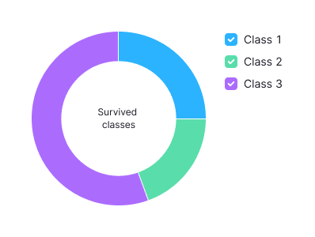

## How charts accessibility works

All charts created with `@semcore/d3-chart` package are available for [screen readers](https://en.wikipedia.org/wiki/Screen_reader) such as [JAWS](https://www.freedomscientific.com/Products/software/JAWS/), [NVDA](https://www.nvaccess.org/), [Apple VoiceOver](https://www.apple.com/accessibility/vision/), [Chrome Vox](https://support.google.com/chromebook/answer/7031755) and others. With keyboard or [braille display](https://en.wikipedia.org/wiki/Refreshable_braille_display) navigation users may reach the block that is hidden for other users. That block contains anchor links for faster navigation, autogenerated summary of data used to build plot and plain table containing all data used during visualization.


Data table may not look pretty but fully accessible for screen readers.


## Examples of accessible charts


Example summary, generated for the chart:

```
Chart represents 1 time series of Temperature:  weakly growing from 15.5 to 16.5, also strongly growing from January to July and strongly declining from July to December.
Temperature represented from January to December.
```


Example summary, generated for the chart:

```
Chart represents 3 clusters of sizes from 1 to 66 of Height: significantly big cluster of 66 size around cross of 68.348 Weight and 174.076 Height, significantly small cluster of 1 size around cross of 78 Weight and 153 Height, and significantly small cluster of 1 size around cross of 99 Weight and 199 Height.
Weight represented from 50 to 99 and Height represented from 148 to 199
```


Example summary, generated for the chart:

```
Chart represents 3 groups each containing 3 values of Genre preferences in survey: group adults contains thriller of value 80, fiction of value 28, and romance of value 20, group elderly contains romance of value 70, fiction of value 24, and thriller of value 18, and group teenagers contains fiction of value 63, thriller of value 25, and romance of value 19.
```


Example summary, generated for the chart:

```
Chart represents 3 values of Survived passengers: Class 3 of value 218, Class 1 of value 107, and Class 2 of value 93.
```



Pie chart representing the same data will have the same summary.

## How to make your charts more accessible

### Define all props

To make sure your users will be provided with a meaningful summary, be sure to provide a `locale` property (e.g. `en`, `zh` or `es`) for the `<Plot />` component of the chart. The `locale` property defines the language of the accessibility card and language the data summary will be generated in. Another one essential property is `label`. The property should describe what is represented on the chart in general, like "Gold stocks" or "Subscribers overview".

### Best practices

1. Make sure you have added both `<XAxis.Title>...<XAxis.Title>` and `<YAxis.Title>...</YAxis.Title>` if it's content matter.
2. Check generated summary with keyboard `Tab` navigation.
3. Make sure all information in tooltips is also provided to `data` property of `<Plot />`.
4. If you are redefining children rendering of `<XAxis.Ticks>` or `<YAxis.Ticks>` beside `children` return `value` property.
5. Only use the charts interactivity for visual, non-important effects.
6. If your chart is highly customized for our default summary generatorm either tune data summarizer or redefine summary.

### Edge cases

#### Redefining children rendering of ticks

If you are redefining children rendering of `<XAxis.Ticks>` or `<YAxis.Ticks>` beside `children` return `value` property in render function. So `value` would be used to describe a tick in the generated summary. Note that render function may be called more times than ticks displayed because some ticks making sense for summary generation may make no sense for visualization.

```jsx
<XAxis>
  <XAxis.Title>Year</XAxis.Title>
  <XAxis.Ticks ticks={xScale.ticks(6)}>
    {({ value }) => ({
      value: new Date(value),
      children: formatDate(value),
    })}
  </XAxis.Ticks>
</XAxis>
```

#### Tune data summarizer

If the chart summary looks similar to what you expect to tell users but not good enough especially with your data (e.g., your data is too variable and summarizer seems to be too sensitive) you can tune it's configuration.

@typescript PlotSummarizerConfig

#### Redefine summary

If the automatically generated summary is not suitable for the data provided to the `<Plot />` component, you may simply disable summarizer and provide your own text.

```jsx
<Plot
  scale={[xScale, yScale]}
  width={width}
  height={height}
  data={data}
  a11yAltTextConfig={{
    override:
      "Chart represents sales of our great unicorn startup. We haven't sold anything for all the time.",
  }}
>
...
```

## Data summarizer architecture in short

Data summarization is performed on the client side in linear time, linear memory and splited into three phases:

1. Catching data structure hints from visualization components (e.g. `<Line />` or `<Bar />`).
2. Extracting data insights into an abstract insights blocks.
3. Serialization of the abstract insights blocks into human-readable text.

## Contributing

If you are interested in extending power of your charts accessibility module for your needs or in ejecting accessibility module into separated package, feel free to open pull request (link to repo). We will react to it sooner.
