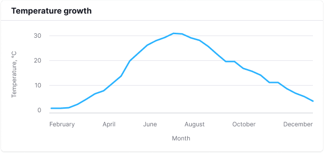
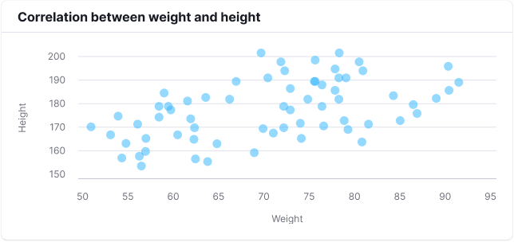
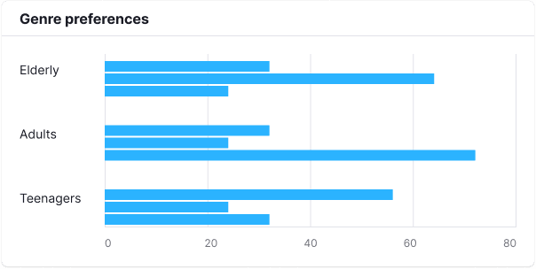
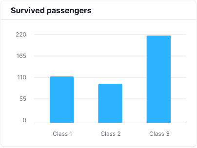
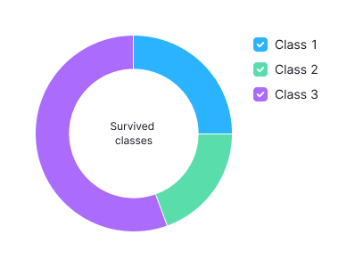

## Description

These components serve as the base for building charts from your data in the product.

They don't manipulate your data, and won't try to calculate, sort or check it in any way. Data manipulation is the product's job, not the component's.

Charts are a complex component that can't be applied in a single line. That's why its API may seem a bit inflated, since it supports all the concepts of our design system.

## Concept

- We want to provide you with a convenient way to use the imperative d3 style with React's declarative approach.
- All charts are based on [d3-scale](https://github.com/d3/d3-scale), which you transfer to our charts in a customized form.
- We try to provide access to each SVG node, so you could modify it if needed.

Each element that you place on the chart is based on a real SVG element or a group of elements. For example, when you render `<Line/>`, you will get an SVG (`<line d = {...}>`). All properties you pass to `<Line/>` will go to the native SVG `<line d = {...}>` tag.

When you render `<Line.Dots/>` (dots on a line plot), you get a set of `<circle cx = {...} cy = {...}/>`. So all properties you pass to `<Line.Dots/>` will also go to the native SVG `<circle cx = {...} cy = {...}/>` tag.

To change properties of specific dots, pass a function that will be called at each dot with the calculated properties of this dot:

```jsx
<Line.Dots>
  {(props) => {
    return {
      // ...your_props
    };
  }}
</Line.Dots>
```

::: tip
You also can put functions into single elements if your properties are calculated dynamically.
:::

Since many SVG elements don't support nesting, they're rendered sequentially. For example, this code example doesn't nest `<circle/>` in `<line/>`, but draws them one after another:

```jsx
<Line>
  <Line.Dots />
</Line>
```

CSS is responsible for all the chart styles. Refer to [Themes](/style/design-tokens/design-tokens#themes) for more information on how to customize it.

## Chart plot

Any SVG container must have absolute values for its size.

Refer to [d3-scale docs on GitHub](https://github.com/d3/d3-scale) for more information about the types of `scale`, as well as their `range` and `domain`.

::: tip
The `range` of the horizontal `scale` is inverted, so that the axes origin is at the bottom left corner.
:::

::: sandbox

<script lang="tsx">
  export Demo from './examples/base.tsx';
</script>

:::

### Plot margins

The chart plot usually has margins inside the `svg` container to prevent clipping grid items such as axes, axis values, and axis titles.

That's why values in `scale.range()` are set with an offset.

::: sandbox

<script lang="tsx">
  export Demo from './examples/paddings-&-margins.tsx';
</script>

:::

## Chart grid

### Axes

When you pass `scale` to the root component it also sets the coordinate axes. However, you still need to specify them for them to render.

- `XAxis/YAxis` are the axis lines.
- `ticks` are the values on the axis.

It's also possible to have multiple axes with different positions.

You can get the number of ticks from the `scale.ticks` or `scale.domain` method. To calculate an approximate number of ticks, divide the chart size by the size of a one tick.

::: tip
According to the design guide, `YAxis` is hidden by default `(hide = true)`.
:::

::: sandbox

<script lang="tsx">
  export Demo from './examples/axes.tsx';
</script>

:::

### Axis values

You can change the values and properties on the axis by passing a function.

The default tag is `<text/>`, but you can change it by defining the `tag` property. For example, you can change it to `foreignObject` for inserting `html` components.

::: tip
The function arguments contain calculated XY coordinates that you can use to shift the object as needed.
:::

::: sandbox

<script lang="tsx">
  export Demo from './examples/axis-values.tsx';
</script>

:::

### Axis titles

Axis titles are formed in the same way as ticks and additional lines.

::: tip
By default, the title is set to the right for the Oy axis, and at the top for the Ox axis. However, you can change this condition by passing the desired location to `position`: `right`, `top`, `left`, or `bottom`.
:::

::: sandbox

<script lang="tsx">
import { Bar, XAxis, Plot, YAxis } from '@semcore/ui/d3-chart';
  export Demo from './examples/axes-titles.tsx';
</script>

:::

### Additional lines

Additional lines are formed in the same way as ticks.

::: tip
To make things easier, ticks can be specified on the `Axis` component itself, and it will be automatically passed to `<Axis.Ticks/>` and `<Axis.Grid/>`.
:::

::: sandbox

<script lang="tsx">
  export Demo from './examples/additional-lines.tsx';
</script>

:::

### Reference line

::: sandbox

<script lang="tsx">
  export Demo from './examples/reference-line.tsx';
</script>

:::

## Adaptive chart

For SVG charts to display correctly on responsive layouts, you need to dynamically calculate their width and height. To help you with that, we created the `ResponsiveContainer` component that supports all the [Box properties](/layout/box-system/box-api) and can help you flexibly adjust the chart size.

::: tip
`ResponsiveContainer` supports the `aspect` property – the aspect ratio between the width and height of a chart.
:::

```jsx
<ResponsiveContainer aspect={1}> // width = height ...</ResponsiveContainer>
```

::: sandbox

<script lang="tsx">
  export Demo from './examples/adaptive-chart.tsx';
</script>

:::

## Tooltip

You can add a tooltip to the chart, for which you can set `Title` and `Footer`.

::: sandbox

<script lang="tsx">
  export Demo from './examples/tooltip.tsx';
</script>

:::

### Tooltip control

To control over tooltip visibility and targeted position, imperatively call plot's event emitter.

::: sandbox

<script lang="tsx">
  export Demo from './examples/tooltip-control.tsx';
</script>

:::

## Chart legend

Refer to [Chart legend](/data-display/chart-legend/chart-legend) for a more detailed guide.

::: sandbox

<script lang="tsx">
  export Demo from './examples/chart-legend.tsx';
</script>

:::

## Synchronous charts

You can pass a single `eventEmitter` to synchronize the charts.

::: tip
Be careful when choosing the `scale` for the axis, since it's common across different charts.
:::

::: sandbox

<script lang="tsx">
  export Demo from './examples/synchronous-charts.tsx';
</script>

:::

## Export to image

::: sandbox

<script lang="tsx">
  export Demo from './examples/export-to-image.tsx';
</script>

:::

## Initial data loading

During initial chart data loading, use [Skeleton](/components/skeleton/skeleton) corresponding to the chart type. Refer to the specific chart type documentation and to [Chart Skeleton examples](../../components/skeleton/skeleton-code.md#chart-skeleton) to choose the appropriate Skeleton type.

If the chart has a title, it should be displayed while the chart is loading.

## Pattern fills, dots and lines

To replace solid fills with visual patterns, add the `patterns` prop to the chart component.

The `patterns` prop is inherited by all children components. So, you can apply it both to _end_ components like `Line` and to _container_ components like `Plot` .

::: sandbox

<script lang="tsx">
  export Demo from './examples/pattern-fill.tsx';
</script>

:::

### Enforcing patterns

You can enforce use of build-in patterns by using it's names. The list of available patterns:

1. `starSmall`
1. `romb`
1. `circleOutline`
1. `triangleDown`
1. `rombOutline`
1. `square`
1. `trees`
1. `wave`
1. `star`
1. `cogwheel`
1. `crossesDiagonal`
1. `triangleOutline`
1. `chain`
1. `squama`
1. `linesDouble`
1. `zigzagVertical`
1. `triangleDownOutline`
1. `crosses`
1. `linesDoubleHorizontal`
1. `waveVertical`
1. `squareOutline`
1. `triangle`
1. `crescent`
1. `zigzag`

::: sandbox

<script lang="tsx">
  export Demo from './examples/enforcing-patterns.tsx';
</script>

:::

### Custom patterns

You can provide custom pattern object to enforce it's form. The pattern object should include both fill and symbol properties.

The fill data is used for rendering charts like an `Area` while symbol data is needed to render corresponding symbol in chart legend or on the dots.

::: sandbox

<script  lang="tsx">
import React from 'react';
import { Chart, Pattern } from '@semcore/ui/d3-chart';

const customPattern: Pattern = {
  fill: {
    viewBox: '0 0 21 20',
    children: (
      <>
        <path d='M9.17 2.927c.3-.921 1.603-.921 1.902 0l1.07 3.292a1 1 0 0 0 .951.69h3.461c.969 0 1.372 1.24.588 1.81l-2.8 2.034a1 1 0 0 0-.364 1.118l1.07 3.292c.3.921-.755 1.688-1.539 1.118l-2.8-2.034a1 1 0 0 0-1.175 0l-2.8 2.034c-.784.57-1.839-.197-1.54-1.118l1.07-3.292a1 1 0 0 0-.363-1.118L3.1 8.72c-.784-.57-.381-1.81.587-1.81H7.15a1 1 0 0 0 .95-.69l1.07-3.292Z' />
      </>
    ),
  },
  symbol: {
    viewBox: '0 0 33 32',
    size: [16.41, 15.66],
    children: (
      <>
        <path d='M15.049.927c.3-.921 1.603-.921 1.902 0l2.866 8.82a1 1 0 0 0 .95.69h9.274c.97 0 1.372 1.24.588 1.81l-7.502 5.45a1 1 0 0 0-.364 1.119l2.866 8.82c.3.92-.755 1.687-1.539 1.117l-7.502-5.45a1 1 0 0 0-1.176 0l-7.502 5.45c-.784.57-1.838-.196-1.54-1.118l2.867-8.82a1 1 0 0 0-.364-1.117l-7.502-5.451c-.784-.57-.381-1.81.588-1.81h9.273a1 1 0 0 0 .951-.69L15.05.927Z' />
      </>
    ),
  },
}

const Demo = () => {
  return (
    <Chart.Line
      data={data}
      plotWidth={500}
      plotHeight={200}
      groupKey={'x'}
      xTicksCount={data.length / 2}
      patterns={customPattern}
      showDots
      showTooltip
      aria-label="Area chart"
    />
  );
};

const data = Array(20)
  .fill({})
  .map((d, i) => ({
    x: i,
    y1: Math.random() * 10,
  }));
</script>

:::

You can also provide a list of patterns.

::: sandbox

<script lang="tsx">
  export Demo from './examples/custom-patterns.tsx';
</script>

:::

### Low level components use

You can access `PatternFill` and `PatternSymbol` components for low level use.

`PatternFill` allows you to initialize [svg pattern](https://developer.mozilla.org/en-US/docs/Web/SVG/Tutorial/Patterns) and use it for customized charts.

`PatternSymbol` allows you to render symbols, you can use pattern key to sync it with `PatternFill` that use same pattern key.

::: sandbox

<script lang="tsx">
  export Demo from './examples/low-level-components-use.tsx';
</script>

:::

## Accessible data summary

### Data formatting

You can provide formatting functions that will control A11y module generated summary and data table content.

::: tip

Click on this tip (to place focus on it) and press `Tab` to navigate to the chart until the accessible summary dialog opens.

:::

::: sandbox

<script lang="tsx">
  export Demo from './examples/a11y-formatting.tsx';
</script>

:::

### Summary examples

The following examples demonstrate automatically generated text summaries for various datasets and chart types.



Example summary (autogenerated):

```
Chart represents 1 time series of Temperature:  weakly growing from 15.5 to 16.5, also strongly growing from January to July and strongly declining from July to December.
Temperature is represented from January to December.
```



Example summary (autogenerated):

```
Chart represents 3 clusters of sizes from 1 to 66 of Height: significantly big cluster of 66 size around cross of 68.348 Weight and 174.076 Height, significantly small cluster of 1 size around cross of 78 Weight and 153 Height, and significantly small cluster of 1 size around cross of 99 Weight and 199 Height.
Weight represented from 50 to 99 and Height represented from 148 to 199
```



Example summary (autogenerated):

```
Chart represents 3 groups each containing 3 values of Genre preferences in survey: group adults contains thriller of value 80, fiction of value 28, and romance of value 20, group elderly contains romance of value 70, fiction of value 24, and thriller of value 18, and group teenagers contains fiction of value 63, thriller of value 25, and romance of value 19.
```



Example summary (autogenerated):

```
Chart represents 3 values of Survived passengers: Class 3 of value 218, Class 1 of value 107, and Class 2 of value 93.
```



A pie chart representing the same data will have the same summary.
