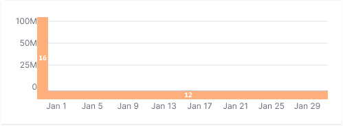
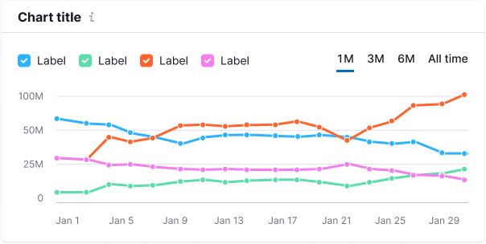
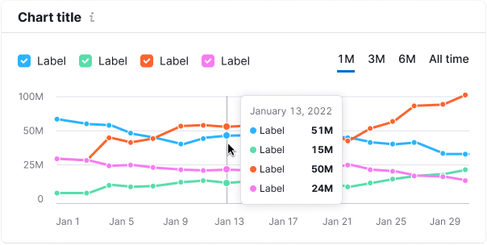
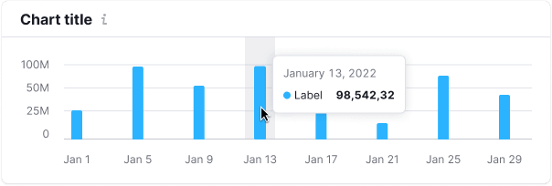
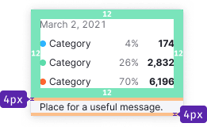

@## Chart widget anatomy

In the Intergalactic Design System, data is typically organized within a [Card](/components/card/), which consists of the `Card.Header` and `Card.Body`.

**Card.Header:**

   1. Title (`margin-bottom: 8px`)
   2. Optional additional information below the title (`margin-bottom: 8px`)
   3. Optional general widget controls (for example, export or view settings)

**Card.Body:**

   1. Optional top controls (for example, filters, buttons)
   2. Chart – axes, values, and the chart itself (`margin-top: 20px`)
   3. Optional bottom controls (`margin-top: 20px`)

> The presence of optional elements depends on the specific interface case.

### Card header

#### Title

**A chart must include a title** that succinctly and clearly describes the displayed data. In cases where the title is distant from the chart, as in a table or report's [Summary](/patterns/summary/), ensure there are adequate margins between widgets. The user should easily grasp what data the chart represents.

The title can be clickable.

You can place an `Info` icon with M size next to the title if you need to hide additional information about the chart.

For the chart title, use 16px text (`--fs-300`, `--lh-300`, `font-weight: var(--bold)`) and `--text-primary` token for color. M size `Info` icon has `--icon-secondary-neutral` color and `margin-left: 4px`. Hover state for the clickable title matches the [styles for link hover](/components/link/).

#### Description

**The header may contain a description text.** Typically, this text provides information on maximum/minimum data statuses, explains the data source, or offers insightful advice related to the visualized data.

For the description text, use 14px text (`--fs-200`, `--lh-200`) and `--text-secondary` token for color.

@## Chart controls

For detailed information about chart controls, refer to the [Chart controls](/data-display/chart-controls/).

@## Collapsing rows

When necessary, you can collapse card rows. Find more information in the [Chart controls](/data-display/chart-controls/#collapsing_rows_with_controls).

@## Legend

The legend provides additional visual information explaining the data on the chart.

The legend can function as a filter or simply represent the data without being clickable. For detailed information about the legend and its types, refer to [Chart legend](/data-display/chart-legend/).

@## Grid and axes

Axes assist users in navigating the data and understanding the relationships between values.

> Avoid making the additional lines overly bright and colorful – the emphasis should remain on the data.

### Styles

- The Y axis is hidden by default.
- The color of additional axes is `--chart-grid-line`.
- The color of the X axis and additional active lines on the grid (if needed) is `--chart-grid-x-axis`.
- The left and right margins for Y-axis values are 16px.
- The `margin-top` for X-axis values is 12px.

### Minimum and maximum number of axes

To make it easier to track changes, use 3-5 additional horizontal guides. Round the values on the axes, such as _25K − 20K − 15K − 10K_, instead of using exact figures like _24.8K − 20.0K − 15.2K − 10.2K_.

> The recommended minimum chart height is 118px. For such a chart, it's advisable to display 3 additional horizontal guides. Keep in mind that charts with such minimal height can make it challenging to discern changes.

Minimum (small) chart height has 3 additional horizontal guides.

The maximum chart height depends on your specific case. For charts with greater heights, utilize no more than 5-6 additional horizontal guides.

@## Tooltip

When hovering over any part of the chart, a tooltip should appear, providing data for the dot or dots.

The tooltip is displayed even for dots with no data. In such cases, display "n/a" instead of the value and consider adding a note about the forecast.

The tooltip appears adjacent to the cursor and is always positioned within the chart container. In other words, if the dot is near the upper or lower border of the chart area, the tooltip will still be contained within the chart area.

- The tooltip displays data for all lines for the selected date.
- For the tooltip title, use the date or the data category name. Ensure that the values are right-aligned for easy comparison.
- The tooltip can also contain the total value.
- If several charts share the same timeline, they can be synchronized. Hovering over one chart triggers the hover state on the others. This is useful for data comparison.

> Typically, measurement units are not included inside the tooltip (they should be clear from the chart title and axes). However, in more complex charts, such as scatterplots, adding a measurement unit can enhance data comprehension.

### Styles

The data tooltip should always be displayed relative to the dot, with an 8px margin.

@table-caption Chart tooltip styles

| Appearance        | Styles   |
| ----------------- | -------- |
|   | The default dot size is `12px * 12px`. The size of the dot in a hover state is `16px * 16px`. |
|                                                                 | The color for the additional vertical line that appears on line charts when hovering is `--chart-grid-y-accent-hover-line`. |
|                                                                 | The background color that appears on bar charts is `--chart-grid-bar-chart-hover`                                           |
|   | The inner tooltip padding is 12px.                                                                                          |

### Cases

@table-caption Chart tooltip cases

| Case                     | Appearance                               | Styles            |
| ------------------------ | ---------------------------------------- | ----------------- |
| Not available data       |    | Use a dashed line to represent not available data. |
| Start of data collecting |  | A solid line is used, and the dot color corresponds to the legend. In the tooltip, text about the beginning of data collection is 12px and has `--chart-grid-y-accent-hover-line` token for color. |

@## Trend and average value

To display the trend line or average value on the chart, use gray color with the following styles: `border: solid 2px var(--chart-palette-order-total-amount)`. Similarly, you can display total values.

- Dots on the line are optional.
- The legend must include a checkbox for the trend line. On the charts, the universal color for the checkbox is `--chart-palette-order-total-amount`.

@## Data loading

During the initial data loading, the widget displays the [Skeleton](/components/skeleton/) instead of the chart.

If the chart has a title, it should be displayed during the initial loading. The user should be aware of what is being loaded and whether they need to wait for the process to complete.

> Keep in mind that each chart type has its own skeleton. Refer to the guides for specific chart types for more information.

@## Edge cases

Specific edge cases may vary depending on the chart type. Refer to the documentation for the specific chart type you are working with.

General recommendations for "empty" states for widgets with charts are described in [Error & n/a widget states](/components/widget-empty/).

@page d3-chart-code
@page d3-chart-api
@page d3-chart-a11y
@page d3-chart-changelog
