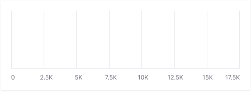
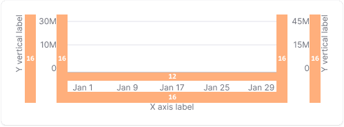
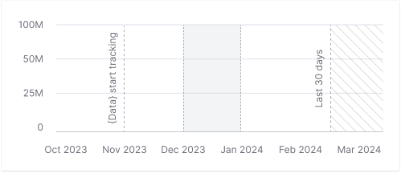
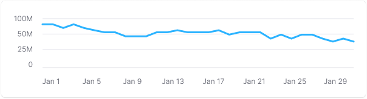
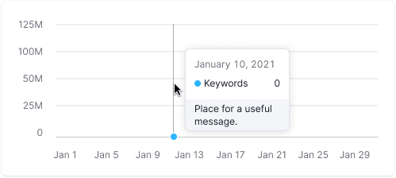
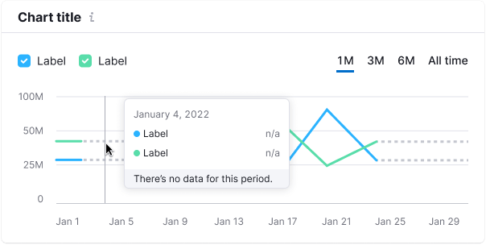

## Description

**D3 chart components** offer various chart types and tools for data visualization.

Refer to [Charts showcase](/data-display/chart-showcase/chart-showcase), to explore all charts and pick the best one for your needs.

## Grid and axes

Axes help users understand data relationships and navigate through data. A plot can include horizontal and vertical lines.

Table: Grid and axes

| Grid lines                         | Appearance example              | When to use                                    |
| ---------------------------------- | ------------------------------- | ---------------------------------------------- |
| Horizontal lines                   |  | Use with charts showing data trends over time. |
| Both horizontal and vertical lines |         | Use with scatter plots and bubble charts.      |
| Vertical lines                     |    | Use with horizontal bar charts.                |

**Basic styles for `Chart.Plot`:**

- The Y-axis is hidden by default.
- Additional axes are colored with `--chart-grid-line` token.
- X-axis and additional active lines on the grid (if needed) have `--chart-grid-x-axis` color.

::: tip
Keep additional lines dim to focus on data.
:::

### Margins

- Y-axis values have 16px left and right margins.
- X-axis values have a 12px top margin.

### Reference line

You can show different reference lines (highlight date or dates range) to guide user through your data visualization.

### Minimum and maximum axes' number

Use 3-5 horizontal additional horizontal lines for clarity. Use rounded values on axes, for example, _25K, 20K, 15K, 10K._

::: tip
The recommended minimum chart height is 120px. For such a chart, it's advisable to display 3 additional horizontal guides. Keep in mind that small charts might make it hard to see data changes.
:::

It's recommended for smal charts having no more than 3 horizontal lines.

The maximum chart height depends on your specific case. For charts with greater heights, use no more than 5-6 additional horizontal lines.

## Tooltip

Tooltips show data when hovering over chart parts, even if no data is present (use "n/a" in this case).

The tooltip aligns with the cursor with a 4px margin within the chart area.

- It shows data for all lines for a selected date.
- Align tooltip values to the right for easy comparison.
- Include total values in the tooltip.
- Synchronize tooltips across charts for data comparison.

::: tip
Avoid measurement units in tooltips unless needed for clarity. However, in more complex charts, such as scatterplots, adding a measurement unit can enhance data reading.
:::

### Tooltip styles

Tooltip padding is always 12px.

 

### Unavailable data

Represent missing data with a dashed line.

### Start of data collecting

Use a solid line for new data. The tooltip should mention the start of data collection, use `--chart-grid-y-accent-hover-line` token for the text color.

<!-- Table: Chart tooltip cases

| Case                     | Appearance                               | Styles            |
| ------------------------ | ---------------------------------------- | ----------------- |
| Not available data       |    | Use a dashed line to represent not available data. |
| Start of data collecting |  | A solid line is used, and the dot color corresponds to the legend. In the tooltip, text about the beginning of data collection is 12px and has `--chart-grid-y-accent-hover-line` token for color. | -->

## Dots

Table: Chart dot styles

| Appearance                                          | Styles                                                                                                                  |
| --------------------------------------------------- | ----------------------------------------------------------------------------------------------------------------------- |
|   | Default dot size is `8px * 8px`. The dot's size in hovered state is `10px * 10px`.                                      |
|                            | Color for the additional vertical line that appears on line charts when hovering is `--chart-grid-y-accent-hover-line`. |
|                            | Background color for hovering bar charts is `--chart-grid-bar-chart-hover`.                                             |

## Legend

Legend explains chart data and can act as filters. For detailed information, refer to [Chart legend](/data-display/chart-legend/chart-legend).

## Usage with Card

In our design system, data is typically placed within a [Card](/components/card/card), which consists of `Card.Header` and `Card.Body`.

### Chart title

Make sure each chart has a title, and it's clear which chart each title belongs to.

If you're displaying the chart inside a `Card`, use the [Card.Title](../../components/card/card.md#card-header) component.

### Chart description

You can add a description text to your chart. Typically, such a text can provide information on maximum/minimum data statuses, explains the data source, or offers insightful advice related to visualized data.

If you're displaying the chart inside a `Card`, use the [Card.Description](../../components/card/card.md#card-header) component.

## Initial data loading

During the initial data loading, display the [Skeleton](/components/skeleton/skeleton) instead of the chart.

If the chart has a title, it should be displayed during the initial loading. The user should be aware of what's being loaded, and whether they need to wait for the process to complete.

::: tip
Each chart type has a specific skeleton. Refer to specific chart type guides and [Chart Skeleton examples](../../components/skeleton/skeleton-code.md#chart-skeleton).
:::

## Edge cases

Edge cases vary by chart type. Check the specific chart documentation for details. For empty states, refer to [Error & n/a widget states](/components/widget-empty/widget-empty).
