> 💡 The basic data visualization rules are described in the [Basic principles and concept](/data-display/chart/).

@## Description

**Donut chart** is the method of visualization of parts to the whole by dividing the circle into proportional segments.

The length of each segment is a proportional fraction, and the entire circle is ALWAYS the total sum of all data, equal to 100%.

**Important points to keep in mind when using pie charts:**

- We recommend using a pie chart when you need to focus on the proportions of categories, rather than on specific numbers.
- If you need to visualize more than 5 categories, we recommend using a different chart type (for example, [Bar chart](/data-display/bar-chart)).

**Donut charts have several disadvantages:**

- The number of displayed values is very limited, because the more values, the smaller the size of each individual segment. Accordingly, these charts are not suitable for working with large amounts of data.
- They take up more space than, for example, [Bar chart](/data-display/bar-chart).
- They are inconvenient for making accurate comparisons between indicators, since visually the area of segments is more difficult to compare than the length.

> 💡 **Interesting fact**
>
> The creation of the pie chart is credited to the Scottish engineer William Playfair. Back in 1801, he used it to show the proportions of land occupied by the Turkish Empire in Asia, Europe and Africa.
>
> The French do not call such charts pie chart, they compare it with round cheese Camembert.
>
> [How to design pie charts](https://visage.co/data-visualization-101-pie-charts/)

@## Appearance

The donut chart is used in the following types:

- donut chart;
- half-donut chart (used when you need to save space on the screen);
- pie chart (rare).

For all types, the values are shown clockwise, starting with the largest one. The angle of the padding between the values: `(paddingAngle='1')`.

**Donut chart** 🍩

The starting angle for displaying values in such a chart is always `90 degrees`. The end angle is - `-270 degrees`.

```jsx
startAngle={90}
endAngle={-270}
paddingAngle='1'
```

**Half-donut chart** 🔪🍩

The starting angle for displaying values for such a chart is `180 degrees`. The end angle is `0 degrees`.

### Donut chart ("doughnut") 🍩

It is recommended to display the percentage occupied by each value within the dataset in the form of a half part of a circle.

|                                                     | Apperance example                                  | Description, styles                                                                                  |
| --------------------------------------------------- | -------------------------------------------------- | ---------------------------------------------------------------------------------------------------- |
| Charts inside small PanelSummary type components    | 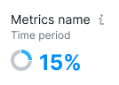   | The donut size is 24px \* 24px. The line thickness is 6px. `innerRadius={6}`, `outerRadius={12}`     |
| Chart inside small narrow widgets (less than 400px) | 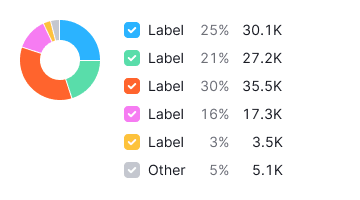 | The donut size is 80px \* 80px. The line thickness is 20px. `innerRadius={20}`, `outerRadius={40}`   |
| Chart inside large widgets (more than 400px)        | 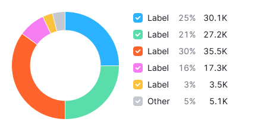       | The donut size is 180px \* 180px. The line thickness is 30px. `innerRadius={60}`, `outerRadius={90}` |

### Half donut chart ("half doughnut") 🔪🍩

It is recommended to display the percentage of the maximum number that one of the values in the data set occupies as a partially filled ring. Often, several such charts are used at once, comparing different values.

|                                                     | Apperance example                                            | Description, styles                                                                                 |
| --------------------------------------------------- | ------------------------------------------------------------ | --------------------------------------------------------------------------------------------------- |
| Charts inside small PanelSummary type components    | 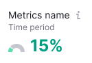   | The donut size is 24px \* 12px. The line thickness is 6px. `innerRadius={6}`, `outerRadius={12}`    |
| Chart inside small narrow widgets (less than 400px) | 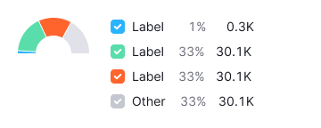 | The donut size is 80px \* 40px. The line thickness is 20px. `innerRadius={20}`, `outerRadius={40}`  |
| Chart inside large widgets (more than 400px)        | 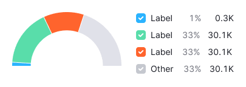       | The donut size is 180px \* 90px. The line thickness is 30px. `innerRadius={60}`, `outerRadius={90}` |

@## Margins

Donut chart has a 24px top margin.

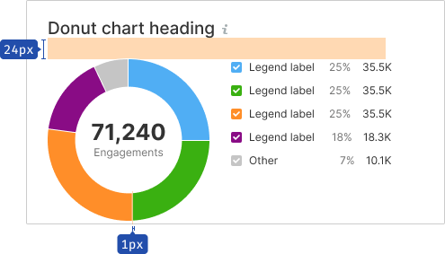

@## Legend

For such a chart, it is recommended to display the legend with the values, if there is enough space.

- The legend should not be far from the chart, the indent is 24px maximum (the rule of proximity between external and internal elements).
- **The legend label is set to 16px. The margin between the values is 12px.**
- The legend is aligned to the top of the chart. This is a more versatile option compared to center alignment.

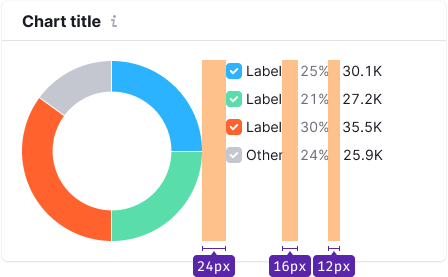

### Long legend

If the category names in the legend are very long, they can be displayed in full length with the text moving to the second line.

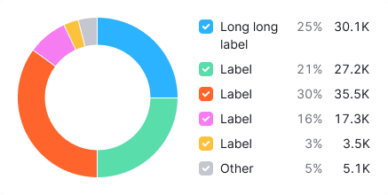

@## Metric in the center of the chart

- In a large donut chart, you can select the largest value and place it inside the chart.
- This metric must have a legend.
- The additional metric information can be hidden in the `Info` icon next to the metric name.

### General value

- The metric default size is 25px (h4, `--fs-500`). The text color is `$gray20`. If necessary, its size can be larger. Accordingly, the inner radius of the donut (`innerRadius`) can be increased to 70-75.
- The default size of the metric legend is 12px (S size, `--fs-100`). The text color is `$gray60`.
- There is no margin between them.
- They are centered vertically and horizontally relative to the chart.
- If you have a small donut and the widget should be compact, the metric can be placed as a total over the legend.

> 💡 If the value name is too large, it can be moved to the second line in a full-fledged donut.
>
> In a half-sized donut, the name of the value should be as short as possible, and the explanation can be contained in the `Info` icon.

| Default donut                                      | Half-sized donut                                             | A default donut in a small widget                      |
| -------------------------------------------------- | ------------------------------------------------------------ | ------------------------------------------------------ |
| 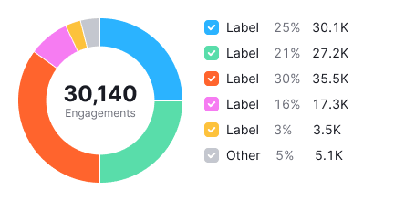 | 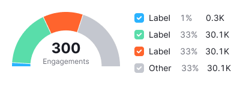 | 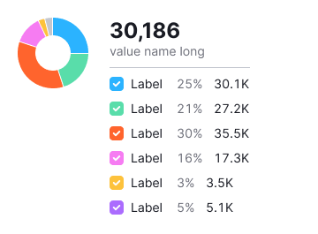 |

### The biggest value

- Metric size is 25px (h4, `--fs-500`). The text color is `$gray20`.
- The legend for the metric is 12px (S size, `--fs-100`). The text color is `$gray60`.
- There is no margin between them.
- They are centered vertically and horizontally relative to the chart.

> 💡 If the metric name is too large, it can be moved to the second line in a full-fledged donut.
>
> In a half-sized donut, the name of the metric should be as short as possible, and the explanation can be contained in the `Info` icon.

| Default donut                                      | Half-sized donut                                             |
| -------------------------------------------------- | ------------------------------------------------------------ |
| 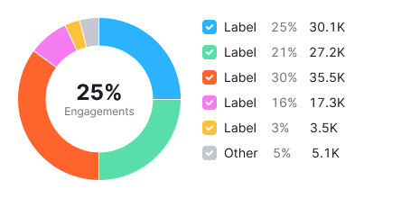 | 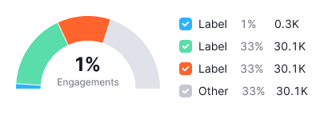 |

@## Interaction

> 💡 The cursor changes to `pointer` when the sector is clickable. In all other cases, the cursor is `default`.

|             | Apperance examples                                        | Styles                                                                                                                                                                                                                                                                         |
| ----------- | --------------------------------------------------------- | ------------------------------------------------------------------------------------------------------------------------------------------------------------------------------------------------------------------------------------------------------------------------------ |
| **default** |            |                                                                                                                                                                                                                                                                                |
| **hover**   | 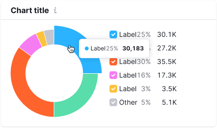     | When hovering over a sector, the cursor changes to `pointer`.                                                                                                                                                                                                                  |
|             | 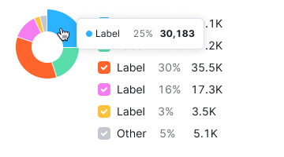   |                                                                                                                                                                                                                                                                                |
| **active**  |    | The active sector of the circle shall be with `outerRadius` increased by 8px.                                                                                                                                                                                                  |
|             | 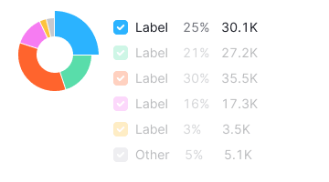 | The cursor changes to pointer when hovering over a sector. All other sectors will be 30% transparent (see [Variables](/style/variables)). `outerRadius` increases by 8px when hovering over it. In the legend, the elements related to other sectors are also 30% transparent. |

@## Tooltip

Hovering over the chart shall trigger a tooltip with the category name and value.

> 💡 The only exceptions are the smallest charts which serve as an icon to illustrate a particular metric. Such charts usually do not have a hover state.

| Description                                                                                          | Apperance examples                         | Styles                                                                                                                                                                                |
| ---------------------------------------------------------------------------------------------------- | ------------------------------------------ | ------------------------------------------------------------------------------------------------------------------------------------------------------------------------------------- |
| The name of the value and the name of the category with the value shall be displayed in the tooltip. |  | In the legend, the percentage values shall be displayed using the secondary text color `$gray60`. The main value in the legend shall be displayed with the main text color `$gray20`. |

@## Edge cases

### The data is 0

If the data for any category is zero, then do not disable the legend. Display 0 as the values in the legend. The zero value sector is not displayed on the chart.

| Apperance examples                              | Styles                                                                                                                                                                                  |
| ----------------------------------------------- | --------------------------------------------------------------------------------------------------------------------------------------------------------------------------------------- |
| 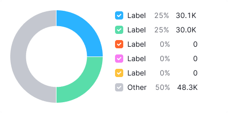 | In the legend, 0 as a percentage shall be displayed using the secondary text color `$gray60`. The main value of 0 in the legend shall be displayed using the main text color `$gray20`. |

### The data has a value less than 1%

In this case, display 1% of the sector.


### Data not available (n/a)

If for some reason the data is not known or not available, then put `n/a` in the legend.

| Apperance examples                           | Styles                                                                                               |
| -------------------------------------------- | ---------------------------------------------------------------------------------------------------- |
| 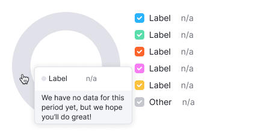 | The `n/a` value of the secondary text color `$gray60`. The color of sectors with `n/a` is `$mystic`. |

### The widget doesn't have enough space for the legend on the right side

In this case, it can be moved under the chart.

| Apperance examples                                      | Styles                                                                                   |
| ------------------------------------------------------- | ---------------------------------------------------------------------------------------- |
| 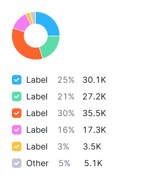 | The margin from the chart to the legend is 24px. Please keep in mind the proximity rule. |

### First loading of the widget

Show a special skeleton shape in chart place. You can read more about this component in [Skeleton](/components/skeleton/).

If the chart has a title, it should be displayed during loading. The user shall have an idea of what is being loaded and whether they need to wait for the loading process to complete.

@## Use in UX/UI

> 💡 **It is not recommended to display more than five categories on the donut chart**. If there are more than five categories, display the largest five, and places the others in the sixth category and name it Other (to be highlighted grey).

Don't use donut charts to compare two sets of values. Instead, you can use [Stacked bar chart](/data-display/bar-chart).

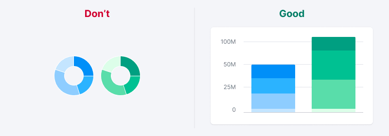

The starting angle for displaying values is always `90 degrees`.

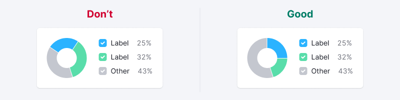

@page donut-chart-api
@page donut-chart-code
