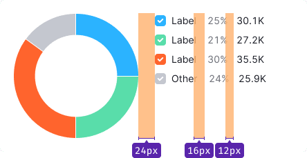
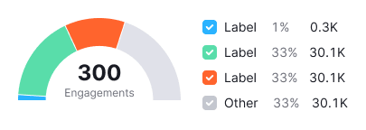
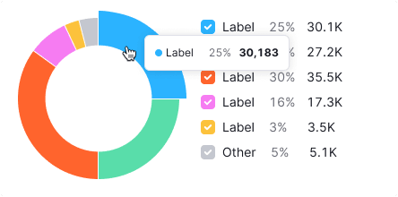

::: react-view

<script lang="tsx">
import React from 'react';
import PlaygroundGeneration from '@components/PlaygroundGeneration';
import { chartPlayground } from '@components/ChartPlayground';
import { Chart, DonutChartProps } from '@semcore/d3-chart';

const data = {
  a: 3,
  b: 1,
  c: 2,
};

const App = PlaygroundGeneration((preview) => {
  const { select, radio, label, bool, text } = preview('ChartDonut');

  const {
    direction,
    alignItems,
    showXAxis,
    showYAxis,
    showTooltip,
    showLegend,
    legendProps,
    patterns,
  } = chartPlayground(
    { select, radio, label, bool },
    { direction: 'row-reverse', legendDirection: 'column' },
  );

  label({ label: 'Donut props', key: 'donutProps' });

  const halfSize = bool({
    key: 'halfSize',
    defaultValue: false,
    label: 'Half size',
  });

  const innerRadius = text({
    key: 'innerRadius',
    defaultValue: 60,
    label: 'Inner Radius',
  });

  const innerLabel = text({
    key: 'innerLabel',
    defaultValue: 'Example',
    label: 'Inner Label',
  });

  legendProps.legendMap = {
    a: { label: 'Nuts' },
    b: { label: 'Fruits' },
    c: { label: 'Milk' },
  };

  const chartProps: DonutChartProps = {
    data,
    plotWidth: 200,
    plotHeight: 200,
    direction,
    showTooltip,
    showXAxis,
    showYAxis,
    alignItems,
    halfsize: halfSize,
    innerRadius,
    innerLabel,
    patterns,
  };

  if (showLegend) {
    chartProps.legendProps = legendProps;
    chartProps.showLegend = true;
  } else {
    chartProps.showLegend = false;
  }

  return <Chart.Donut {...chartProps} />;
}, {filterProps: ['data']});
</script>

:::

::: info
Basic data visualization rules are described in the [D3 chart](/data-display/d3-chart/d3-chart).
:::

## Description

**Donut chart** shows parts of a whole by dividing a circle into proportional segments. Each segment represents a fraction, and the entire circle represents the total sum, always equaling 100%.

**Key points for using donut chart:**

- Donut charts are best for highlighting category proportions, not exact values.
- For more than 5 categories, consider another chart type, like a [Bar chart](/data-display/bar-chart/bar-chart).


**Disadvantages of donut chart:**

- It can only show a few values clearly. With more values, segments become too small to be effective.
- Donut chart needs more space than, for instance, [Bar chart](/data-display/bar-chart/bar-chart).
- Comparing data between different donut charts is hard because it's tougher to compare segment areas than lengths.

::: tip
William Playfair, a Scottish engineer, introduced the donut chart in 1801 to depict the Turkish Empire's land distribution across Asia, Europe, and Africa.

In France, this chart is likened to Camembert cheese rather than a donut.

[How to design pie charts](https://visage.co/data-visualization-101-pie-charts/)
:::

## Appearance

Display values in a clockwise direction. The gap between values is 1px.


### Start and end angles

For donut chart:

```jsx
startAngle={90}
endAngle={-270}
```

For semi donut chart:

```jsx
startAngle={180}
endAngle={0}
```

### Donut chart ("doughnut") 🍩

Table: Donut chart ("doughnut") styles

| Case | Appearance example                                 | Description, styles                                                                                  |
| ---- | -------------------------------------------------- | ---------------------------------------------------------------------------------------------------- |
| In [Summary](/patterns/summary/summary) |    | The chart is 24px by 24px with a 6px line thickness. Use `innerRadius={6}`, `outerRadius={12}`.     |
| Small widgets (less than 400px).                |  | The chart is 80px by 80px with a 20px line thickness. Use `innerRadius={20}`, `outerRadius={40}`.   |
| Large widgets (more than 400px).                |        | The chart is 180px by 180px with a 30px line thickness. Use `innerRadius={60}`, `outerRadius={90}`. |

### Semi donut chart ("half doughnut") 🔪🍩

Table: Semi donut chart ("half doughnut") styles

| Case    | Appearance example                                           | Description, styles                                                                                 |
| ------- | ------------------------------------------------------------ | --------------------------------------------------------------------------------------------------- |
| In [Summary](/patterns/summary/summary). |    | The semi donut is 24px by 12px with a 6px line thickness. Use `innerRadius={6}`, `outerRadius={12}`.    |
| Small narrow widgets (less than 400px).         |  | The semi donut is 80px by 40px with a 20px line thickness. Use `innerRadius={20}`, `outerRadius={40}`.  |
| Large widgets (more than 400px).                |        | The semi donut is 180px by 90px with a 30px line thickness. Use `innerRadius={60}`, `outerRadius={90}`. |

## Legend

- Keep the legend close to the chart, ideally within a 24px margin.
- Legends have a 16px margin-right and a 12px margin between values.
- Align the legend with the chart's top.




### Long label

Wrap long labels to the next line for clarity.


## Main metric

- You can place the largest or main value inside large donut charts.
- Always name the metric.
- Additional info can go in an `Info` icon next to the metric name.
- For small donuts, position the metric above the legend.

### Metric styles

- Use 24px (`--fs-500`) size, `--bold` font-weight and `--text-primary` color for the metric text.
- For the description text use 12px (`--fs-100`) size and `--text-secondary` color.
- Center them inside the chart vertically and horizontally.

::: tip
If the metrics name is too long, wrap it to the next line.

In a semi donut, the metric's name should be as short as possible, and its description can be contained in the `Info` icon.
:::

Table: Metric examples in Donut and Semi donut charts

| Donut                                                                                                 | Semi donut                                                                                                                | Donut in a small widget                                |
| ----------------------------------------------------------------------------------------------------- | ------------------------------------------------------------------------------------------------------------------------- | ------------------------------------------------------ |
|   |   |  |

## Interaction

When hovering over a sector, `outerRadius` increases by 8px. For a clickable sector the cursor changes to `pointer`.

 

## Tooltip

Display name and value in tooltips. Disable tooltips for very small charts.


## Edge cases

### Null values

Show zeros in the legend but not on the chart. Show 0 as the values in the legend, use `--text-secondary` color.


### Value less than or equal 1%

Show as 1% on the chart.


### No data

Mark data as n/a in legend and tooltip, use `--text-secondary` color.


### Not enough space for the legend

Move the legend below the chart with a 24px margin.


## Initial data loading

Show [Skeleton](/components/skeleton/skeleton) during initial loading. If the chart has a title, display it to inform users about what's loading. Refer to [Skeleton](/components/skeleton/skeleton) for more details.

Use the `--skeleton-bg` color token for the skeleton's background.


Refer to [Error & n/a widget states](/components/widget-empty/widget-empty) for all other empty states.

## Usage in UX/UI

::: tip
**It isn’t recommended to display more than five categories on the donut chart**. If there are more than five categories, display the largest five, and place the others in the "Other" category.
:::

Avoid using donut chart for comparing two sets of values. Use [Stacked bar chart](/data-display/bar-chart/bar-chart) instead.


Start displaying values from a 90-degree angle.


