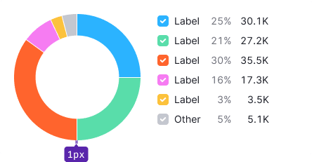
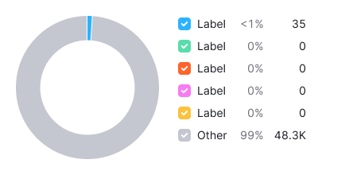
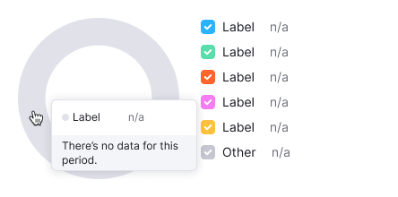

> 💡 Basic data visualization rules are described in the [Chart principles](/data-display/chart/).

@## Description

**Donut chart** visualizes parts to the whole by dividing the circle into proportional segments.

The length of each segment is a proportional fraction, and the entire circle is ALWAYS the total sum of all data, equal to 100%.

**Important points to keep in mind when using donut chart:**

- We recommend using a donut chart when you need to focus on the proportions of categories, rather than on specific values.
- If you need to visualize more than 5 categories, we recommend using a different chart type (for example, [Bar chart](/data-display/bar-chart/)).

**Donut chart has several disadvantages:**

- The number of displayed values is very limited, because the more values, the smaller the size of each individual segment. Accordingly, these charts are not suitable for working with large amounts of data.
- They take up more space than, for example, [Bar chart](/data-display/bar-chart/).
- They are inconvenient for making accurate comparisons between different data sets, since visually the area of segments is more difficult to compare than the length.

> 💡 **Interesting fact**
>
> The creation of the donut chart is credited to the Scottish engineer William Playfair. Back in 1801, he used it to show the proportions of land occupied by the Turkish Empire in Asia, Europe and Africa.
>
> The French do not call such charts donut chart, they compare it with round cheese Camembert.
>
> [How to design pie charts](https://visage.co/data-visualization-101-pie-charts/)

@## Appearance

For all types, show the values clockwise, starting with the largest one. The angle of the padding between the values: `(paddingAngle='1')`.



### Start and end angles

For donut chart:

```jsx
startAngle={90}
endAngle={-270}
```

For semi donut chart:

```jsx
startAngle={180}
endAngle={0}
```

### Donut chart ("doughnut") 🍩

|                                                              | Appearance example                                 | Description, styles                                                                                  |
| ------------------------------------------------------------ | -------------------------------------------------- | ---------------------------------------------------------------------------------------------------- |
| Charts inside [Summary type components](/patterns/summary/). |    | The donut size is 24px \* 24px. The line thickness is 6px. `innerRadius={6}`, `outerRadius={12}`     |
| Chart inside small widgets (less than 400px).                |  | The donut size is 80px \* 80px. The line thickness is 20px. `innerRadius={20}`, `outerRadius={40}`   |
| Chart inside large widgets (more than 400px).                |        | The donut size is 180px \* 180px. The line thickness is 30px. `innerRadius={60}`, `outerRadius={90}` |

### Semi donut chart ("half doughnut") 🔪🍩

|                                                              | Appearance example                                           | Description, styles                                                                                 |
| ------------------------------------------------------------ | ------------------------------------------------------------ | --------------------------------------------------------------------------------------------------- |
| Charts inside [Summary type components](/patterns/summary/). |    | The donut size is 24px \* 12px. The line thickness is 6px. `innerRadius={6}`, `outerRadius={12}`    |
| Chart inside small narrow widgets (less than 400px).         |  | The donut size is 80px \* 40px. The line thickness is 20px. `innerRadius={20}`, `outerRadius={40}`  |
| Chart inside large widgets (more than 400px).                |        | The donut size is 180px \* 90px. The line thickness is 30px. `innerRadius={60}`, `outerRadius={90}` |

@## Legend

Show legend with the values.

- The legend should not be far from the chart, the margin is 24px maximum.
- **The legend label has 16px margin-right. The margin between the values is 12px.**
- The legend is aligned to the top of the chart.


### Long label

If legend label is very long, wrap it to the next line.


@## Main metric

- For a big donut chart, you can select the largest or the main value and place it inside the chart.
- The metric must have a name.
- The additional metric information can be hidden in the Info icon next to the metric name.

If you have a small donut and the widget should be compact, the metric can be placed over the legend.

### Metric styles

- The metric default size is 24px (`--fs-500`). The text color is `--gray-800`.
- The default size of the metric legend is 12px (`--fs-100`). The text color is `--gray-500`.
- There is no margin between them.
- They are centered vertically and horizontally relative to the chart.

> 💡 If the metrics name is too long, wrap it to the next line.
>
> In a half-sized donut, the name of the metric should be as short as possible, and the explanation can be contained in the Info icon.

| Donut                                                                                                 | Semi donut                                                                                                                | Donut in a small widget                                |
| ----------------------------------------------------------------------------------------------------- | ------------------------------------------------------------------------------------------------------------------------- | ------------------------------------------------------ |
|   |   |  |

@## Interaction

> 💡 The cursor changes to `pointer` when the sector is clickable. In all other cases, the cursor is `default`.

|             | Appearance examples                                                                                               | Styles                                                                                                                                   |
| ----------- | ----------------------------------------------------------------------------------------------------------------- | ---------------------------------------------------------------------------------------------------------------------------------------- |
| **default** |                                                                    |                                                                                                                                          |
| **hover**   |       | When hovering over a sector, `outerRadius` increases by 8px. For a clickable sector the cursor changes to `pointer`.                     |
| **active**  |   | The `outerRadius` of the active sector is increased by 8px. In the legend, the elements related to the inactive sectors get 30% opacity. |

@## Tooltip

Hovering over the chart triggers a tooltip with the name and value of the data.

> 💡 Disable tooltip for the smallest charts which serve as an illustration to a particular metric.


@## Edge cases

### Null values

If the data for any category is zero, then do not disable the legend. Show 0 as the values in the legend, use `--gray-500` color. The zero value sector is not displayed on the chart.


### Value less than 1%

In this case, display 1% of the sector.



### Not available data

If for some reason the data is not known or not available, show `n/a` in the legend and tooltip, use `--gray-500` color.



### Not enough space for the legend

In this case, move legend under the chart. The margin from the chart to the legend is 24px.


@## Initial loading

When loading the chart for the first time, show [Skeleton](/components/skeleton/) instead of the chart.

If the chart has a title, show it during the loading. The user shall have an idea of what is being loaded and whether they need to wait for the loading process to complete.

More information about this state see in the guide for [Skeleton](/components/skeleton/).


@## Use in UX/UI

> 💡 **It is not recommended to display more than five of data on the donut chart**. If there are more than five categories, display the largest five, and place the others in the sixth category and name it Other.

Don't use donut chart to compare two sets of values. Instead, you can use [Stacked bar chart](/data-display/bar-chart).


The starting angle for displaying values is always `90 degrees`.


@page donut-chart-api
@page donut-chart-d3-code
@page donut-chart-recharts-code
