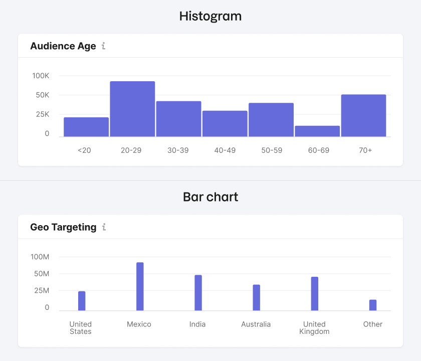
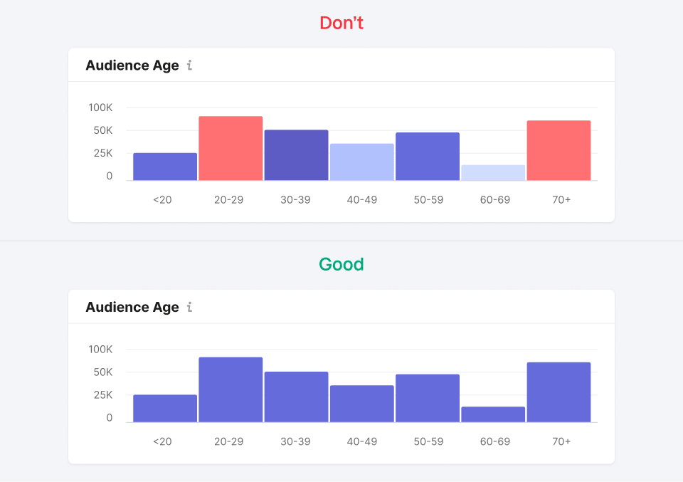
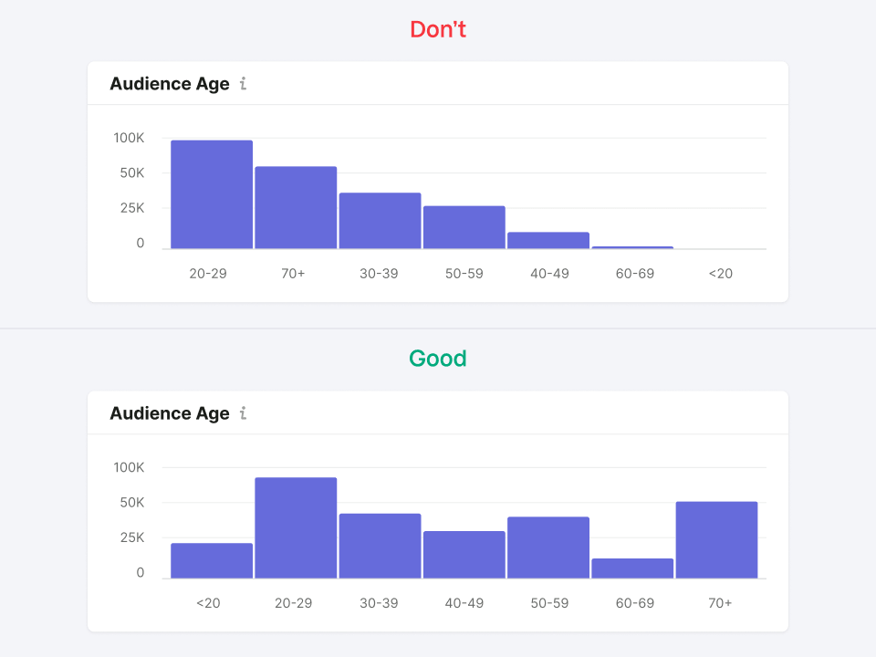
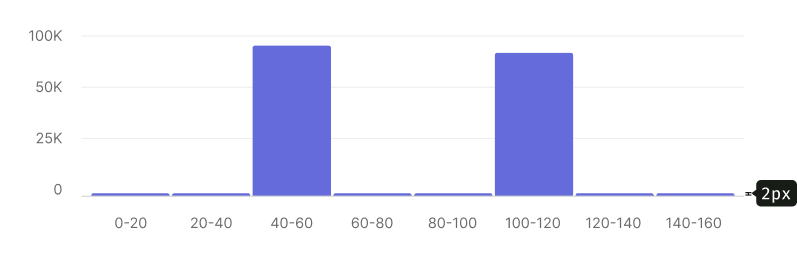
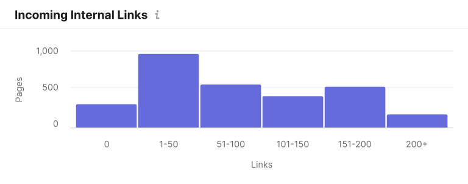
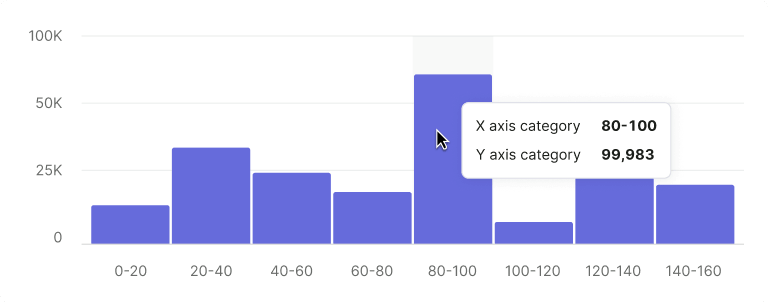
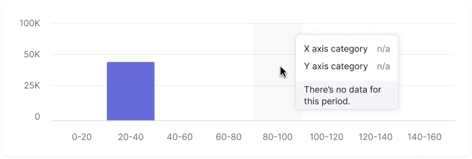
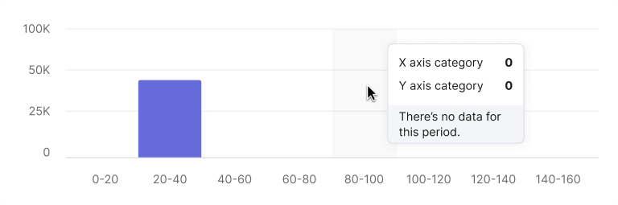
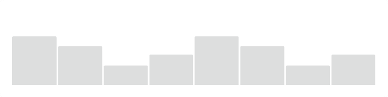
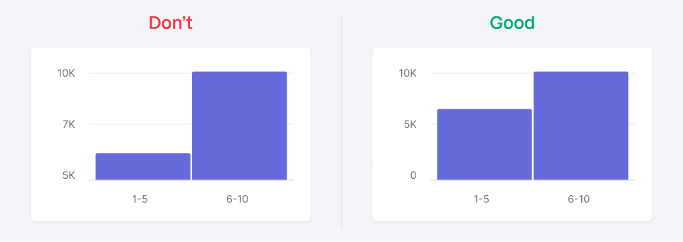

<Playground for="Chart.Histogram" />

::: info
Basic data visualization rules are described in the [D3 chart](/data-display/d3-chart/d3-chart).
:::

## Description

**Histogram** groups numeric data to compare it by quantity. It's good for showing the distribution of values.

**Key points for using histogram:**

- Start the Y-axis at zero.
- Make sure the chart title explains the axes. Add labels if needed.
- Use a single color or similar shades for simplicity.
- Consider horizontal histogram for long range names or many ranges.

### Histogram vs. Bar chart

- Histogram shows quantitative data distribution. Each bar represents a range of numerical values, such as age. The bar length shows how many values fall into that range.
- [Bar chart](../bar-chart/bar-chart) displays qualitative data distribution, with bars representing nominal categories, such as countries. Unlike histograms, bar charts have visual gaps between bars to emphasize the discrete character of the categories.

## Appearance

### Color

- Stick to the [color palette](/data-display/color-palette/color-palette) guidelines.
- Normally, all bars should be the same color. Use different colors only if it's helpful for understanding the data.

### Bar order

Organize values logically, such as largest to smallest, or chronologically for months.

::: tip
Avoid ordering histogram bars by length—it makes the chart hard to read.
:::

### Handling outliers

Sometimes data values vary widely. Showing such data as is can skew perception towards larger values, making others seem insignificant.

::: tip
Bars have a minimum height of 2px to ensure visibility next to very large values.
:::

A logarithmic scale can help balance the representation of data ranges. Possible solutions for such case are described in the [Handling outliers](/data-display/bar-chart/bar-chart#handling-outliers) section for Bar chart.

## Legend and axes

Usually, histograms don't need a legend. Just clearly name the chart and possibly label the axes.

## Interaction

Hovering highlights a column with `--chart-grid-bar-chart-hover`, indicating focus or clickability. For trend lines, display corresponding points on hover.

## Edge cases

### Data for one range

Display a single bar for single-range data.

### Null values

Show zero in tooltips for all-zero data.

::: tip
Zero values count as data and are different from "n/a".
:::

### No data

Don't display bars for ranges without values. When hovering over such ranges, show a tooltip with the "n/a" value. Additionally, consider adding a message explaining the absence of data and providing information on when it will be available (if possible).

## Initial data loading

Show [Skeleton](/components/skeleton/skeleton) during initial loading. If the chart has a title, display it to inform users about what's loading. Refer to [Skeleton](/components/skeleton/skeleton) for more details.

Use the `--skeleton-bg` color token for the skeleton's background.

## Usage in UX/UI

Bars should always begin from zero to avoid misleading comparisons. Incorrect scaling can create illusions of proportion, making one value seem half as large as another when it's not.

