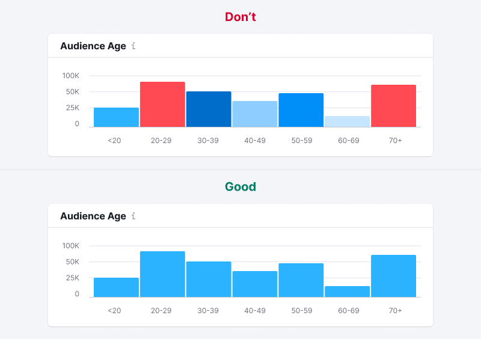
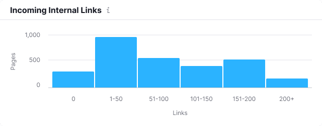

> 💡 Basic data visualization rules are described in the [Chart principles](/data-display/chart/).

@## Description

**Histogram chart** helps you grouping numeric data for comparison by quantitative indicators. It shows you the distribution of values.

**This histogram is used** when you need to display the distribution of data sets by groups (most often these are quantitative ranges).

**Important points to keep in mind when presenting data as a histogram:**

- Start the Y-axis from zero.
- The axes should be clear to the user from the chart name. However, in cases where the graph name is not enough, you can denote the axes.
- Don't use too many colors to represent values. One color or shades of the same color shall be sufficient for your tasks. However, you can always select a value if necessary.
- The histogram can be placed vertically if the range names are long and there are many ranges.

> 💡 Difference from Bar chart
>
> - Histogram charts are used to display distribution of data sets: how often values fall into quantitative ranges.
> - Bar chart displays the distribution of data sets by quality categories for comparison.
>
> `Histograms are used to show distributions of variables while bar charts are used to compare variables`, [source](https://www.forbes.com/sites/naomirobbins/2012/01/04/a-histogram-is-not-a-bar-chart/#93b29b6d775f).
>
> _For example, we want to compare revenues of five companies. In this case, we should use [bar chart](/data-display/bar-chart/)._
>
> If we want to compare the number of companies that earn from 0 to 10,000; from 10,000 to 20,000; from 20,000 to 30,000, etc., then we should use the histogram chart.
>
> - In statistics, a histogram is a visual representation of the probability density function of a random variable based on a sample.
> - Most often, in order to ease the perception, the width of the columns shall be the same.

@## Appearance

If we need to display different categories of data within a dataset, `stacked histogram chart` can be used.

### Vertical histogram chart

| Appearance examples                                   | Styles                                                                                                                              |
| ----------------------------------------------------- | ----------------------------------------------------------------------------------------------------------------------------------- |
|        | The columns have `border-radius` of 2px. Margin between the columns is 1 ([barGap](http://recharts.org/en-US/api/BarChart#barGap)). |
|  | No margins between data categories compared to [Stacked bar chart](/data-display/bar-chart).                                        |

### Horizontal histogram chart

| Appearance examples                                  | Styles                                                                                                                              |
| ---------------------------------------------------- | ----------------------------------------------------------------------------------------------------------------------------------- |
|        | The columns have `border-radius` of 2px. Margin between the columns is 1 ([barGap](http://recharts.org/en-US/api/BarChart#barGap)). |
|  | No margins between data categories compared to [Stacked bar chart](/data-display/bar-chart).                                        |

@## Use of color

- Use [special chart palette](/style/color/) and follow the the rules prescribed for it.
- **Please keep in mind that you should only color the bars on the histogram in different colors when this can be useful for easier reading of the chart.** _For example, you need to highlight a certain gradation of ranges. In this case, you can choose the appropriate colors from the chart palette._

@## Legend, names of axes

As a rule, a histogram does not need a legend. You only need to clearly name the chart and in some cases you can add names to the axes.

@## Sorting of columns
Don't forget to use a reasonable order of values to distribute your data sets. For example, from the largest value to the smallest one, and if they represent months - from January to December, etc.

> 💡 You can't change the order of the bars on the histogram, depending on the size of bars on the `Y-axis`. This will make it harder to read the data.

@## Large values (outliers)

In some cases some of the values in our data are very different from the majority of values.

If you show this picture as it is, with a zero value on the `Y-axis`, then large values will draw all the attention to themselves, while the rest of the data will appear to be zero.

> 💡 **The column has a minimum height of 2px.** It is necessary so that the column does not "disappear" if there are extremely large values next to it.

Possible solutions for such cases are described in the guide about bar charts, [see the section describing large values](data-display/bar-chart/). **The recommended solution is to make the scale logarithmic instead of linear.**

@## Interaction

When you hover over a column, we highlight it with a gray background – r`gba 152 170 175, 0.3` (`var(--mist)` с .3 opacity). The hover takes up half of the margin column on the right and left sides.

> 💡 If the column is clickable, the cursor must change to `pointer`.

@## Edge cases

### Data for one range

- We display a single column if we only have data for one range.
- In the missing data area, display `n/a` in the tooltip as well as the text that there are no data for this period.

### All values are zero

If all the values on the chart are zero, then in the tooltip we shall display 0 for this point.

> **Zero is also data. 0 ≠ `n/a`.**

### A part of the chart contains no data

- Do not display columns in the area without data.
- When you hover over a range without data, the tooltip with the `n/a` value for the point shall appear. It is recommended to specify in the tooltip why there is no data, and when it will be available (if possible).

> **When there is no data, you can't draw a zero line. Zero is also data. 0 ≠ `n/a`.**

### Data loading

- Display Skeleton in the place of the chart.
- If the chart has a title, it should be displayed during loading. The user shall have an idea of what is being loaded and whether they need to wait for the loading process to complete.

@## Use in UX/UI

- Start the columns from zero.
- By comparing columns, we are actually comparing the length. If we do not start the scale from zero, there will be a visual illusion.

Check out the charts below. In the wrong case, the scale does not start from zero, and it seems that the `Y value` is almost half as large as the `X value`. However, this is not true.

@page histogram-chart-api
@page histogram-chart-code
