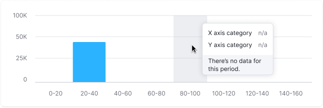
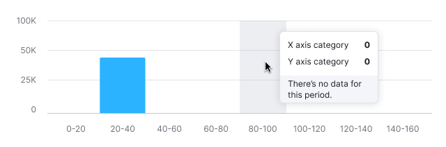

::: react-view

:::

::: info
Basic data visualization rules are described in the [D3 chart](/data-display/d3-chart/d3-chart).
:::

## Description

**Histogram chart** groups numeric data to compare it by quantity. It's good for showing the distribution of values.

**Key points for using histogram:**

- Start the Y-axis at zero.
- Make sure the chart title explains the axes. Add labels if needed.
- Use a single color or similar shades for simplicity.
- Consider horizontal histogram for long range names or many ranges.

::: tip
Histogram vs. Bar Chart

- Histogram chart are used to display distribution of data sets: how often values fall into quantitative ranges.
- Bar chart displays the distribution of data sets by quality categories for comparison.

> Histograms are used to show distributions of variables while bar charts are used to compare variables, [source](https://www.forbes.com/sites/naomirobbins/2012/01/04/a-histogram-is-not-a-bar-chart/#93b29b6d775f). _For example, we want to compare revenues of five companies. In this case, use [Bar chart](/data-display/bar-chart/bar-chart)._
>
> If we want to compare the number of companies that earn from 0 to 10,000; from 10,000 to 20,000; from 20,000 to 30,000, etc., then we should use the histogram chart.

- Histograms visually represent data distribution probability.
- Columns are usually the same width for clarity.
  :::

## Appearance

### Vertical histogram chart

The upper part of the bar should have `border-radius: 2px`.

### Color usage

- Stick to the [color palette](/data-display/color-palette/color-palette) guidelines.
- Different colors can make the chart easier to read. Use this carefully, like for highlighting specific ranges.

### Sorting of columns

Organize values logically, such as largest to smallest, or chronologically for months.

::: tip
Don't reorder histogram bars by size; it makes the chart hard to read.
:::

### Handling outliers

Sometimes data values vary widely. Showing such data as is can skew perception towards larger values, making others seem insignificant.

::: tip
Bars have a minimum height of 2px to ensure visibility next to very large values.
:::

A logarithmic scale can help balance the representation of data ranges. Possible solutions for such case are described in the [Handling outliers](/data-display/bar-chart/bar-chart#handling-outliers) section for Bar chart.

## Legend and axes

Usually, histograms don't need a legend. Just clearly name the chart and possibly label the axes.

## Interaction

Hovering highlights a column with `--chart-grid-bar-chart-hover`, indicating focus or clickability. For trend lines, display corresponding points on hover.

## Edge cases

### Data for one range

Display a single bar for single-range data.

### Null values

Show zero in tooltips for all-zero data.

::: tip
Zero counts as data. 0 ≠ n/a.
:::

### No data

Do not display bars for ranges without values. When hovering over such ranges, show a tooltip with the "n/a" value. Additionally, consider adding a message explaining the absence of data and providing information on when it will be available (if possible).

## Initial data loading

Show [Skeleton](/components/skeleton/skeleton) during initial loading. If the chart has a title, display it to inform users about what's loading. Refer to [Skeleton](/components/skeleton/skeleton) for more details.

Use the `--skeleton-bg` color token for the skeleton's background.

## Usage in UX/UI

Always start columns from zero to avoid misleading comparisons. Incorrect scaling can create illusions of proportion, making one value seem half as large as another when it's not.

