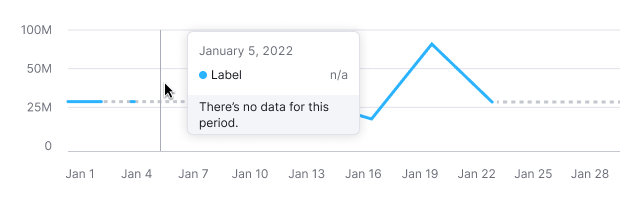
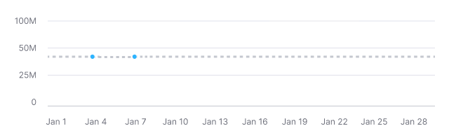
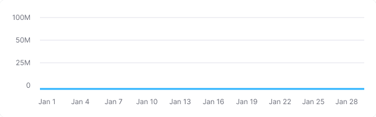
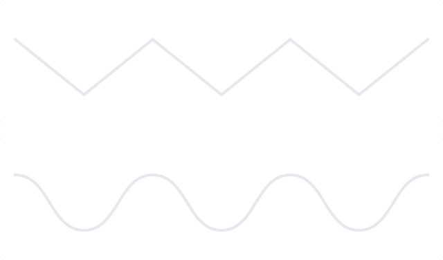

::: react-view

:::

::: info
Basic data visualization rules are described in the [D3 chart](/data-display/d3-chart/d3-chart).
:::

## Description

**Line chart** displays the trend of numeric variables over time, making it ideal for showing changes in data across a specified period.

**Key considerations for line chart:**

- Ensure the chart's axes are clear, adding labels if the chart name isn't sufficient.
- Simplify the chart by removing unnecessary visuals like excessive lines or colors to avoid distracting the viewer.
- If data doesn't start at zero, consider zooming in on the Y-axis for better readability.
- Limit data sets to 5-7 categories to prevent the chart from becoming cluttered and confusing.

::: tip
Refer to materials below, to have insights on choosing between line and area charts:

- [Choosing the right chart type: Line charts vs Area charts](https://www.fusioncharts.com/blog/line-charts-vs-area-charts/)
- [The Fine Line In a Gray Area: When to Use Line vs Area Charts](https://visual.ly/blog/line-vs-area-charts/)
:::

## Appearance

Charts are displayed with non-curved lines by default (without `curve` property) to make it easier to read exact values.

Table: Line chart default appearance

| Example                                       | Styles                 |
| --------------------------------------------- | ---------------------- |
|  | Line thickness: 3px. |

Display dots on lines when data points either are few or collected irregularly.

Table: Line chart default appearance with dots

| Example                            | Styles                                                                                                                      |
| ---------------------------------- | --------------------------------------------------------------------------------------------------------------------------- |
|  | Dot has size **8px * 8px** and **border: 1px solid var(--chart-grid-border)**. On hover, dot expand to **10px * 10px**. |

## Interaction

Hovering over the chart displays a vertical guide line at the nearest dot and a detailed tooltip. The guide line color is `--chart-grid-y-accent-hover-line`.

Show a tooltip with n/a for areas without data values.

With many categories, tooltips display dots and values for all under the cursor, maintaining the chart's category order.

::: tip
Keep tooltip category order consistent with the chart.
:::

::: tip
For detailed tooltip information, see [Chart principles](/data-display/d3-chart/d3-chart#tooltip).
:::

## Edge cases

### One value

Display dots by default for charts with a single data point. The line is dashed and colored with `--chart-palette-order-other-data`.

### Two values

Display dots by default.

**Example 1** is for two distant dates.

**Example 2** is for consecutive dates.

### Null values

Display the line at the zero axis if all values are zero.

::: tip
Zero counts as data. 0 ≠ n/a.
:::

### No data

For periods without data, use a dashed line between known points.

::: tip
When there is no data, you can't draw a zero line. Zero counts as data. 0 ≠ n/a.
:::

Display a tooltip with n/a when hovering over a dot without data, and explain why, if possible.

## Initial data loading

Show [Skeleton](/components/skeleton/skeleton) during initial loading. If the chart has a title, display it to inform users about what's loading. Refer to [Skeleton](/components/skeleton/skeleton) for more details.

Use the `--skeleton-bg` color token for the skeleton's background.

Refer to [Error & n/a widget states](/components/widget-empty/widget-empty) for all other empty states.
