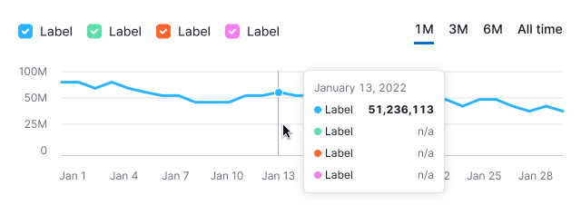

> 💡 The basic data visualization rules in widgets with graphs are described in [Data vizualization](/data-display/conception/).

@## Description

**Line chart** helps to visualize the trend of quantitative indicators over a period of time.

If you have an array of points for a certain period, you can use this chart type to present all changes and developments.

**Important points to keep in mind when presenting data as a line chart:**

- The axes should be clear to the user from the chart name. However, in cases where the graph name is not enough, you can denote the axes.
- Remove all unnecessary visual information, such as extra additional background lines, bunch of colors and incomprehensible bulky legends. Otherwise, this may distract the user from being able to see the data clearly.
- If the data doesn't start from zero, in some cases you can track the chart along the `Y-axis`. This can make your data more readable and easier to understand.
- **Try not to compare more than 5-7 values on a line chart**. In this case, the chart may become unreadable and confusing.

> 💡 Useful materials about line chart vs. area chart:
>
> - [Choosing the right chart type: Line charts vs Area charts](https://www.fusioncharts.com/blog/line-charts-vs-area-charts/)
> - [The Fine Line In a Gray Area: When to Use Line vs Area Charts](https://visual.ly/blog/line-vs-area-charts/)

@## Appearance

By default, we show a chart with rounded lines. This view facilitates reading the trend; this is what most people look at the chart for. For those who are interested in specific values, there is a tooltip with data for a specific point that appears when you hover over the chart.

> 💡 Add a possibility for user to select either rounded or sharp line type in the widget settings.

| Example                                       | Styles                 |
| --------------------------------------------- | ---------------------- |
|  | Line thickness is 3px. |

It is recommended to display the points on lines either when there are few of them (one or two), or when data collection is irregular.

| Example                            | Styles                                                                                                        |
| ---------------------------------- | ------------------------------------------------------------------------------------------------------------- |
|  | Point size is `16px * 16px`, `border: 2px solid $white`. When hovering, the point increases to `20px * 20px`. |

@## Interaction

When you hover over the chart area, a vertical guide line is shown at the nearest point; this point is enlarged itself, and a tooltip with detailed data for the point appears next to it. The color of the vertical guide line is `$stone`.

When hovering over the chart area without values, a tooltip with information shall also be displayed. In this case, the value is `n/a`. And the dot is grey, `$stone-light`.

If there are a lot of lines on the chart, the tooltip shows points and values for all points under the cursor on the `Y-axis`.

At the same time, we do not change the order of points inside the tooltip in relation to the order of lines on the chart.

@## Edge cases

Here you will find the states for one, two, zero, and fractional values. All other "empty states" for widgets are specified in [Error & n/a widget states](/components/widget-empty/).

@## One value

For this case, it will be needed to enable the display of points on the chart by default.

### Styles

- **Point size is 16px \* 16px**. When hovering, the point increases to **20px \* 20px**.
- The line where the point is displayed has the `dashed` line style. Color `$stone-light`.

@## Two values

For this case, it will be needed to enable the display of points on the chart by default.

If there are only two data points on the chart, then these two shall be displayed by connecting them with a dotted line. Do not change the range of the selected period. After the existing data points, continue the dotted line of the expected trend.

**Example 1** is for the case when there is data for two non-near dates.

**Example 2** is when there is data for two consecutive dates.

@## All values are zero

If all values on the chart are zero, then we show the trend line on the zero axis.

> **Zero is also data. 0 ≠ `n/a`.**

@## No data in one of the categories

When you hover over a point that some of the categories don't have data for, a tooltip with the `n/a` value for these categories shall be displayed.

@## A part of the chart contains no data

In the area without data, a dotted line between known points should be displayed. If the unknown period is at the beginning or end of the chart, then the lines must be horizontal.

When you hover over a point without data, the tooltip with the `n/a` value for the point shall be shown. We recommend to specify in the tooltip why there is no data, and when it will be available, if possible.

> **When there is no data, you can't draw a zero line. Zero is also data. 0 ≠ `n/a`.**

@## Initial data loading

When loading the chart for the first time, [Skeleton](/components/skeleton/) should be displayed instead of the chart.

If the chart has a title, it should be displayed during loading. The user shall have an idea of what is being loaded and whether they need to wait for the loading process to complete.

Styles can be found in the guide book for [Skeleton](/components/skeleton/).

@page line-chart-api
@page line-chart-code
