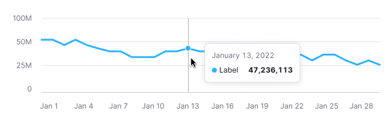

> 💡 Basic data visualization rules in widgets with charts are described in [Data vizualization](/data-display/chart/).

@## Description

**Line chart** helps to visualize the trend of numeric variables over a period of time.

If you have an array of values for a certain period, you can use this chart type to present changes of the array through the time.

**Important points to keep in mind when presenting data as a line chart:**

- The axes should be clear to the user from the chart name. However, in cases where the chart name is not enough, you can add labels for the axes.
- Remove all unnecessary visual information, such as extra additional background lines and a bunch of colors. Otherwise, this may distract the user from being able to understand the data.
- If the data doesn't start from zero, in some cases you can zoom the chart to the `Y-axis`. This can make your data more readable and easier to understand.
- **Try not to compare more than 5-7 categories on a line chart**. The chart may become unreadable and confusing.

> 💡 Useful materials about line chart vs. area chart:
>
> - [Choosing the right chart type: Line charts vs Area charts](https://www.fusioncharts.com/blog/line-charts-vs-area-charts/)
> - [The Fine Line In a Gray Area: When to Use Line vs Area Charts](https://visual.ly/blog/line-vs-area-charts/)

@## Appearance

By default, we show a chart with straight lines. This view facilitates reading the trend; this is what most people look at the chart for.

> 💡 Add a possibility to select either straight or smooth line type in the widget settings.

| Example                                       | Styles                 |
| --------------------------------------------- | ---------------------- |
|  | Line thickness is 3px. |

We recommended you to display the dots on lines either when there are few of them (one or two), or when data collection is irregular.

| Example                            | Styles                                                                                                    |
| ---------------------------------- | --------------------------------------------------------------------------------------------------------- |
|  | Point size is `8px * 8px`, `border: 2px solid $white`. When hovering, the dot increases to `12px * 12px`. |

@## Interaction

When user hovers over the chart area, show a vertical guide line at the nearest dot and a tooltip with detailed data for the dot appears next to it. The color of the vertical guide line is `--gray-300`.

When user hovers over the chart area without values, show tooltip with information. In this case, the value is `n/a`.

If there are a lot of categories on the chart, the tooltip shows dots and values for all dots under the cursor.

> Do not change the order of categories inside the tooltip in relation to the order of lines on the chart.

@## Edge cases

Here you will find the states for one, two, zero values, etc. All other "empty states" for widgets are specified in [Error & n/a widget states](/components/widget-empty/).

@## One value

For this case enable the display of dots on the chart by default.

### Styles

- **Point size is 8px \* 8px**. When hovering, the point increases to **12px \* 12px**.
- The line has the `dashed` border style and `--gray-200` color.

@## Two values

For this case enable the display of dots on the chart by default.

**Example 1** is for the case when there is data for two non-near dates.

**Example 2** is when there is data for one after another dates.

@## All values are null

If all values on the chart are zero, then show the trend line on the zero axis.

> **Zero is also data. 0 ≠ `n/a`.**

@## No data

When user hovers over a dot that some of the categories don't have data for, show tooltip with the `n/a` value for these categories.

@## No data area

> **When there is no data, you can't draw a zero line. Zero is also data. 0 ≠ `n/a`.**

In the area without data, show a dashed line between known dots. If the not available period is at the beginning or end of the chart, then the lines must be horizontal.

When user hovers over a dot without data, show the tooltip with the `n/a` value. We recommend you to add a message why there is no data, and when it will be available, if possible.

@## Initial data loading

When loading the chart for the first time, show [Skeleton](/components/skeleton/) instead of the chart.

If the chart has a title, show it during the loading. The user shall have an idea of what is being loaded and whether they need to wait for the loading process to complete.

More information about this state see in the guide for [Skeleton](/components/skeleton/).

@page line-chart-api
@page line-chart-d3-code
@page line-chart-recharts-code
