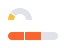

## Description

Mini chart is a component for visualizing a small dataset or a single value that needs to be highlighted in the interface to assist the user in quickly reviewing data and understanding how the data has changed on the page.

## Types

Mini chart has two types:

Table: Mini chart types

| type       | Appearance example | Description |
| ---------- | ------------------ | ----------- |
| `trend`    |  | Use to show trend from a list of values. |
| `score`    |  | Use to visualize some value or to indicate if something (in per cents or absolute numbers) is good/bad, high/low, above average, etc. |

## Sizes

The component charts have default sizes, but you can set them to those you need, chart will scale to them. For example:

### Trend type

Table: Versions of charts with trend type

| Chart type       | Appearance example | Description |
| ---------------- | ------------------ | ----------- |
| Line chart       |  | Use to show overall trend over time for a big dataset.|
| Area chart       |  | Use to show overall trend over time for a big dataset, but when you need to make trend more visible in the interface.|
| Bar chart        |  | Use to show overall trend over time for a small dataset. |
| Histogram chart  |  |Use to show overall trend over time for a big dataset. |

You can show the highest/lowest point if necessary.

### Score type

The choice of one of the charts below depends on how visually prominent the value should be in your interface and how much space is actually available.

Table: Versions of charts with score type

| Chart type               | Appearance example |
| ------------------------ | ------------------ |
| Donut chart              |  |
| Semi donut chart (Gauge) |  |
| Line gauge chart         |  |

## Usage with text

You can place a value with any font size next to a mini-chart. We recommend making margins multiples of our `--intergalactic-scale-indent` (4px).

## States

Table: Mini chart states

| State         | Appearance example | Description |
| ------------- | ------------------ | ----------- |
| Default       |  | |
| Null data     |  | If all values on the chart are zero, then show the trend line on the zero axis. **Zero is also data. 0 ≠ `n/a`.** |
| No available data       |  | If there are no available data, then show only the "n/a" text for the value. |
| Initial data loading |  | When the chart is loading for the first time, show [Skeleton](/components/skeleton/skeleton) instead of the chart. |
