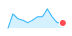
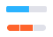
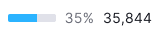

::: react-view

:::

## Description

**Mini chart** is a component for visualizing a small data set or a single value that needs to be highlighted in the interface to assist the user in quickly reviewing data and understanding how the data has changed on the page.

## Types

Mini chart has two types:

Table: Mini chart types

| type    | Appearance example    | Description                                                                                                                           |
| ------- | --------------------- | ------------------------------------------------------------------------------------------------------------------------------------- |
| `trend` |  | Use to show trend from a list of values.                                                                                              |
| `score` |  | Use to visualize some value or to indicate if something (in per cents or absolute numbers) is good/bad, high/low, above average, etc. |

### Trend type

Table: Versions of charts with trend type

| Chart type      | Appearance example              | Description                                                                                                            |
| --------------- | ------------------------------- | ---------------------------------------------------------------------------------------------------------------------- |
| Line chart      |       | Use to show overall trend over time for a big data set.                                                                |
| Area chart      |       | Use to show overall trend over time for a big data set, but when you need to make trend more visible in the interface. |
| Bar chart       |        | Use to show overall trend over time for a small data set.                                                              |
| Histogram chart |  | Use to show overall trend over time for a big data set.                                                                |

You can show the highest/lowest point if necessary.

### Score type

The choice of one of the charts below depends on how visually prominent the value should be in your interface and how much space is actually available.

Table: Versions of charts with score type

| Chart type               | Appearance example               |
| ------------------------ | -------------------------------- |
| Donut chart              |       |
| Semi donut chart (Gauge) |  |
| Line gauge chart         |  |

## Sizes

The component charts have default sizes, but you can set them to those you need, chart will scale to them. For example:

## Usage with text

You can place a value with any font size next to a mini-chart. We recommend making margins multiples of our `--intergalactic-scale-indent` (4px).

## States

Table: Mini chart states

| State                | Appearance example              | Description                                                                                                        |
| -------------------- | ------------------------------- | ------------------------------------------------------------------------------------------------------------------ |
| Default              |    |                                                                                                                    |
| Null data            |  | If all values on the chart are zero, then show the trend line on the zero axis. **Zero counts as data. 0 ≠ n/a.**  |
| No available data    |    | If there are no available data, then show only the "n/a" text for the value.                                       |
| Initial data loading |   | When the chart is loading for the first time, show [Skeleton](/components/skeleton/skeleton) instead of the chart. |
