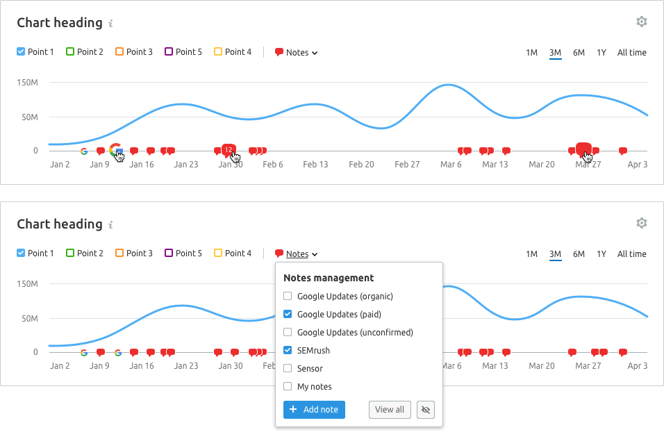
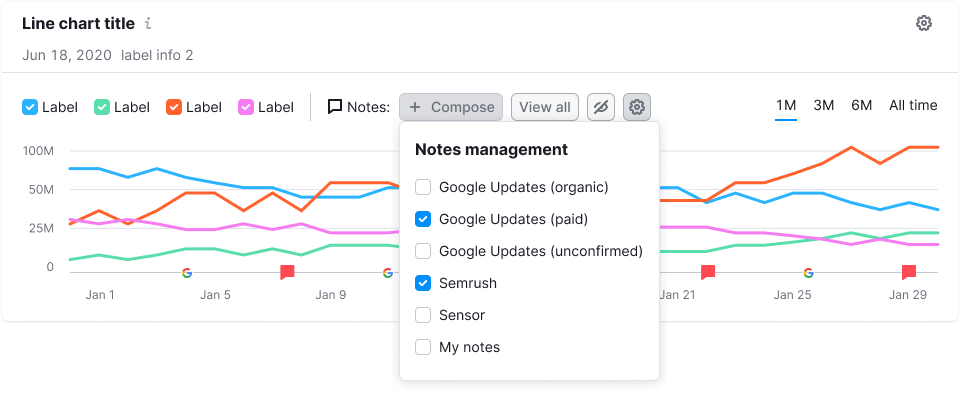
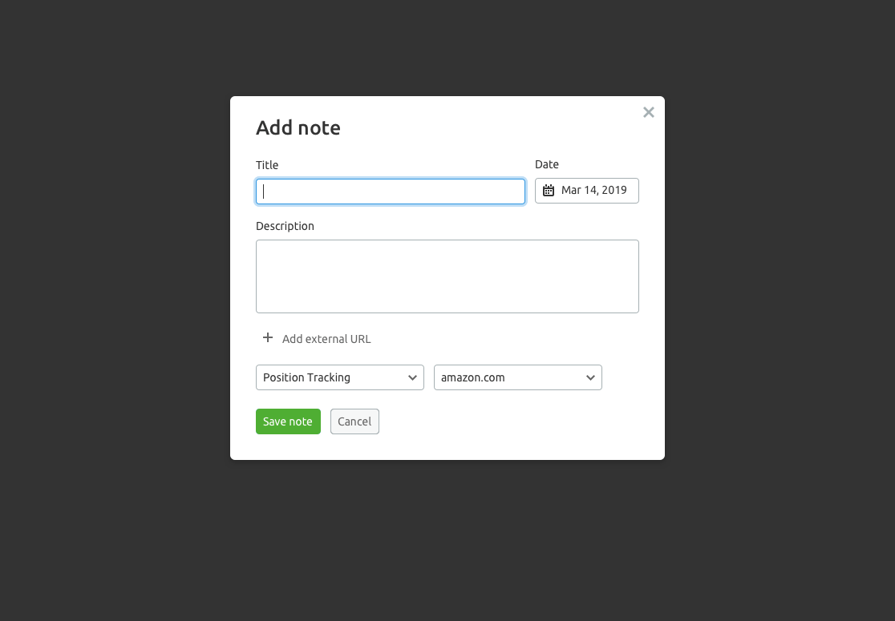
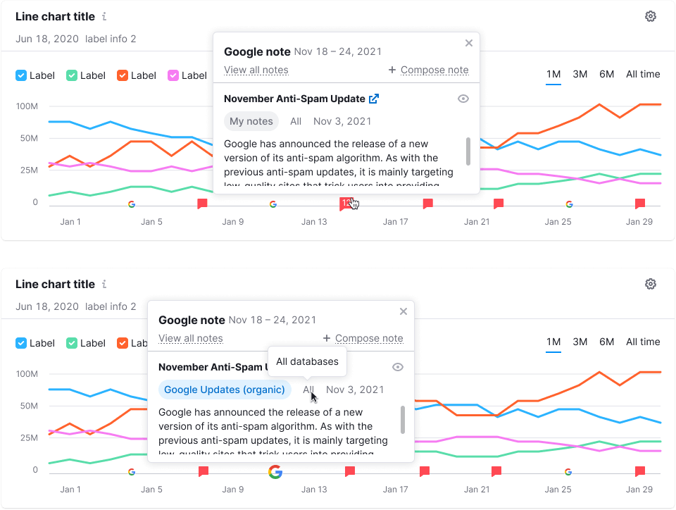

> 💡 Basic data visualization rules in widgets with charts are described in [Chart principles](/data-display/chart/).

@## Description

**Notes** is a module for creating notes and displaying them in charts.

- Notes can be created by the user, system, or other services. You can make an unlimited number of notes for a single date.
- We recommended you to place a trigger for managing notes above the chart.
- _In exceptional cases place it under the chart._

@## Appearance

You can display the module in compact or advanced variant.

@## Compact (in DropdownMenu)

In this variant, all Notes settings are hidden in the [DropdownMenu](/components/dropdown-menu/), where you can enable/disable notes on the chart, compose a note, and change other settings.

@## Advanced

If there is enough space next to the chart and composing notes is one of the user's main tasks, all the main controls for managing notes can be removed from the dropdown.

In any case, it is better to hide additional settings in the settings button. It helps not to overload the chart.

@## Notes icon

**To mark notes, use:**

- `ChatFilled` icon with M size and `--red-400` color for user and system notes. There may be a 12px text counter inside the `ChatFilled` icon, which is visible when you hover and click the icon;
- Icon with the logo of the corresponding service with a white 1px outline border, if the note is generated by a third-party service.

@## Interaction

- **When hovering over the note icon on the chart axis, the icon is increased in size from 16px to 24px.**
- `ChatFilled` icon increases from M to L size.

After clicking on the "+ Compose" or "+ Compose note" buttons, a modal window opens with the inputs for entering note parameters.

@## Note preview

After clicking the note icon show dropdown with all the notes parameters.

> For more information about other controls that can be placed next to charts please see [Chart controls](/data-display/chart-controls/).
