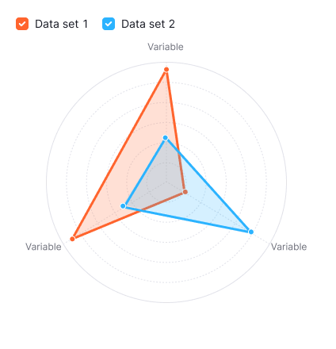
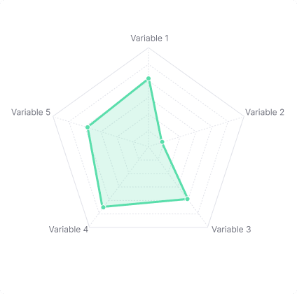
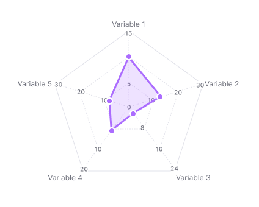
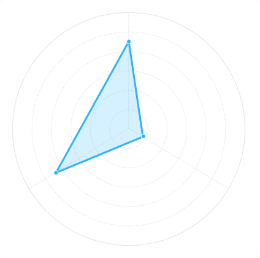
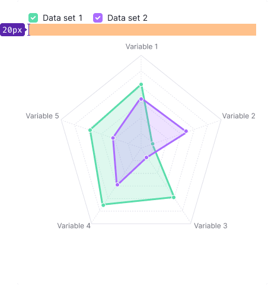
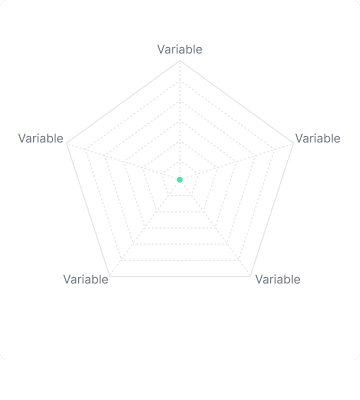

> Basic data visualization rules are described in the [Chart principles](/data-display/d3-chart).

@## Description

**Radar chart** is a chart for displaying multivariate data in the form of a two-dimensional chart of three or more quantitative variables represented on axes starting from the same point.

It is designed to show similarities, differences, and outliers, or any other item of interest at a glance.

> The radar chart is also known as web chart, spider chart, spider graph, spider web chart, star chart, star plot, cobweb chart, irregular polygon, polar chart, or Kiviat diagram. It is equivalent to a parallel coordinates plot, with the axes arranged radially.

**Use radar chart when:**

- There are multivariate data.
- There is an arbitrary number of variables.
- You need to show outliers.
- You need to make comparisons across multivariate data.
- Data sets are small or moderately sized.

Radar charts are at their best when used to quickly compare multiple dimensions in a compact space. They can be attention-grabbing, due both to their circular structure and their relative novelty compared to other business graphs, so they can be effective when you need to visually engage your audience. A general audience might find them confusing or intimidating to read without additional guidance (which you can provide – we’ll talk more about that in a later section), but technical audiences might find them intriguing.

> Instead of the radar chart, you can use the parallel coordinates chart. This chart "unwinds" the same data into a straight line, which can make the comparisons across data easier to see.

### Advantages of radar charts

**Outliers and similarities are easy to see**

The most significant advantage of using a radar chart is that outliers are immediately visible. Any metric or variable that is vastly different from the others on the chart or in a set of charts is obvious. Commonalities are also easy to assess, particularly if they are plotted on the same chart.

### Disadvantages of radar charts

Data visualization specialists often criticize radar charts – for example, in [this blog post](https://blog.scottlogic.com/2011/09/23/a-critique-of-radar-charts.html#chart2) and in [this article](https://www.perceptualedge.com/articles/dmreview/radar_graphs.pdf).

Their main cons are:

- Hard to judge radii length.
- Radar charts can distort data.
- Radar charts can create connections where there are none.
- Radar charts can cause occlusion and confusion.

> Additionally, humans recognize and can discern data in shapes like squares, circles, and triangles. Therefore, from a psychological standpoint, the random nature of radar chart shapes makes them less useful than known and quantifiable shapes.

@## Appearance

### Axes and variables

Variables usually start at 0 degrees and divide the grid into equal parts.

Radar charts are most beneficial when there are a few items to compare. That is why we recommend showing 3-10 variables for your data sets.

#### Styles

- Use the `--chart-grid-line` token for the color of the all axis and variables lines.
- Use dashed lines for variables.

| Minimum variables (3)                                                 | Maximum recommended variables (10)                                     |
| --------------------------------------------------------------------- | ---------------------------------------------------------------------- |
|  |  |

You can turn off grid ticks and labels if needed. It can be helpful for small-sized charts like the following one:


### Curved data set

You can curve polygons (data sets), if needed.

> To get smoothed lines, you need to transfer curve with the required rounding method to the chart. Just like in Line chart.
>
> You can find all available methods in the [d3 Curves documentation](https://github.com/d3/d3-shape#curves).


### Circular grid

If there are three or four variables grid is displayed as a circle.



But in case if you have more than four variables, you can also display the grid as a circle instead of a polygon. Use `type="circle"` in this case.

| Grid as a polygon                                                                | Grid as a circle                                                                 |
| -------------------------------------------------------------------------------- | -------------------------------------------------------------------------------- |
|  |  |

### Filled areas

You can display your data sets with filled areas or without filled areas. Radar chart with filled areas makes charts more attention-grabbing and helps to visually engage your audience.

Areas use the same color as the line, but with 20% opacity. Areas are enabled by default. To disable the area, use the `fill="transparent"` property.


### Size

Size can be set through the `width` and `height` properties ([check API](data-display/d3-chart/d3-chart-api/#plot)). Chart components don't have maximum and minimum size.

For a small radar chart, we recommend turning off scales, variables, labels, and data points to reduce visual noise. For example:


### Text labels

For labels, use the `--chart-grid-text-label` color token.

If a variable's label is too long, wrap it to the next line:


### Non-text labels

Variables can be labeled with other components such as [Tag](/components/tag), [Button](/components/button), or [Icon](/style/icon):


### Scales

You can add as many scales as you need to the axes. To keep your chart readable, we recommend that you don't add too many.

Use `dashed` lines for scales:




#### Variables with different scales

Variables can have different scales. To reduce visual noise, we recommend that you don't show values on the axes. **The example below is not the recommendation, it's for illustration purpose only.**



@## Data sets

The radar chart is best suited for comparing several dimensions when there isn't much space in the interface. These charts are most beneficial when there are a few data sets to compare. We recommend you use it for no more than three data sets. Five data sets can make a mess out of your chart.

**Data set styles:**

- Line thickness for data sets is 3px.
- Dot size is 8px with 2px outer border (use the `--chart-grid-border` color token).

| Minimum data sets (1)                                          | Maximum recommended data sets (3)                                                     |
| -------------------------------------------------------------- | ------------------------------------------------------------------------------------- |
|  |  |

### Data set with curve

To get smoothed lines, transfer `curve` with the required [rounding method](https://github.com/d3/d3-shape#curves) to the chart.

Your charts could look like this:


@## Legend

If there is more than one data set, your chart needs a legend. Place it above the chart or on the right side.

| Legend placement | Appearance example                                                                          | Margins                                                                                                  |
| ---------------- | ------------------------------------------------------------------------------------------- | -------------------------------------------------------------------------------------------------------- |
| Top              |            |              |
| Right            |  |  |

### Legend hover

To highlight one data set and dim the others on the chart, use the `transparent` property:


@## Interaction

On hover, the chart shows the values of the variable for all data sets.


Highlight the area on the axes with the `--chart-grid-bar-chart-hover` color token. The hover area for a variable includes the area of the variable itself and half the distance to the next variables.

Highlight the variable line with the `--chart-grid-y-accent-hover` color token.

Data points that lie on this variable are increased to 12px (plus 2px outer border).

@## Animation

Data sets grow from the 0 point (from the center) using animation with these properties:

```css
animation-timing-function: cubic-bezier(0, 0.44, 0.42, 1);
animation-delay: 400ms;
animation-duration: 100ms;
```

@## Tooltip

Tooltips show a variable's data for all data sets:


@## Edge cases

### No data

If the values across all datasets are 0, then all points will be in the middle of the chart.




### Not available data

If for some reason data isn't available, show `n/a` in the tooltip. Data point isn't showed for such a case.


### Initial data loading

When the chart is loading for the first time, show [Skeleton](/components/skeleton/) instead of the chart.

If the chart has a title, show it during loading. The user will have an idea of what is being loaded and whether they need to wait for the loading process to complete.

For more information about this state, refer to [Skeleton](/components/skeleton/).

Use the `--skeleton-bg` color token for the skeleton background color.


@## Usage in UX/UI

**When creating a radar chart, there are a few best practices.**

Variables should be arranged in some meaningful order.


More than three data sets should be presented on their own radar charts or visualized through other chart type.


Don’t use too many variables or the chart risks becoming confusing.

Consider using other chart type – e.g. Bar chart.


If there are multiple data series, the filled-in color should be transparent.


@page radar-chart-api
@page radar-chart-code
