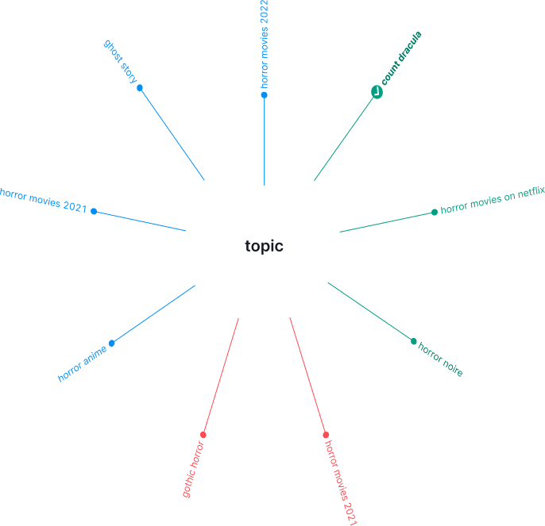
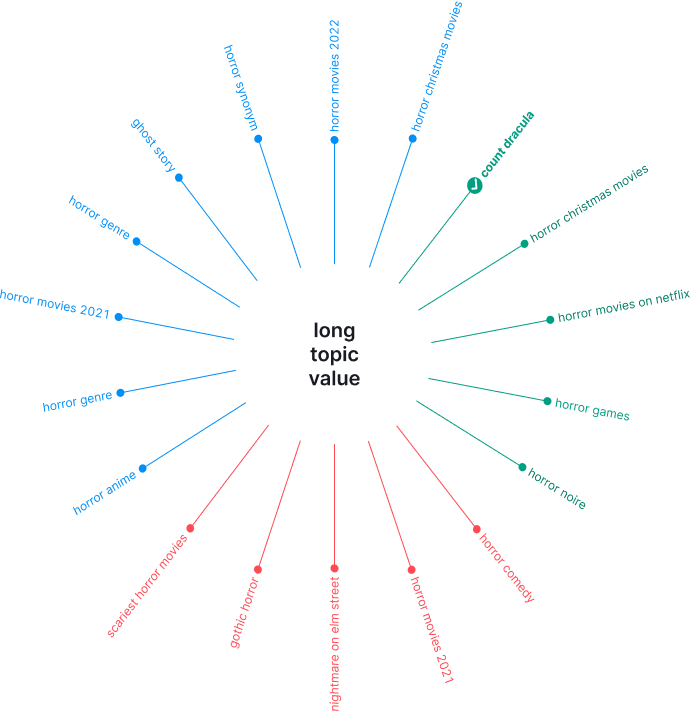

@## Description

**Radial Tree chart** is a radial chart for visual organization of information, one of the versions of MindMap. Such a chart in focus always has one central element (idea, phrase, keyword), which starts the search for new related ideas / topics / keywords.

**Use this chart when:**

- you need to visualize related ideas / topics / keywords;
- you need a tool for pre-analytical hierarchical visualization of ideas/themes/keywords.

@## Appearance

Basic rules for visualizing data as a Radial Tree:

- There should always be one idea/topic/keyword in the center. Build the rest of the chart from it.
- Keep it simple. The simpler the visualization, the more readable and understandable it is.
- There should be as much space as possible for such a chart. Otherwise, the data will be difficult to read.

| Appearance example                                    | Styles and sizes                                                     |
| ----------------------------------------------------- | -------------------------------------------------------------------- |
|  | The recommended minimum chart size is 600px (don't make it smaller). |

### Value's styles

#### Default state

- Stroke width — 1px.
- Default size of the circle bullet — `8px * 8px`.
- Font size — 14px (`--fs-200`).
- In the default state, use 400 hue colors. E.g., `--blue-400`, `--red-400`, `--green-400` , etc.

#### Active state

- Size of the circle bullet in the active state — `16px * 16px`.
- You can place an icon of M size inside the circle bullet in the active state.

@## Legend

For cases where you need to group data using colors on a chart, add a legend next to the chart. This will make it easier for users to read the data.

@## Tooltip

This chart doesn't need tooltip.

@## Interaction

| State   | Appearance example                              | Styles                                                                                                                                                                                                                                                    |
| ------- | ----------------------------------------------- | --------------------------------------------------------------------------------------------------------------------------------------------------------------------------------------------------------------------------------------------------------- |
| default |  | In the default state, use 400 hue colors. E.g., `--blue-400`, `--red-400`, `--green-400` , etc.                                                                                                                                                           |
| hover   |      | For the text's hover state use the next color hue. E.g., `--blue-500`, `--red-500`, `--green-500` , etc. **Do not change the color of the additional line and the circle bullet.**                                                                        |
| active  |   | In the active state, the text has the same color as on hover, but changes its font-weight to 700. E.g., `--blue-500`, `--red-500`, `--green-500` , etc. The circle bullet grows to `16px * 16px` size. You can place an icon inside the bullet if needed. |

@## Animation

All values appears from the center with `ease-in` and `200ms` delay.

The transparency of values appearance changes from 0 to 100 with `ease-in` and `200ms` delay.

@## Edge cases

| Case                                                                                                                                                                                                                           | Appearance example                                                |
| ------------------------------------------------------------------------------------------------------------------------------------------------------------------------------------------------------------------------------ | ----------------------------------------------------------------- |
| **One value**                                                                                                                                                                                                                  |                |
| **Two values**                                                                                                                                                                                                                 |              |
| **Few values.** If there are very few values, then they are evenly distributed around the entire circle relative to the central value in a clockwise direction.                                                                |              |
| **Very long main element.** Don't fold the long center value into ellipsis. Wrap it on the second line.                                                                                                                        |  |
| **No data.** Show a special WidgetEmpty message for cases when there is no data.                                                                                                                                               |              |
| **N/a.** Show a special WidgetEmpty message for cases when data isn't available.                                                                                                                                               |            |
| **Initial loading.** Show the skeleton for this state. If the chart has a title, it should be displayed while the chart is loading. The user must understand what exactly is being loaded and whether they should wait for it. |                  |

@page radial-tree-chart-api
@page radial-tree-chart-d3-examples
