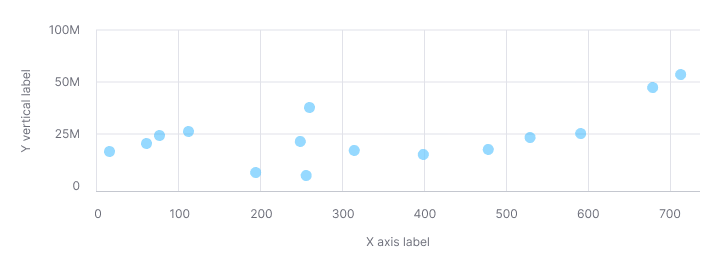
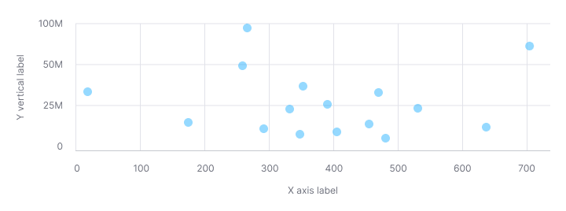
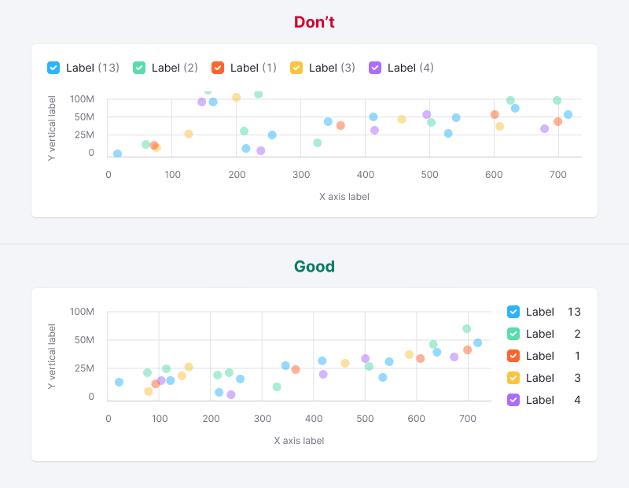

::: react-view

:::

::: tip
Basic data visualization rules are described in the [D3 chart](/data-display/d3-chart/d3-chart).
:::

## Description

**Scatterplot chart** displays the relationship between two variables in datasets, revealing trends, clusters, and patterns. It's useful for analyzing how two variables correlate, particularly in large datasets.

::: tip
The scatterplot is highly valued for its versatility and utility in statistical graphics, praised as a significant invention in statistical graphics history (refer to [Journal of the History of the Behavioral Sciences](http://onlinelibrary.wiley.com/doi/10.1002/jhbs.20078/abstract)).
:::

**Use scatterplot chart when you need to:**

- Identify patterns and relationships between data variables.
- Explore correlations, using bubble size and color for additional dimensions.

### How to read a scatterplot chart

| Case                                                                                                                                 | Appearance example                                       |
| ------------------------------------------------------------------------------------------------------------------------------------ | -------------------------------------------------------- |
| If the points form a line that runs from bottom left to top right, there is likely a positive correlation between the two variables. |  |
| If the line runs from top left to bottom right, there is likely a negative correlation between the two variables.                    |  |
| If the overall trend doesn't form a clear straight line, there is probably no correlation.                                           |              |

::: tip
Correlation does not imply causation. Unseen variables might influence the charted data.
:::

## Appearance

Scatterplot chart should contain:

- Both vertical and horizontal lines.
- Clear labels for X and Y axes without coloring them to keep the chart readable.
- Legend for datasets with varying colors.

Dot size is 11px by 11px.

Table: Scatterplot chart styles

| Case             | Appearance example                                     | Styles                                                                                                                                                                                    |
| ---------------- | ------------------------------------------------------ | ----------------------------------------------------------------------------------------------------------------------------------------------------------------------------------------- |
| One data set      |               | The default color for the category is `--chart-palette-order-blue` (or `--blue-300`) with 50% transparency. However, if necessary, you can select any other color from the [chart palette](/data-display/color-palette/color-palette). |
| Several data sets |  | Use colors from the [chart palette](/data-display/color-palette/color-palette).  |

## Value label

- Dot size: 24px by 24px.
- Text size: 12px.

Display values over 100 as "99+". Use a darker shade for text color than the dot color (for example, if dot has `--blue-300` color, then use `--blue-400` color for the label).

## Legend

Add a legend for charts with multiple datasets, favoring a vertical layout for easier reading and values comparing.

## Interaction

- Dots increase opacity to 80% on hover, displaying values.
- Change the cursor to a `pointer` for clickable dots.

## Tooltip

Tooltips should highlight:

- X-axis and Y-axis values.
- Focus on values rather than axis names or categories.
- Include dataset colors in tooltips for charts with multiple datasets.

Table: Scatterplot chart tooltip examples

| Case             | Appearance example       |
| ---------------- | ------------------------ |
| One data set      |  |
| Several data sets |  |

## Edge cases

### Null data

Zero values are displayed at the origin, with legend reflecting zero data.

::: tip
Zero counts as data. 0 ≠ n/a.
:::

### No data

Omit points without data on the chart and reflect this in the legend.

### Bubbles near axes

The chart will scale automatically if the bubble is near the axes.

## Initial data loading

Show [Skeleton](/components/skeleton/skeleton) during initial loading. If the chart has a title, display it to inform users about what's loading. Refer to [Skeleton](/components/skeleton/skeleton) for more details.

Use the `--skeleton-bg` color token for the skeleton's background.        

Refer to [Error & n/a widget states](/components/widget-empty/widget-empty) for all other empty states.

## Usage in UX/UI

### Axes

Label both the X and Y axes. Avoind coloring the axis labels, this can make the data harder to read.

### Y-axis strating point

Always start the Y-axis at 0 to avoid visual distortion of data correlation.

### Data sets number

Limit the number of datasets to keep the chart readable.

