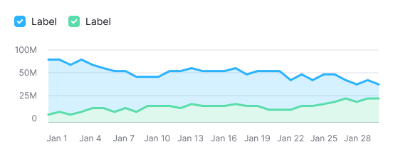
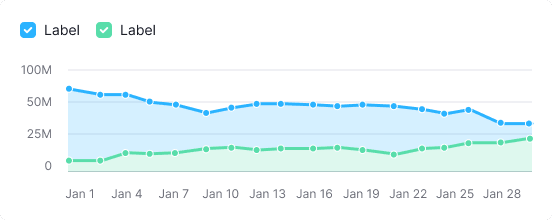
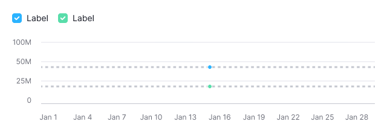
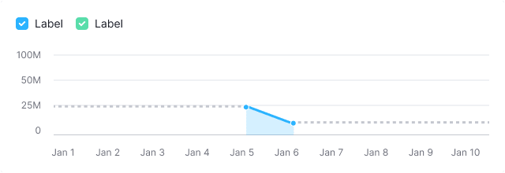
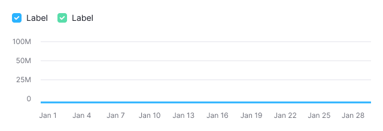
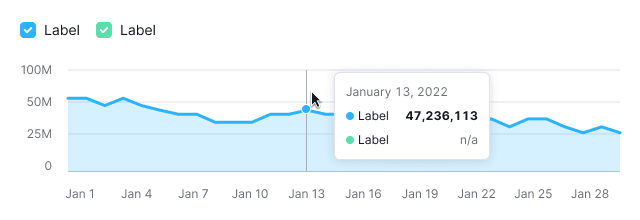
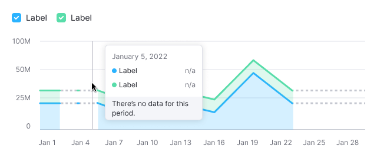
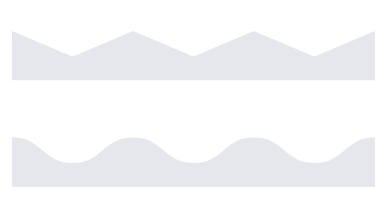

::: react-view

:::

::: info
Basic data visualization rules are described in the [D3 chart](/data-display/d3-chart/d3-chart).
:::

## Description

**Area chart** shows trends and the relationship between numeric variables over time. Area charts often used to show overall trends over time rather than specific values.

Use a stacked area chart to display both the total data amount and how parts contribute to the whole.

**Key considerations for using stacked area chart:**

- Use area charts for a comprehensive view of your data. _For instance, while line charts are great for showing how a population changes over time, area charts excel at showing the total population volume within a specific period._
- Stick to no more than four data sets to keep your chart readable. If you have more, the [Line](/data-display/line-chart/line-chart) might be a better choice for a clearer view.
- Ensure your chart is clearly labeled to make the axes easy to understand.

::: tip
Refer to materials below, to have insights on choosing between line and area charts:

- [Choosing the right chart type: Line charts vs Area charts](https://www.fusioncharts.com/blog/line-charts-vs-area-charts/)
- [The Fine Line In a Gray Area: When to Use Line vs Area Charts](https://visual.ly/blog/line-vs-area-charts/)
:::

## Appearance

Charts are displayed with non-curved lines by default (without `curve` property) to make it easier to read exact values.

Table: Stacked bar chart with non-curved lines

| Example                                             | Styles                                                                                                     |
| --------------------------------------------------- | ---------------------------------------------------------------------------------------------------------- |
|  | **Line thickness: 3px.** The background color under the line matches the line color with 0.2 transparency. |

Display dots on lines when data points either are few or collected irregularly.

Table: Stacked bar chart with dots and non-curved lines

| Example                                  | Styles                                                                                                                      |
| ---------------------------------------- | --------------------------------------------------------------------------------------------------------------------------- |
|  | Dot has size **8px * 8px** and **border: 1px solid var(--chart-grid-border)**. On hover, dot expand to **10px * 10px**. |

## Interaction

Hovering over the chart highlights the nearest point with a vertical guide line, enlarges the dot, and shows a detailed tooltip. The color of the vertical guide line is `--chart-grid-y-accent-hover-line`.

::: tip
For detailed tooltip information, see [Chart principles](/data-display/d3-chart/d3-chart#tooltip) and [Line chart](/data-display/line-chart/line-chart).
:::

## Edge cases

### One value

Display dots by default for charts with a single data point. The line is dashed and colored with `--chart-palette-order-other-data`.

### Two values

Display dots by default.

**Example 1** is for two distant dates.

**Example 2** is for consecutive dates.

### Null values

Display the line at the zero axis if all values are zero.

::: tip
Zero counts as data. 0 ≠ n/a.
:::

### No data

For periods without data, use a dashed line between known points.

::: tip
When there is no data, you can't draw a zero line. Zero counts as data. 0 ≠ n/a.
:::

Display a tooltip with n/a when hovering over a dot without data, and explain why, if possible.

## Initial data loading

Show [Skeleton](/components/skeleton/skeleton) during initial loading. If the chart has a title, display it to inform users about what's loading. Refer to [Skeleton](/components/skeleton/skeleton) for more details.

Use the `--skeleton-bg` color token for the skeleton's background.

Refer to [Error & n/a widget states](/components/widget-empty/widget-empty) for all other empty states.
