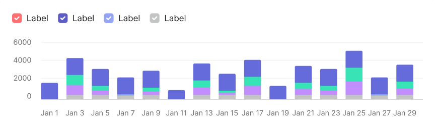
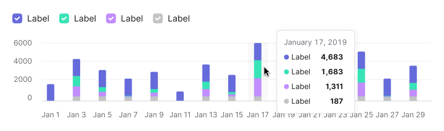
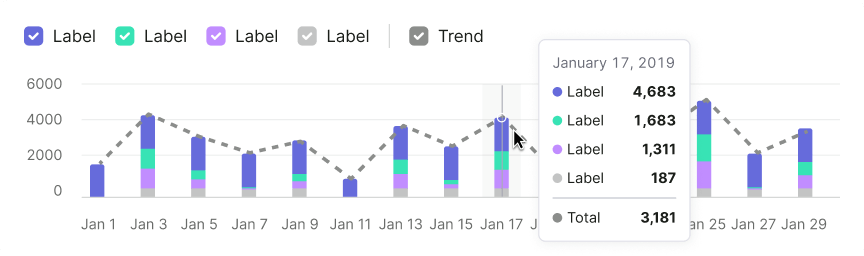

<Playground for="Chart.StackedBar" />

::: info
Basic data visualization rules are described in the [D3 chart](/data-display/d3-chart/d3-chart).
:::

## Description

**Stacked bar chart** is used to display multiple categories of values and illustrate his proportions relative to the total.

**Key points for using stacked bar chart:**

- Choose this chart to compare more than two categories.
- It's ideal for showing how parts contribute to a whole.
- Pick distinctly different colors for clarity.
- Ensure the chart is large enough to easily read the data.

::: tip
**Bar vs. Histogram Chart**

- Bar charts categorize data qualitatively, showing how different categories compare.
- Histograms organize data quantitatively, indicating how often values fall within certain ranges.
:::

## Appearance

In a stacked bar chart, bars have no gaps between value segments. Select contrasting colors for visibility.

Aim for at least a 20% margin between bars to avoid clutter.

### Chart colors

Stick to the [designated chart palette](/data-display/color-palette/color-palette) and ensure consistent color use.

## Interaction

Hovering highlights a bar with `--chart-grid-bar-chart-hover`, indicating focus or clickability. For trend lines, display corresponding points on hover.

For more, refer to the [Bar chart](../bar-chart/bar-chart#interaction).

## Trend

Trend lines can help identify overall patterns but may clutter simple charts. If used, ensure tooltips provide comprehensive value details.

## Edge cases

Edge cases for stacked bar chart align with those of the [Bar chart](/data-display/bar-chart/bar-chart#edge-cases).

## Initial data loading

For loading details, refer to the [Bar chart guide](/data-display/bar-chart/bar-chart#initial-data-loading).

## Usage in UX/UI

Refer to the [Bar chart guide](/data-display/bar-chart/bar-chart#usage-in-ux-ui), for the detailed information on specific use cases.
